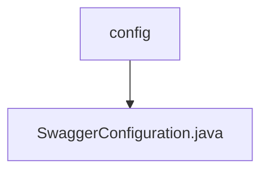

# 基础信息

|      |      |
|------|------|
| 名称 | config |
| 编码语言 | .java |
| 代码路径 | spring-ai-alibaba/spring-ai-alibaba-graph/spring-ai-alibaba-graph-studio/src/main/java/com/alibaba/cloud/ai/config |
| 包名 | spring-ai-alibaba.spring-ai-alibaba-graph.spring-ai-alibaba-graph-studio.src.main.java.com.alibaba.cloud.ai.config |
| 概述说明 | Swagger配置类管理API分组，路径为/graph-studio。 |

# 说明

Swagger配置类用于管理API分组，并指定该分组匹配路径为/graph-studio。该配置类的主要功能是通过Swagger工具对API进行分组管理，确保与/graph-studio路径相关的API能够被正确分类和展示。通过这种方式，开发者可以更方便地管理和查看与该路径相关的API文档，提升API的可维护性和可读性。

### 包内部结构视图

这段流程图展示了路径的层级关系，其中`config`文件夹下包含一个文件`SwaggerConfiguration.java`。该图清晰地反映了文件夹与文件之间的从属关系，帮助开发者快速理解项目结构。

# 文件列表 File List

| 名称   | 类型  | 说明 |
|-------|------|-------------|
| [SwaggerConfiguration.java](SwaggerConfiguration.md) | file | Swagger配置类管理API分组，路径为/graph-studio。 |

