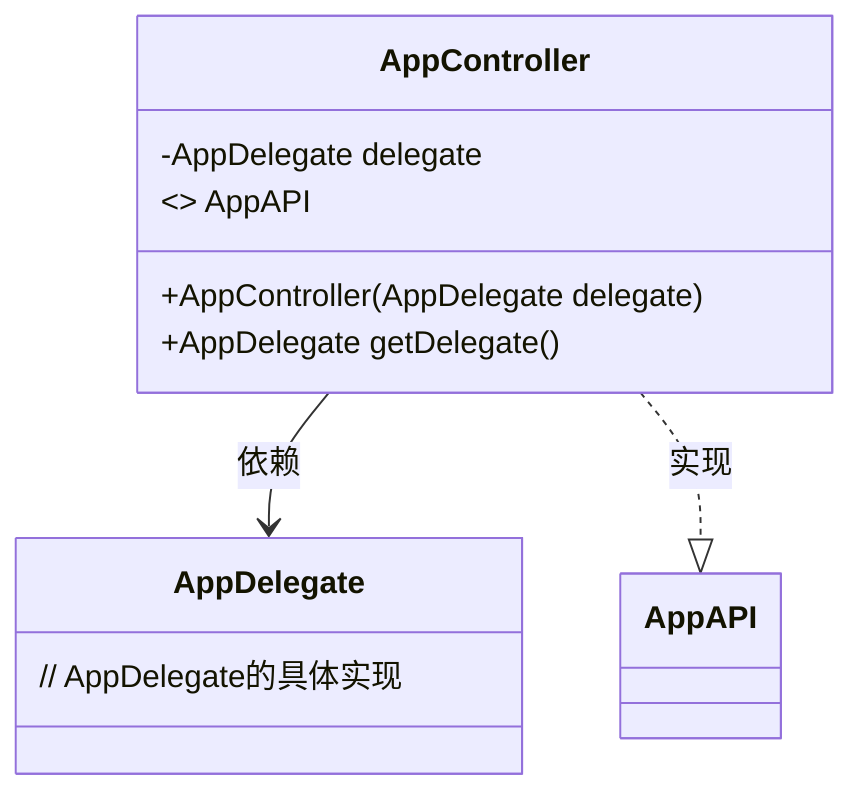
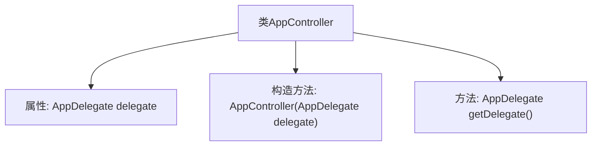

# 基础信息

|      |      |
|------|------|
| 名称 | AppController |
| 编码语言 | .java |
| 代码路径 | spring-ai-alibaba/spring-ai-alibaba-graph/spring-ai-alibaba-graph-studio/src/main/java/com/alibaba/cloud/ai/controller/AppController.java |
| 包名 | com.alibaba.cloud.ai.controller |
| 依赖项 | ['com.alibaba.cloud.ai.api.AppAPI', 'com.alibaba.cloud.ai.service.app.AppDelegate', 'org.springframework.web.bind.annotation.CrossOrigin', 'org.springframework.web.bind.annotation.RequestMapping', 'org.springframework.web.bind.annotation.RestController'] |
| 概述说明 | AppController实现AppAPI，依赖注入AppDelegate。 |

# 说明

AppController实现了AppAPI接口，并通过依赖注入的方式引入了AppDelegate。这种设计使得AppController能够与AppDelegate进行交互，同时遵循了接口定义的规范，增强了代码的可维护性和扩展性。

# 类列表 Class Summary

| 名称   | 类型  | 说明 |
|-------|------|-------------|
| AppController | class | AppController实现AppAPI，包含AppDelegate依赖注入。 |

## 类 AppController

|      |      |
|------|------|
| 访问范围 | @CrossOrigin;@RestController;@RequestMapping("graph-studio/api/app");public |
| 类型 | class |
| 名称 | AppController |
| 说明 | AppController实现AppAPI，包含AppDelegate依赖注入。 |

### UML类图

这段代码展示了一个名为 `AppController` 的类，它实现了 `AppAPI` 接口，并依赖于 `AppDelegate` 类。`AppController` 通过构造函数注入 `AppDelegate` 的实例，并提供了一个公共方法 `getDelegate()` 来获取该实例。`AppAPI` 接口的具体实现由 `AppController` 提供，而 `AppDelegate` 则负责处理具体的业务逻辑。这种设计模式有助于分离关注点，使代码更易于维护和扩展。

### 内部方法调用关系图

这段代码定义了一个名为 `AppController` 的类，该类实现了 `AppAPI` 接口。`AppController` 类包含一个私有属性 `delegate`，类型为 `AppDelegate`，并通过构造函数进行初始化。类中还定义了一个 `getDelegate` 方法，用于返回 `delegate` 属性。流程图展示了类的结构及其内部方法之间的关系，清晰地反映了属性的初始化和方法的调用流程。

### 字段列表 Field List

| 名称  | 类型  | 说明 |
|-------|-------|------|
| delegate | AppDelegate | 私有且不可变的AppDelegate实例。 |

### 方法列表 Method List

| 名称  | 类型  | 说明 |
|-------|-------|------|
| getDelegate | AppDelegate | 重写getDelegate方法，返回delegate实例。 |

