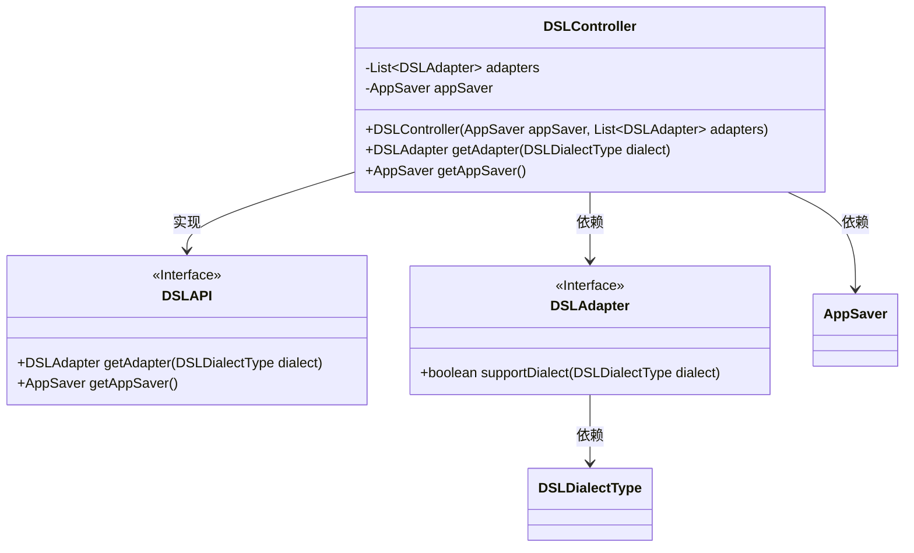
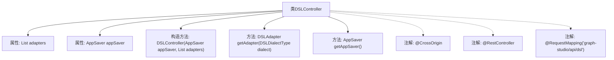

# 基础信息

|      |      |
|------|------|
| 名称 | DSLController |
| 编码语言 | .java |
| 代码路径 | spring-ai-alibaba/spring-ai-alibaba-graph/spring-ai-alibaba-graph-studio/src/main/java/com/alibaba/cloud/ai/controller/DSLController.java |
| 包名 | com.alibaba.cloud.ai.controller |
| 依赖项 | ['com.alibaba.cloud.ai.api.DSLAPI', 'com.alibaba.cloud.ai.saver.AppSaver', 'com.alibaba.cloud.ai.service.dsl.DSLAdapter', 'com.alibaba.cloud.ai.service.dsl.DSLDialectType', 'org.springframework.web.bind.annotation.CrossOrigin', 'org.springframework.web.bind.annotation.RequestMapping', 'org.springframework.web.bind.annotation.RestController', 'java.util.List'] |
| 概述说明 | DSL控制器类负责管理DSL适配器和应用保存器。 |

# 说明

DSL控制器类负责管理DSL适配器和应用保存器。它协调适配器与应用保存器之间的交互，确保数据流和操作的高效执行。控制器类的主要职责包括初始化适配器、处理应用状态、以及调用保存器进行数据持久化。通过集中管理这些组件，DSL控制器类提高了系统的可维护性和扩展性。

# 类列表 Class Summary

| 名称   | 类型  | 说明 |
|-------|------|-------------|
| DSLController | class | DSL控制器类，管理DSL适配器和应用保存器。 |

## 类 DSLController

|      |      |
|------|------|
| 访问范围 | @CrossOrigin;@RestController;@RequestMapping("graph-studio/api/dsl");public |
| 类型 | class |
| 名称 | DSLController |
| 说明 | DSL控制器类，管理DSL适配器和应用保存器。 |

### UML类图

**描述：**
`DSLController` 类实现了 `DSLAPI` 接口，负责管理 `DSLAdapter` 和 `AppSaver`。`DSLController` 通过构造函数注入 `AppSaver` 和 `DSLAdapter` 列表，并提供方法获取特定方言的适配器和应用保存器。`DSLAdapter` 接口定义了支持特定方言的方法，而 `AppSaver` 类则负责应用的保存操作。整个设计展示了控制器与适配器、保存器之间的依赖关系。

### 内部方法调用关系图

这段代码定义了一个名为`DSLController`的类，该类实现了`DSLAPI`接口。它包含两个主要属性：`adapters`（一个`DSLAdapter`类型的列表）和`appSaver`（一个`AppSaver`类型的对象）。类中定义了一个构造方法，用于初始化这两个属性。此外，类中还实现了两个方法：`getAdapter`用于根据`DSLDialectType`类型获取适配器，`getAppSaver`用于返回`appSaver`对象。类上使用了`@CrossOrigin`、`@RestController`和`@RequestMapping`注解，分别用于处理跨域请求、标识该类为REST控制器以及映射请求路径。

### 字段列表 Field List

| 名称  | 类型  | 说明 |
|-------|-------|------|
| adapters | List<DSLAdapter> | 私有且不可变的DSL适配器列表。 |
| appSaver | AppSaver | 私有且不可变的AppSaver实例。 |

### 方法列表 Method List

| 名称  | 类型  | 说明 |
|-------|-------|------|
| getAppSaver | AppSaver | 重写getAppSaver方法，返回appSaver实例。 |
| getAdapter | DSLAdapter | 方法通过流过滤适配器，返回支持指定方言的第一个适配器，若无则返回null。 |

