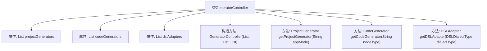

# 基础信息

|      |      |
|------|------|
| 名称 | GeneratorController |
| 编码语言 | .java |
| 代码路径 | spring-ai-alibaba/spring-ai-alibaba-graph/spring-ai-alibaba-graph-studio/src/main/java/com/alibaba/cloud/ai/controller/GeneratorController.java |
| 包名 | com.alibaba.cloud.ai.controller |
| 依赖项 | ['com.alibaba.cloud.ai.api.GeneratorAPI', 'com.alibaba.cloud.ai.service.dsl.DSLAdapter', 'com.alibaba.cloud.ai.service.dsl.DSLDialectType', 'com.alibaba.cloud.ai.service.generator.CodeGenerator', 'com.alibaba.cloud.ai.service.generator.ProjectGenerator', 'org.springframework.web.bind.annotation.RequestMapping', 'org.springframework.web.bind.annotation.RestController', 'java.util.List'] |
| 概述说明 | GeneratorController实现GeneratorAPI，管理项目、代码生成器和DSL适配器，支持按模式、节点类型和方言获取实例。 |

# 说明

GeneratorController实现了GeneratorAPI接口，负责管理项目生成器、代码生成器和DSL适配器。它支持根据模式、节点类型和方言获取相应的实例，确保生成器和适配器的灵活调用与配置。

# 类列表 Class Summary

| 名称   | 类型  | 说明 |
|-------|------|-------------|
| GeneratorController | class | GeneratorController实现GeneratorAPI，管理项目生成器、代码生成器和DSL适配器，支持按模式、节点类型和方言获取相应实例。 |


## 类 GeneratorController

|      |      |
|------|------|
| 访问范围 | @RestController;@RequestMapping("graph-studio/api/generate");public |
| 类型 | class |
| 名称 | GeneratorController |
| 说明 | GeneratorController实现GeneratorAPI，管理项目生成器、代码生成器和DSL适配器，支持按模式、节点类型和方言获取相应实例。 |


### UML类图

```mermaid
classDiagram
    class GeneratorController {
        -List~ProjectGenerator~ projectGenerators
        -List~CodeGenerator~ codeGenerators
        -List~DSLAdapter~ dslAdapters
        +GeneratorController(List~ProjectGenerator~ projectGenerators, List~CodeGenerator~ codeGenerators, List~DSLAdapter~ dslAdapters)
        +ProjectGenerator getProjectGenerator(String appMode)
        +CodeGenerator getCodeGenerator(String nodeType)
        +DSLAdapter getDSLAdapter(DSLDialectType dialectType)
    }

    <<Interface>> GeneratorAPI {
        +ProjectGenerator getProjectGenerator(String appMode)
        +CodeGenerator getCodeGenerator(String nodeType)
        +DSLAdapter getDSLAdapter(DSLDialectType dialectType)
    }

    class ProjectGenerator {
        +boolean supportAppMode(String appMode)
    }

    class CodeGenerator {
        +boolean supportNodeType(String nodeType)
    }

    class DSLAdapter {
        +boolean supportDialect(DSLDialectType dialectType)
    }

    GeneratorController --> GeneratorAPI : 实现
    GeneratorController --> ProjectGenerator : 依赖
    GeneratorController --> CodeGenerator : 依赖
    GeneratorController --> DSLAdapter : 依赖
```

### 描述
`GeneratorController` 类实现了 `GeneratorAPI` 接口，负责根据不同的应用模式、节点类型和 DSL 方言类型，获取相应的 `ProjectGenerator`、`CodeGenerator` 和 `DSLAdapter`。这些生成器和适配器通过构造函数注入，控制器通过流操作筛选出符合条件的实例。该设计允许灵活扩展和替换不同的生成器和适配器实现。


### 内部方法调用关系图



这段代码定义了一个名为 `GeneratorController` 的类，它实现了 `GeneratorAPI` 接口。该类包含三个主要属性：`projectGenerators`、`codeGenerators` 和 `dslAdapters`，分别用于存储不同类型的生成器和适配器。类中定义了一个构造方法，用于初始化这些属性，并提供了三个方法：`getProjectGenerator`、`getCodeGenerator` 和 `getDSLAdapter`，分别用于根据不同的条件获取相应的生成器或适配器。这些方法通过流式操作过滤出符合条件的实例，并返回第一个匹配项，如果没有找到则返回 `null`。

### 字段列表 Field List

| 名称  | 类型  | 说明 |
|-------|-------|------|
| projectGenerators | List<ProjectGenerator> | 私有项目生成器列表。 |
| dslAdapters | List<DSLAdapter> | 私有不可变的DSL适配器列表。 |
| codeGenerators | List<CodeGenerator> | 私有最终代码生成器列表变量。 |

### 方法列表 Method List

| 名称  | 类型  | 说明 |
|-------|-------|------|
| getDSLAdapter | DSLAdapter | 根据DSL类型获取适配器，若无则返回空。 |
| getProjectGenerator | ProjectGenerator | 根据应用模式获取支持的项目生成器，若无则返回空。 |
| getCodeGenerator | CodeGenerator | 根据节点类型获取对应的代码生成器，若无则返回空。 |


