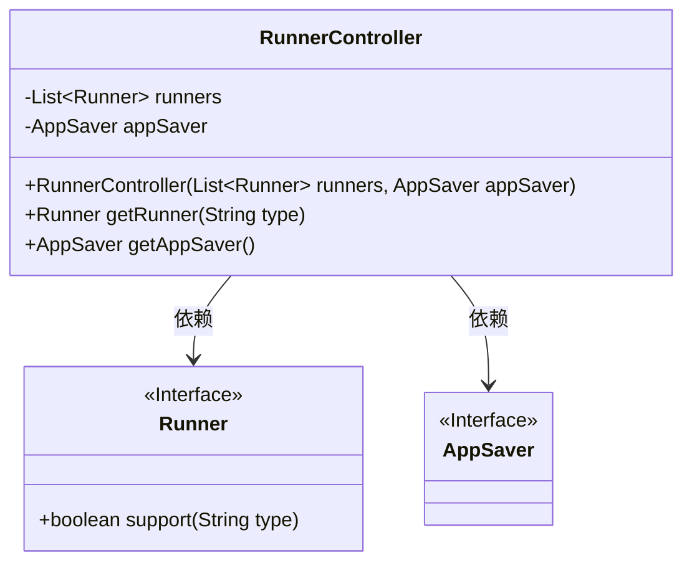
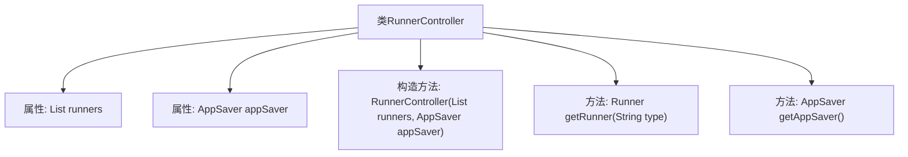

# 基础信息

|      |      |
|------|------|
| 名称 | RunnerController |
| 编码语言 | .java |
| 代码路径 | spring-ai-alibaba/spring-ai-alibaba-graph/spring-ai-alibaba-graph-studio/src/main/java/com/alibaba/cloud/ai/controller/RunnerController.java |
| 包名 | com.alibaba.cloud.ai.controller |
| 依赖项 | ['com.alibaba.cloud.ai.api.RunnerAPI', 'com.alibaba.cloud.ai.saver.AppSaver', 'com.alibaba.cloud.ai.service.runner.Runner', 'org.springframework.web.bind.annotation.RequestMapping', 'org.springframework.web.bind.annotation.RestController', 'java.util.List'] |
| 概述说明 | RunnerController实现RunnerAPI，管理Runner列表和AppSaver实例。 |

# 说明

RunnerController实现了RunnerAPI接口，负责管理Runner列表和AppSaver实例。该控制器主要功能包括对Runner的增删改查操作，以及与AppSaver实例的交互，确保应用程序状态的保存和恢复。通过集成RunnerAPI，RunnerController能够有效地协调和管理多个Runner实例，提升系统的整体运行效率和稳定性。

# 类列表 Class Summary

| 名称   | 类型  | 说明 |
|-------|------|-------------|
| RunnerController | class | RunnerController实现RunnerAPI，管理Runner列表和AppSaver实例。 |

## 类 RunnerController

|      |      |
|------|------|
| 访问范围 | @RestController;@RequestMapping("graph-studio/run");public |
| 类型 | class |
| 名称 | RunnerController |
| 说明 | RunnerController实现RunnerAPI，管理Runner列表和AppSaver实例。 |

### UML类图

这段代码定义了一个名为 `RunnerController` 的类，它实现了 `RunnerAPI` 接口。`RunnerController` 类包含两个私有成员：一个 `Runner` 对象的列表和一个 `AppSaver` 对象。类中提供了两个公有方法：`getRunner` 用于根据类型获取支持的 `Runner` 对象，`getAppSaver` 用于返回 `AppSaver` 对象。`Runner` 和 `AppSaver` 都是接口，分别定义了 `support` 方法和可能的其他方法。`RunnerController` 依赖于这两个接口来实现其功能。

### 内部方法调用关系图

这段代码定义了一个名为`RunnerController`的类，它实现了`RunnerAPI`接口。该类包含两个私有属性：`runners`（一个`Runner`对象的列表）和`appSaver`（一个`AppSaver`对象）。类中定义了一个构造方法，用于初始化这两个属性。此外，类中还提供了两个方法：`getRunner`用于根据类型查找支持的`Runner`对象，`getAppSaver`用于返回`appSaver`对象。

### 字段列表 Field List

| 名称  | 类型  | 说明 |
|-------|-------|------|
| runners | List<Runner> | 私有且不可变的Runner对象列表。 |
| appSaver | AppSaver | 类中包含一个私有的AppSaver类型成员变量appSaver。 |

### 方法列表 Method List

| 名称  | 类型  | 说明 |
|-------|-------|------|
| getAppSaver | AppSaver | 重写getAppSaver方法，返回appSarer实例。 |
| getRunner | Runner | 通过类型筛选获取支持的Runner实例。 |

