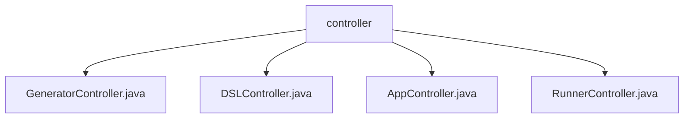

# 基础信息

|      |      |
|------|------|
| 名称 | controller |
| 编码语言 | .java |
| 代码路径 | spring-ai-alibaba/spring-ai-alibaba-graph/spring-ai-alibaba-graph-studio/src/main/java/com/alibaba/cloud/ai/controller |
| 包名 | spring-ai-alibaba.spring-ai-alibaba-graph.spring-ai-alibaba-graph-studio.src.main.java.com.alibaba.cloud.ai.controller |
| 概述说明 | GeneratorController管理生成器与适配器，DSLController协调适配器与保存器，AppController与AppDelegate交互，RunnerController管理Runner与AppSaver。 |

# 说明

## 概述
该代码模块是一个基于Spring框架的AI图形化开发平台，主要包含多个控制器类，用于管理生成器、DSL适配器、应用程序状态以及运行实例。每个控制器类都实现了特定的API接口，并通过依赖注入的方式与其他组件进行交互，确保系统的灵活性、可维护性和扩展性。模块的核心功能包括代码生成、DSL适配、应用状态管理以及运行实例的协调与保存。

## 主要业务场景
1. **代码生成与适配**：`GeneratorController`负责管理项目生成器、代码生成器和DSL适配器，支持根据模式、节点类型和方言获取相应的实例，确保生成器和适配器的灵活调用与配置。
2. **DSL适配与应用保存**：`DSLController`协调DSL适配器与应用保存器之间的交互，确保数据流和操作的高效执行，主要职责包括初始化适配器、处理应用状态以及调用保存器进行数据持久化。
3. **应用状态管理**：`AppController`通过实现`AppAPI`接口并与`AppDelegate`交互，负责应用状态的管理，增强了代码的可维护性和扩展性。
4. **运行实例管理**：`RunnerController`管理Runner列表和AppSaver实例，支持对Runner的增删改查操作，并与AppSaver实例交互，确保应用程序状态的保存和恢复，提升系统的整体运行效率和稳定性。

通过这些业务场景，该模块为AI图形化开发提供了一个高效、灵活且易于扩展的基础架构。

### 包内部结构视图

该流程图展示了在`spring-ai-alibaba-graph-studio`项目中的控制器层级结构。`controller`作为根节点，包含了四个子节点，分别是`GeneratorController.java`、`DSLController.java`、`AppController.java`和`RunnerController.java`。这些控制器类负责处理不同的业务逻辑，共同构成了该项目的控制器模块。

# 文件列表 File List

| 名称   | 类型  | 说明 |
|-------|------|-------------|
| [RunnerController.java](RunnerController.md) | file | RunnerController实现RunnerAPI，管理Runner列表和AppSaver实例。 |
| [GeneratorController.java](GeneratorController.md) | file | GeneratorController实现GeneratorAPI，管理项目、代码生成器和DSL适配器，支持按模式、节点类型和方言获取实例。 |
| [DSLController.java](DSLController.md) | file | DSL控制器类负责管理DSL适配器和应用保存器。 |
| [AppController.java](AppController.md) | file | AppController实现AppAPI，依赖注入AppDelegate。 |

