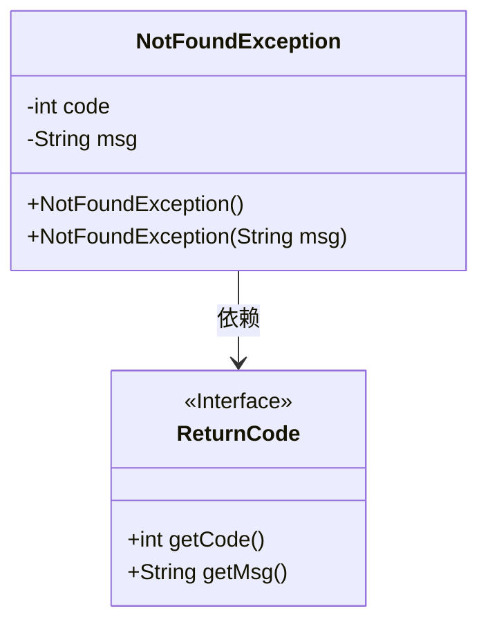
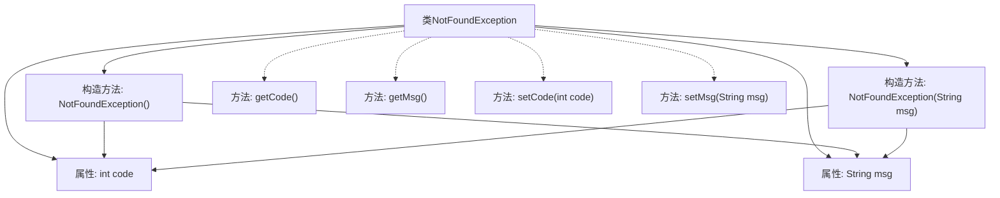

# 基础信息

|      |      |
|------|------|
| 名称 | NotFoundException |
| 编码语言 | .java |
| 代码路径 | spring-ai-alibaba/spring-ai-alibaba-graph/spring-ai-alibaba-graph-studio/src/main/java/com/alibaba/cloud/ai/exception/NotFoundException.java |
| 包名 | com.alibaba.cloud.ai.exception |
| 依赖项 | ['com.alibaba.cloud.ai.common.ReturnCode', 'lombok.Getter', 'lombok.Setter'] |
| 概述说明 | NotFoundException继承RuntimeException，默认404错误码及消息。 |

# 说明

NotFoundException类继承自RuntimeException类，主要用于处理未找到资源的异常情况。该类包含两个属性：code和msg，分别用于存储错误代码和错误信息。默认情况下，该类将错误码设置为404，并附带相应的错误消息，表示资源未找到。这种设计使得在捕获和处理此类异常时，能够快速识别问题类型，并进行相应的处理。

# 类列表 Class Summary

| 名称   | 类型  | 说明 |
|-------|------|-------------|
| NotFoundException | class | NotFoundException类继承RuntimeException，包含code和msg属性，默认设置404错误码及消息。 |

## 类 NotFoundException

|      |      |
|------|------|
| 访问范围 | @Getter;@Setter;public |
| 类型 | class |
| 名称 | NotFoundException |
| 说明 | NotFoundException类继承RuntimeException，包含code和msg属性，默认设置404错误码及消息。 |

### UML类图

**描述**：`NotFoundException` 是一个自定义异常类，继承自 `RuntimeException`。它包含两个私有成员变量 `code` 和 `msg`，分别表示错误代码和错误信息。该类有两个构造函数：一个默认构造函数，使用 `ReturnCode.RC404` 的代码和信息初始化；另一个构造函数允许自定义错误信息。`ReturnCode` 是一个接口，提供了获取代码和信息的方法。`NotFoundException` 依赖于 `ReturnCode` 接口来获取默认的错误代码和信息。

### 内部方法调用关系图

这段代码定义了一个名为 `NotFoundException` 的类，该类继承自 `RuntimeException`。类中包含两个属性：`code` 和 `msg`，分别表示错误代码和错误信息。类中提供了两个构造方法：一个无参构造方法，默认使用 `ReturnCode.RC404` 的代码和信息；另一个接受 `msg` 参数的构造方法，允许自定义错误信息。此外，类中通过注解 `@Getter` 和 `@Setter` 自动生成了 `getCode`、`getMsg`、`setCode` 和 `setMsg` 方法，用于访问和修改属性。

### 字段列表 Field List

| 名称  | 类型  | 说明 |
|-------|-------|------|
| code | int | 私有整型变量code。 |
| msg | String | 定义了一个私有的字符串变量msg。 |

### 方法列表 Method List

| 名称  | 类型  | 说明 |
|-------|-------|------|

