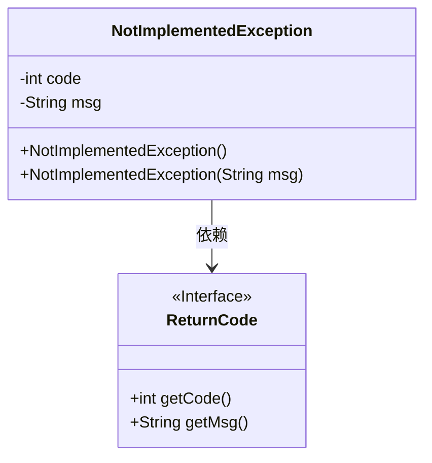
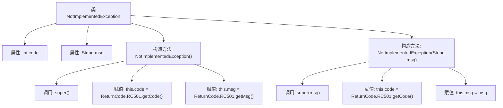

# 基础信息

|      |      |
|------|------|
| 名称 | NotImplementedException |
| 编码语言 | .java |
| 代码路径 | spring-ai-alibaba/spring-ai-alibaba-graph/spring-ai-alibaba-graph-studio/src/main/java/com/alibaba/cloud/ai/exception/NotImplementedException.java |
| 包名 | com.alibaba.cloud.ai.exception |
| 依赖项 | ['com.alibaba.cloud.ai.common.ReturnCode', 'lombok.Getter', 'lombok.Setter'] |
| 概述说明 | 未实现异常类，含代码和消息属性，支持默认和自定义消息构造。 |

# 说明

未实现异常类是一个自定义异常类，包含代码和消息两个属性。该类提供了两种构造函数：一种是默认构造函数，使用预设的默认消息；另一种是自定义构造函数，允许用户传入特定的消息内容。这种设计使得异常处理更加灵活，能够根据不同的场景提供具体的错误信息，便于开发者快速定位和解决问题。

# 类列表 Class Summary

| 名称   | 类型  | 说明 |
|-------|------|-------------|
| NotImplementedException | class | 未实现异常类，包含代码和消息属性，提供默认和自定义消息构造函数。 |

## 类 NotImplementedException

|      |      |
|------|------|
| 访问范围 | @Getter;@Setter;public |
| 类型 | class |
| 名称 | NotImplementedException |
| 说明 | 未实现异常类，包含代码和消息属性，提供默认和自定义消息构造函数。 |

### UML类图

这段代码定义了一个 `NotImplementedException` 类，它继承自 `RuntimeException`。该类包含两个私有成员变量 `code` 和 `msg`，并通过构造函数初始化这些变量。`NotImplementedException` 类依赖于 `ReturnCode` 接口来获取错误代码和消息。`ReturnCode` 接口提供了 `getCode` 和 `getMsg` 方法，用于返回错误代码和消息。这个类主要用于表示未实现的功能或操作的异常情况。

### 内部方法调用关系图

这段代码定义了一个名为 `NotImplementedException` 的异常类，继承自 `RuntimeException`。该类包含两个属性：`code` 和 `msg`，并提供了两个构造方法。第一个构造方法无参数，调用父类的无参构造方法，并初始化 `code` 和 `msg` 为 `ReturnCode.RC501` 的值。第二个构造方法接受一个 `msg` 参数，调用父类的带参构造方法，并初始化 `code` 为 `ReturnCode.RC501` 的值，`msg` 为传入的参数。代码使用了 Lombok 注解 `@Getter` 和 `@Setter` 自动生成 getter 和 setter 方法。

### 字段列表 Field List

| 名称  | 类型  | 说明 |
|-------|-------|------|
| msg | String | 声明一个私有字符串变量msg。 |
| code | int | 声明一个私有的整型变量code。 |

### 方法列表 Method List

| 名称  | 类型  | 说明 |
|-------|-------|------|

