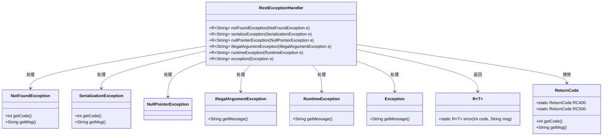

# 基础信息

|      |      |
|------|------|
| 名称 | RestExceptionHandler |
| 编码语言 | .java |
| 代码路径 | spring-ai-alibaba/spring-ai-alibaba-graph/spring-ai-alibaba-graph-studio/src/main/java/com/alibaba/cloud/ai/exception/RestExceptionHandler.java |
| 包名 | com.alibaba.cloud.ai.exception |
| 依赖项 | ['com.alibaba.cloud.ai.common.R', 'com.alibaba.cloud.ai.common.ReturnCode', 'lombok.extern.slf4j.Slf4j', 'org.springframework.web.bind.annotation.ExceptionHandler', 'org.springframework.web.bind.annotation.ResponseBody', 'org.springframework.web.bind.annotation.RestControllerAdvice'] |
| 概述说明 | RestExceptionHandler类负责处理多种异常并返回相应错误信息。 |

# 说明

RestExceptionHandler类负责处理多种异常情况，并在发生异常时返回相应的错误信息。该类的主要功能是捕获不同类型的异常，确保系统在遇到错误时能够提供清晰、准确的反馈，从而帮助开发者和用户更好地理解和解决问题。通过集中处理异常，RestExceptionHandler类提高了代码的可维护性和系统的稳定性。

# 类列表 Class Summary

| 名称   | 类型  | 说明 |
|-------|------|-------------|
| RestExceptionHandler | class | RestExceptionHandler类处理多种异常并返回错误信息。 |

## 类 RestExceptionHandler

|      |      |
|------|------|
| 访问范围 | @Slf4j;@RestControllerAdvice;@ResponseBody;public |
| 类型 | class |
| 名称 | RestExceptionHandler |
| 说明 | RestExceptionHandler类处理多种异常并返回错误信息。 |

### UML类图

这段代码定义了一个`RestExceptionHandler`类，用于处理不同类型的异常，并返回相应的错误响应。每个异常处理方法都会记录错误日志，并调用`R.error`方法生成错误响应。`R`是一个泛型类，用于封装错误码和错误信息。`ReturnCode`类提供了预定义的错误码和错误信息。`RestExceptionHandler`类依赖于多个异常类、`R`类和`ReturnCode`类来完成异常处理和错误响应生成。

### 内部方法调用关系图

这段代码定义了一个名为 `RestExceptionHandler` 的类，用于处理不同类型的异常。每个方法都通过 `@ExceptionHandler` 注解来捕获特定的异常类型，并在捕获到异常时记录错误日志，然后返回一个包含错误代码和错误信息的 `R<String>` 对象。流程图展示了类中各个方法的调用关系以及每个方法内部的步骤。

### 字段列表 Field List

| 名称  | 类型  | 说明 |
|-------|-------|------|

### 方法列表 Method List

| 名称  | 类型  | 说明 |
|-------|-------|------|
| runtimeException | R<String> | 处理RuntimeException异常，记录错误并返回500状态码及错误信息。 |
| illegalArgumentException | R<String> | 处理非法参数异常，记录错误并返回400状态码及错误信息。 |
| exception | R<String> | 处理未知异常，记录错误并返回500状态码。 |
| notFoundException | R<String> | 处理NotFoundException异常，记录错误并返回错误代码和消息。 |
| serializeException | R<String> | 处理序列化异常，记录错误并返回错误信息。 |
| nullPointerException | R<String> | 处理空指针异常，记录错误并返回400状态码及错误信息。 |

