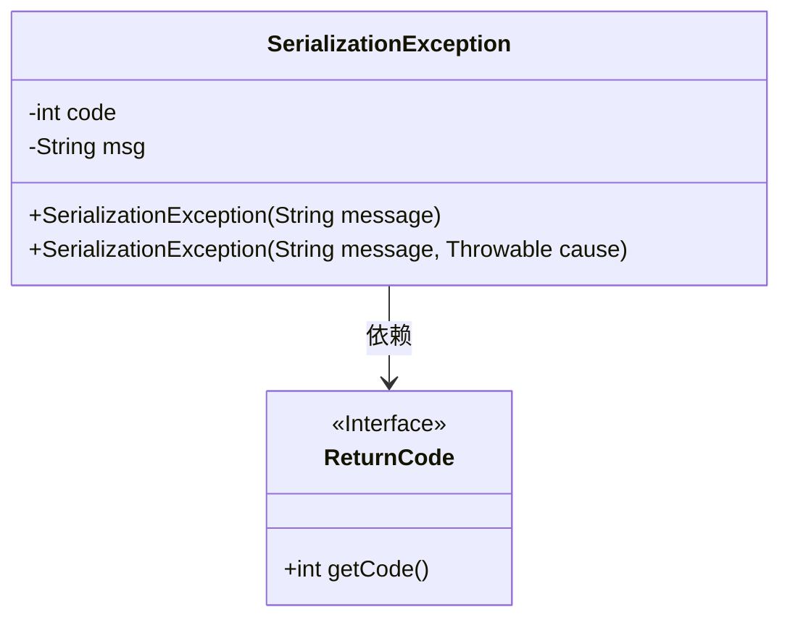
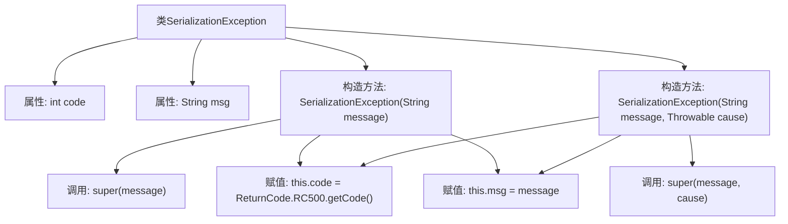

# 基础信息

|      |      |
|------|------|
| 名称 | SerializationException |
| 编码语言 | .java |
| 代码路径 | spring-ai-alibaba/spring-ai-alibaba-graph/spring-ai-alibaba-graph-studio/src/main/java/com/alibaba/cloud/ai/exception/SerializationException.java |
| 包名 | com.alibaba.cloud.ai.exception |
| 依赖项 | ['com.alibaba.cloud.ai.common.ReturnCode', 'lombok.Getter', 'lombok.Setter'] |
| 概述说明 | SerializationException继承RuntimeException，含code和msg属性，提供两个构造函数。 |

# 说明

SerializationException类继承自RuntimeException，具有code和msg两个属性。该类提供了两个构造函数，用于处理序列化过程中的异常情况。通过继承RuntimeException，SerializationException表示一种运行时异常，适用于在序列化操作中遇到的错误场景。code属性用于标识异常的具体类型或错误代码，而msg属性则提供详细的错误信息描述。这两个构造函数的实现使得在创建SerializationException实例时，可以根据需要传递不同的参数，以便更灵活地处理异常。

# 类列表 Class Summary

| 名称   | 类型  | 说明 |
|-------|------|-------------|
| SerializationException | class | SerializationException类继承RuntimeException，包含code和msg属性，提供两个构造函数。 |

## 类 SerializationException

|      |      |
|------|------|
| 访问范围 | @Getter;@Setter;public |
| 类型 | class |
| 名称 | SerializationException |
| 说明 | SerializationException类继承RuntimeException，包含code和msg属性，提供两个构造函数。 |

### UML类图

这段代码定义了一个 `SerializationException` 类，该类继承自 `RuntimeException`，用于处理序列化过程中可能出现的异常。`SerializationException` 类包含两个私有成员变量 `code` 和 `msg`，分别表示错误代码和错误信息。类中提供了两个构造函数，一个接受错误信息，另一个接受错误信息和异常原因。`ReturnCode` 是一个接口，提供了获取错误代码的方法。`SerializationException` 类依赖于 `ReturnCode` 接口来获取错误代码。

### 内部方法调用关系图

**描述：**
该流程图展示了`SerializationException`类的结构及其内部构造方法的行为。类包含两个属性`code`和`msg`，并有两个构造方法，分别接受`message`参数或`message`和`cause`参数。构造方法中调用了父类的构造方法，并初始化了`code`和`msg`属性。`code`属性通过`ReturnCode.RC500.getCode()`方法获取，`msg`属性直接赋值为传入的`message`参数。

### 字段列表 Field List

| 名称  | 类型  | 说明 |
|-------|-------|------|
| msg | String | 定义了一个私有的字符串变量msg。 |
| code | int | 定义一个私有整型变量code。 |

### 方法列表 Method List

| 名称  | 类型  | 说明 |
|-------|-------|------|

