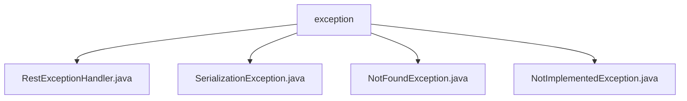

# 基础信息

|      |      |
|------|------|
| 名称 | exception |
| 编码语言 | .java |
| 代码路径 | spring-ai-alibaba/spring-ai-alibaba-graph/spring-ai-alibaba-graph-studio/src/main/java/com/alibaba/cloud/ai/exception |
| 包名 | spring-ai-alibaba.spring-ai-alibaba-graph.spring-ai-alibaba-graph-studio.src.main.java.com.alibaba.cloud.ai.exception |
| 概述说明 | RestExceptionHandler处理异常，SerializationException、NotFoundException、NotImplementedException继承RuntimeException，含code和msg属性。 |

# 说明

## 概述
该代码模块主要处理系统中的异常情况，提供了多种自定义异常类以及一个集中处理异常的类。通过这些异常类，系统能够在不同场景下捕获并处理特定的错误，确保系统在遇到问题时能够提供清晰、准确的反馈。`RestExceptionHandler` 类作为异常处理的中心，负责捕获并处理这些异常，返回相应的错误信息，从而提高系统的可维护性和稳定性。

## 主要业务场景
1. **异常集中处理**：`RestExceptionHandler` 类负责捕获和处理多种异常情况，确保系统在发生错误时能够返回适当的错误信息，帮助开发者和用户更好地理解和解决问题。
2. **序列化异常处理**：`SerializationException` 类用于处理序列化过程中可能出现的异常，通过 `code` 和 `msg` 属性提供具体的错误信息，便于在序列化操作中快速定位和解决问题。
3. **资源未找到异常处理**：`NotFoundException` 类专门用于处理未找到资源的异常情况，默认将错误码设置为 `404`，并附带相应的错误消息，便于快速识别和处理资源未找到的问题。
4. **未实现功能异常处理**：`NotImplementedException` 类用于处理未实现功能的异常情况，提供默认和自定义的构造函数，允许根据不同的场景提供具体的错误信息，便于开发者快速定位和解决问题。

### 包内部结构视图

该流程图展示了`exception`文件夹与其内部文件之间的层级关系。`exception`作为根节点，包含了四个异常处理类文件：`RestExceptionHandler.java`、`SerializationException.java`、`NotFoundException.java`和`NotImplementedException.java`。每个文件都是`exception`文件夹的直接子节点，清晰地反映了文件结构。

# 文件列表 File List

| 名称   | 类型  | 说明 |
|-------|------|-------------|
| [NotFoundException.java](NotFoundException.md) | file | NotFoundException继承RuntimeException，默认404错误码及消息。 |
| [NotImplementedException.java](NotImplementedException.md) | file | 未实现异常类，含代码和消息属性，支持默认和自定义消息构造。 |
| [SerializationException.java](SerializationException.md) | file | SerializationException继承RuntimeException，含code和msg属性，提供两个构造函数。 |
| [RestExceptionHandler.java](RestExceptionHandler.md) | file | RestExceptionHandler类负责处理多种异常并返回相应错误信息。 |

