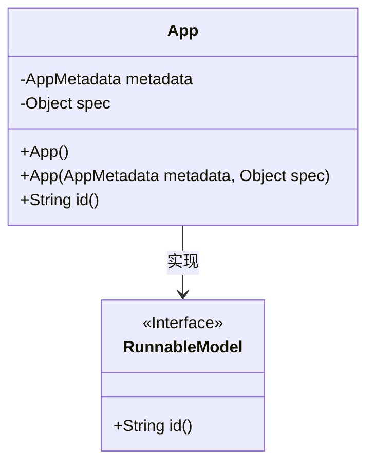
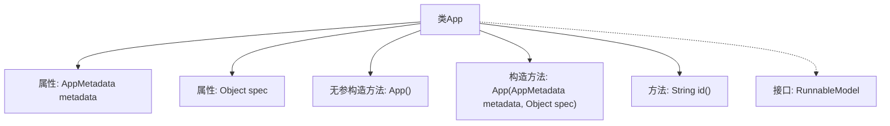

# 基础信息

|      |      |
|------|------|
| 名称 | App |
| 编码语言 | .java |
| 代码路径 | spring-ai-alibaba/spring-ai-alibaba-graph/spring-ai-alibaba-graph-studio/src/main/java/com/alibaba/cloud/ai/model/App.java |
| 包名 | com.alibaba.cloud.ai.model |
| 依赖项 | ['com.alibaba.cloud.ai.service.runner.RunnableModel', 'lombok.Data', 'lombok.NoArgsConstructor'] |
| 概述说明 | App类实现RunnableModel，含metadata和spec属性，提供构造和id方法。 |

# 说明

App类实现了RunnableModel接口，具备metadata和spec两个属性。该类提供了构造函数以及一个id方法，用于获取或生成唯一标识符。通过这些功能，App类能够有效地管理和操作其元数据和规格信息，确保在运行模型时具备必要的属性和方法支持。

# 类列表 Class Summary

| 名称   | 类型  | 说明 |
|-------|------|-------------|
| App | class | App类实现RunnableModel，包含metadata和spec属性，提供构造函数和id方法。 |

## 类 App

|      |      |
|------|------|
| 访问范围 | @Data;@NoArgsConstructor;public |
| 类型 | class |
| 名称 | App |
| 说明 | App类实现RunnableModel，包含metadata和spec属性，提供构造函数和id方法。 |

### UML类图

这段代码定义了一个 `App` 类，该类实现了 `RunnableModel` 接口。`App` 类包含两个私有成员变量：`metadata` 和 `spec`，分别表示应用的元数据和规范。类中提供了两个构造函数：一个无参构造函数和一个带有 `metadata` 和 `spec` 参数的构造函数。`App` 类还实现了 `RunnableModel` 接口中的 `id()` 方法，返回 `metadata` 的 ID。`RunnableModel` 是一个接口，定义了 `id()` 方法。

### 内部方法调用关系图

这段代码定义了一个名为 `App` 的类，该类实现了 `RunnableModel` 接口。`App` 类包含两个属性：`metadata` 和 `spec`，分别用于存储应用程序的元数据和具体实现。类中定义了两个构造方法，一个无参构造方法和一个带参数的构造方法，用于初始化这两个属性。此外，`App` 类还重写了 `id()` 方法，返回 `metadata` 的 `id`。流程图展示了类的结构及其方法之间的关系。

### 字段列表 Field List

| 名称  | 类型  | 说明 |
|-------|-------|------|
| metadata | AppMetadata | 定义私有AppMetadata类型变量metadata。 |
| spec | Object | 私有对象spec的声明。 |

### 方法列表 Method List

| 名称  | 类型  | 说明 |
|-------|-------|------|
| id | String | 重写id方法，返回metadata的id值。 |

