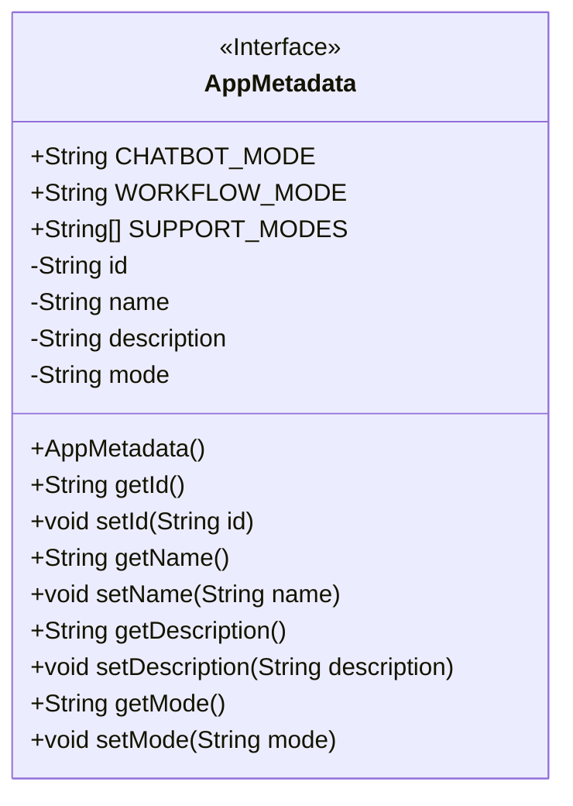
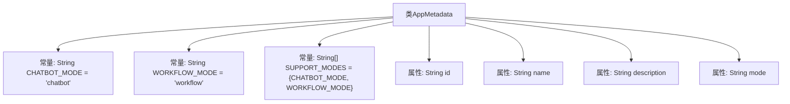

# 基础信息

|      |      |
|------|------|
| 名称 | AppMetadata |
| 编码语言 | .java |
| 代码路径 | spring-ai-alibaba/spring-ai-alibaba-graph/spring-ai-alibaba-graph-studio/src/main/java/com/alibaba/cloud/ai/model/AppMetadata.java |
| 包名 | com.alibaba.cloud.ai.model |
| 依赖项 | ['lombok.Data', 'lombok.experimental.Accessors'] |
| 概述说明 | AppMetadata类定义应用元数据，含ID、名称、描述和模式，支持聊天机器人和工作流。 |

# 说明

AppMetadata类用于定义应用的元数据，包含四个主要属性：ID、名称、描述和模式。该类支持两种模式，分别是聊天机器人和工作流，用于区分应用的不同使用场景和功能类型。

# 类列表 Class Summary

| 名称   | 类型  | 说明 |
|-------|------|-------------|
| AppMetadata | class | AppMetadata类定义应用元数据，包含ID、名称、描述和模式，支持聊天机器人和工作流两种模式。 |

## 类 AppMetadata

|      |      |
|------|------|
| 访问范围 | @Data;@Accessors(chain = true);public |
| 类型 | class |
| 名称 | AppMetadata |
| 说明 | AppMetadata类定义应用元数据，包含ID、名称、描述和模式，支持聊天机器人和工作流两种模式。 |

### UML类图

**描述：**  
`AppMetadata` 类是一个包含应用程序元数据的实体类，具有 `id`、`name`、`description` 和 `mode` 四个私有属性，并提供了相应的 `getter` 和 `setter` 方法。类中还定义了三个公共静态常量：`CHATBOT_MODE`、`WORKFLOW_MODE` 和 `SUPPORT_MODES`，用于表示支持的应用模式。该类使用了 `@Data` 和 `@Accessors(chain = true)` 注解，简化了代码的编写并支持链式调用。

### 内部方法调用关系图

这段代码定义了一个名为 `AppMetadata` 的类，该类包含两个静态常量 `CHATBOT_MODE` 和 `WORKFLOW_MODE`，以及一个静态数组 `SUPPORT_MODES`，用于存储支持的模式。类中还定义了四个私有属性：`id`、`name`、`description` 和 `mode`，用于存储应用程序的元数据。代码使用了 Lombok 的 `@Data` 注解，自动生成 getter、setter 等方法，并通过 `@Accessors(chain = true)` 注解支持链式调用。

### 字段列表 Field List

| 名称  | 类型  | 说明 |
|-------|-------|------|
| WORKFLOW_MODE = "workflow" | String | 定义常量WORKFLOW_MODE，值为"workflow"。 |
| name | String | 声明了一个私有字符串变量name。 |
| id | String | 定义了一个私有字符串类型的变量id。 |
| mode | String | 定义私有字符串变量mode。 |
| CHATBOT_MODE = "chatbot" | String | 定义常量CHATBOT_MODE，值为"chatbot"。 |
| description | String | 私有字符串变量描述。 |
| SUPPORT_MODES = { CHATBOT_MODE, WORKFLOW_MODE } | String[] | 定义支持模式为聊天机器人和工作流两种。 |

### 方法列表 Method List

| 名称  | 类型  | 说明 |
|-------|-------|------|

