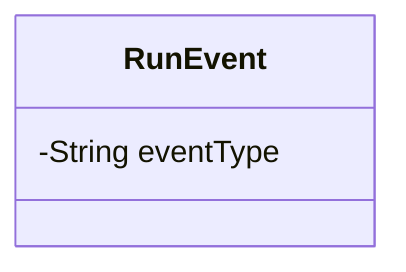
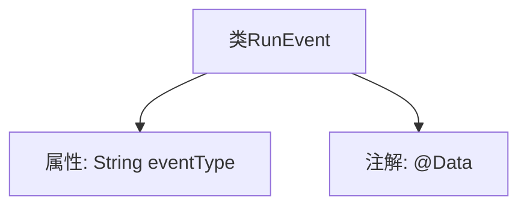

# 基础信息

|      |      |
|------|------|
| 名称 | RunEvent |
| 编码语言 | .java |
| 代码路径 | spring-ai-alibaba/spring-ai-alibaba-graph/spring-ai-alibaba-graph-studio/src/main/java/com/alibaba/cloud/ai/model/RunEvent.java |
| 包名 | com.alibaba.cloud.ai.model |
| 依赖项 | ['lombok.Data'] |
| 概述说明 | RunEvent类包含私有字符串字段eventType。 |

# 说明

RunEvent类包含一个私有字符串类型的eventType字段，该字段用于存储事件类型信息。

# 类列表 Class Summary

| 名称   | 类型  | 说明 |
|-------|------|-------------|
| RunEvent | class | RunEvent类包含一个私有字符串类型的eventType字段。 |

## 类 RunEvent

|      |      |
|------|------|
| 访问范围 | @Data;public |
| 类型 | class |
| 名称 | RunEvent |
| 说明 | RunEvent类包含一个私有字符串类型的eventType字段。 |

### UML类图

这段代码定义了一个名为 `RunEvent` 的类，其中包含一个私有成员变量 `eventType`，类型为 `String`。该类使用了 `@Data` 注解，通常这意味着该类会自动生成 `getter`、`setter`、`toString`、`equals` 和 `hashCode` 等方法，但在此类图中未显示这些方法。`RunEvent` 类的主要作用是封装一个事件类型，可能用于表示某种运行事件的相关信息。

### 内部方法调用关系图

这段代码定义了一个名为 `RunEvent` 的类，其中包含一个私有属性 `eventType`，并使用 `@Data` 注解来自动生成 getter、setter、toString 等方法。`@Data` 注解通常用于简化代码，减少手动编写样板代码的工作量。

### 字段列表 Field List

| 名称  | 类型  | 说明 |
|-------|-------|------|
| eventType | String | 事件类型字段定义。 |

### 方法列表 Method List

| 名称  | 类型  | 说明 |
|-------|-------|------|

