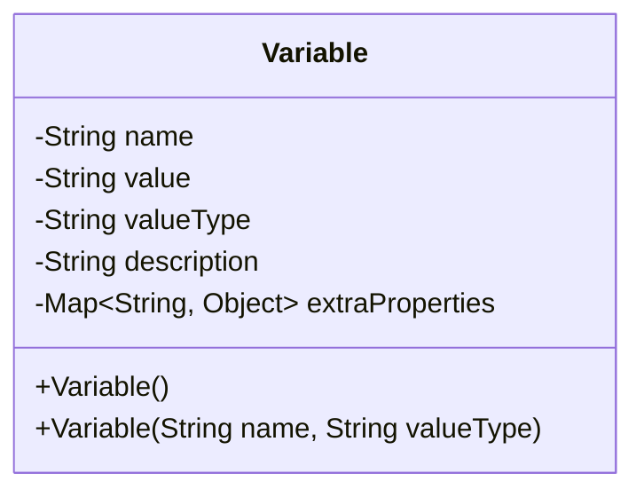
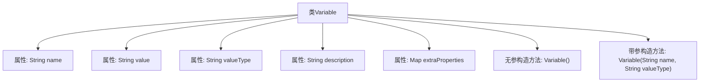

# 基础信息

|      |      |
|------|------|
| 名称 | Variable |
| 编码语言 | .java |
| 代码路径 | spring-ai-alibaba/spring-ai-alibaba-graph/spring-ai-alibaba-graph-studio/src/main/java/com/alibaba/cloud/ai/model/Variable.java |
| 包名 | com.alibaba.cloud.ai.model |
| 依赖项 | ['lombok.Data', 'lombok.NoArgsConstructor', 'java.util.Map'] |
| 概述说明 | 变量类包含名称、值、类型、描述及属性，构造函数需名称和类型。 |

# 说明

变量类包含五个主要属性：名称、值、值类型、描述和额外属性。构造函数需要两个参数：名称和值类型。名称用于标识变量，值用于存储具体数据，值类型指定数据的类型，描述提供变量的详细说明，额外属性用于存储其他相关信息。构造函数通过名称和值类型初始化变量实例。

# 类列表 Class Summary

| 名称   | 类型  | 说明 |
|-------|------|-------------|
| Variable | class | 变量类包含名称、值、值类型、描述和额外属性，构造函数需名称和值类型。 |

## 类 Variable

|      |      |
|------|------|
| 访问范围 | @Data;@NoArgsConstructor;public |
| 类型 | class |
| 名称 | Variable |
| 说明 | 变量类包含名称、值、值类型、描述和额外属性，构造函数需名称和值类型。 |

### UML类图

**描述**：  
`Variable` 类用于表示一个变量，包含变量的名称、值、值类型、描述以及额外的属性。类提供了两个构造函数，一个无参构造函数和一个带有名称和值类型的构造函数。类中的成员变量均为私有，确保了封装性。`extraProperties` 是一个泛型映射，用于存储额外的属性信息。

### 内部方法调用关系图

这段代码定义了一个名为 `Variable` 的类，包含了五个属性：`name`、`value`、`valueType`、`description` 和 `extraProperties`。类中提供了两个构造方法，一个无参构造方法和一个带参构造方法，后者仅需要 `name` 和 `valueType` 作为参数。代码通过 Lombok 注解 `@Data` 和 `@NoArgsConstructor` 自动生成了 getter、setter、toString 等方法以及无参构造方法。

### 字段列表 Field List

| 名称  | 类型  | 说明 |
|-------|-------|------|
| name | String | 声明一个私有字符串类型变量name。 |
| description | String | 私有字符串类型变量描述。 |
| value | String | 声明一个私有的字符串类型变量value。 |
| valueType | String | 定义私有字符串类型变量valueType。 |
| extraProperties | Map<String, Object> | 私有映射存储额外属性。 |

### 方法列表 Method List

| 名称  | 类型  | 说明 |
|-------|-------|------|

