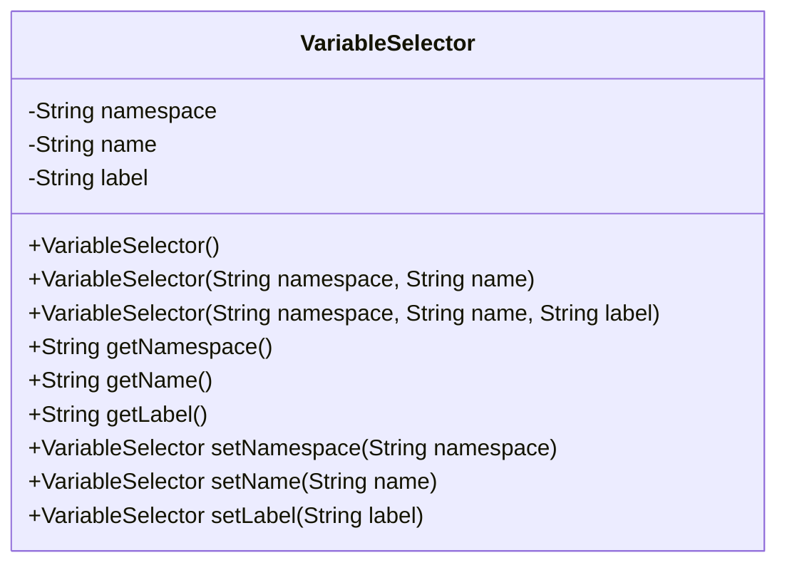
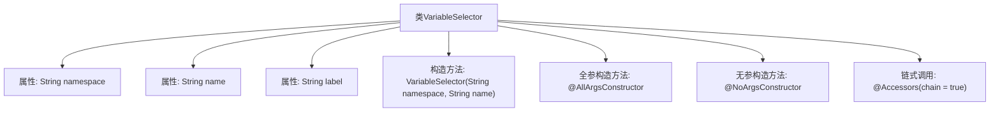

# 基础信息

|      |      |
|------|------|
| 名称 | VariableSelector |
| 编码语言 | .java |
| 代码路径 | spring-ai-alibaba/spring-ai-alibaba-graph/spring-ai-alibaba-graph-studio/src/main/java/com/alibaba/cloud/ai/model/VariableSelector.java |
| 包名 | com.alibaba.cloud.ai.model |
| 依赖项 | ['lombok.AllArgsConstructor', 'lombok.Data', 'lombok.NoArgsConstructor', 'lombok.experimental.Accessors'] |
| 概述说明 | VariableSelector类有namespace、name、label属性，构造器需namespace和name。 |

# 说明

VariableSelector类具有三个主要属性：namespace、name和label。其中，namespace和name是必填项，而label是可选的。该类的构造器需要接收namespace和name两个参数，用于初始化相应的属性。这一设计使得VariableSelector类能够有效地管理和标识变量，确保在复杂的命名空间中准确地定位和区分不同的变量。

# 类列表 Class Summary

| 名称   | 类型  | 说明 |
|-------|------|-------------|
| VariableSelector | class | VariableSelector类包含namespace、name和label属性，构造器需namespace和name。 |

## 类 VariableSelector

|      |      |
|------|------|
| 访问范围 | @Data;@Accessors(chain = true);@AllArgsConstructor;@NoArgsConstructor;public |
| 类型 | class |
| 名称 | VariableSelector |
| 说明 | VariableSelector类包含namespace、name和label属性，构造器需namespace和name。 |

### UML类图

**描述：**  
`VariableSelector` 类用于表示变量的选择器，包含命名空间、名称和标签三个属性。类提供了无参构造器、部分参数构造器和全参数构造器，并通过链式调用方法设置属性。命名空间和名称是必需的，标签为可选属性。

### 内部方法调用关系图

这段代码定义了一个名为 `VariableSelector` 的类，包含三个属性：`namespace`、`name` 和 `label`。类中提供了两个构造方法：一个接受 `namespace` 和 `name` 的构造方法，以及一个全参构造方法和一个无参构造方法。通过 `@Accessors(chain = true)` 注解，类支持链式调用。代码结构清晰，适合用于变量选择器的场景。

### 字段列表 Field List

| 名称  | 类型  | 说明 |
|-------|-------|------|
| name | String | 定义了一个私有的字符串类型变量name。 |
| label | String | 定义了一个私有字符串变量label。 |
| namespace | String | 定义了一个私有字符串变量`namespace`。 |

### 方法列表 Method List

| 名称  | 类型  | 说明 |
|-------|-------|------|

