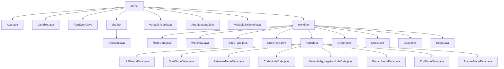

# 基础信息

|      |      |
|------|------|
| 名称 | model |
| 编码语言 | .java |
| 代码路径 | spring-ai-alibaba/spring-ai-alibaba-graph/spring-ai-alibaba-graph-studio/src/main/java/com/alibaba/cloud/ai/model |
| 包名 | spring-ai-alibaba.spring-ai-alibaba-graph.spring-ai-alibaba-graph-studio.src.main.java.com.alibaba.cloud.ai.model |
| 概述说明 | Spring框架AI工作流管理系统，支持节点数据、工作流执行、图结构管理及复杂任务处理。 |

# 说明

## 概述

该代码模块是一个基于Spring框架的AI工作流管理系统，主要用于管理和处理不同类型节点的数据。模块中的核心类包括`App`、`Variable`、`RunEvent`、`ChatBot`、`AppMetadata`、`VariableSelector`等，这些类共同协作，支持工作流的定义、执行和管理。模块通过维护节点间的数据传递、工作流变量和环境变量，确保工作流能够按照预定的逻辑和条件顺利执行。此外，模块还提供了灵活的节点设计和丰富的功能支持，能够高效地处理复杂的工作流任务，适用于多种AI应用场景。

## 主要业务场景

1. **应用管理与元数据处理**：`App`类实现了`RunnableModel`接口，具备`metadata`和`spec`两个属性，用于管理和操作应用的元数据和规格信息，确保在运行模型时具备必要的属性和方法支持。`AppMetadata`类用于定义应用的元数据，包含ID、名称、描述和模式等属性，支持聊天机器人和工作流两种模式，区分应用的不同使用场景和功能类型。

2. **变量管理**：`Variable`类包含名称、值、值类型、描述和额外属性等主要属性，用于标识和存储具体数据，支持通过构造函数初始化变量实例。`VariableSelector`类用于管理和标识变量，包含`namespace`、`name`和`label`三个属性，确保在复杂的命名空间中准确地定位和区分不同的变量。

3. **事件处理**：`RunEvent`类包含一个`eventType`字段，用于存储事件类型信息，支持在运行过程中处理和记录不同类型的事件。

4. **聊天机器人功能**：`ChatBot`类是一个公共类，表明它与聊天机器人或对话系统相关，用于定义应用程序的核心功能或服务，以便在不同的上下文中复用。

5. **工作流管理**：该模块还包含一系列与工作流相关的类，如`NodeData`、`Workflow`、`Graph`、`Node`、`Edge`和`Case`等，支持工作流的定义、执行和管理。通过维护节点间的数据传递、工作流变量和环境变量，确保工作流能够按照预定的逻辑和条件顺利执行。

该模块通过灵活的节点设计和丰富的功能支持，能够高效地处理复杂的工作流任务，适用于多种AI应用场景。

### 包内部结构视图

该流程图展示了 `spring-ai-alibaba-graph-studio` 项目中 `model` 目录下的文件结构。`model` 包含多个文件和子目录，如 `chatbot` 和 `workflow`。`workflow` 目录下进一步分为 `nodedata` 和其他相关文件，每个节点代表一个具体的文件或子目录，清晰地展示了层级关系。

# 文件列表 File List

| 名称   | 类型  | 说明 |
|-------|------|-------------|
| [AppMetadata.java](AppMetadata.md) | file | AppMetadata类定义应用元数据，含ID、名称、描述和模式，支持聊天机器人和工作流。 |
| [VariableType.java](VariableType.md) | file | 无内容提供，无法生成概要描述。 |
| [RunEvent.java](RunEvent.md) | file | RunEvent类包含私有字符串字段eventType。 |
| [App.java](App.md) | file | App类实现RunnableModel，含metadata和spec属性，提供构造和id方法。 |
| [VariableSelector.java](VariableSelector.md) | file | VariableSelector类有namespace、name、label属性，构造器需namespace和name。 |
| [Variable.java](Variable.md) | file | 变量类包含名称、值、类型、描述及属性，构造函数需名称和类型。 |
| [workflow](workflow/_module.md) | package | Spring框架的AI工作流管理系统，管理节点数据与执行流程。 |
| [chatbot](chatbot/_module.md) | package | 定义了一个名为ChatBot的公共类。 |

