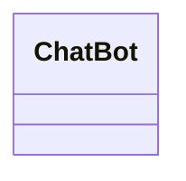
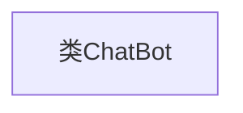

# 基础信息

|      |      |
|------|------|
| 名称 | ChatBot |
| 编码语言 | .java |
| 代码路径 | spring-ai-alibaba/spring-ai-alibaba-graph/spring-ai-alibaba-graph-studio/src/main/java/com/alibaba/cloud/ai/model/chatbot/ChatBot.java |
| 包名 | com.alibaba.cloud.ai.model.chatbot |
| 依赖项 | [] |
| 概述说明 | 定义了一个名为ChatBot的公共类。 |

# 说明

定义了一个名为ChatBot的公共类。这个类是公开的，意味着它可以被其他类或模块访问和使用。类的名称ChatBot表明它可能与聊天机器人或对话系统相关。公共类通常用于定义应用程序的核心功能或服务，以便在不同的上下文中复用。这个定义是面向对象编程的基础，为后续的属性和方法的实现提供了框架。

# 类列表 Class Summary

| 名称   | 类型  | 说明 |
|-------|------|-------------|
| ChatBot | class | 定义了一个名为ChatBot的公共类。 |

## 类 ChatBot

|      |      |
|------|------|
| 访问范围 | public |
| 类型 | class |
| 名称 | ChatBot |
| 说明 | 定义了一个名为ChatBot的公共类。 |

### UML类图

这段代码定义了一个名为 `ChatBot` 的类，目前该类没有任何成员变量或方法。这是一个简单的空类，可能作为后续功能扩展的基础。`ChatBot` 类可以被视为一个聊天机器人的骨架，未来可以通过添加方法和属性来实现具体的功能，如处理用户输入、生成响应等。这个类为后续的开发提供了一个清晰的起点。

### 内部方法调用关系图

该流程图展示了一个简单的类结构，即 `ChatBot` 类。由于代码中未定义任何属性或方法，因此流程图中仅包含一个节点，表示类的声明。这个类目前是一个空类，没有具体的功能或行为，后续可以根据需求添加属性和方法来扩展其功能。

### 字段列表 Field List

| 名称  | 类型  | 说明 |
|-------|-------|------|

### 方法列表 Method List

| 名称  | 类型  | 说明 |
|-------|-------|------|

