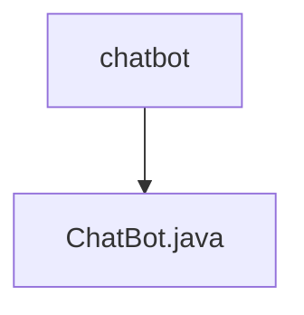

# 基础信息

|      |      |
|------|------|
| 名称 | chatbot |
| 编码语言 | .java |
| 代码路径 | spring-ai-alibaba/spring-ai-alibaba-graph/spring-ai-alibaba-graph-studio/src/main/java/com/alibaba/cloud/ai/model/chatbot |
| 包名 | spring-ai-alibaba.spring-ai-alibaba-graph.spring-ai-alibaba-graph-studio.src.main.java.com.alibaba.cloud.ai.model.chatbot |
| 概述说明 | 定义了一个名为ChatBot的公共类。 |

# 说明

定义了一个名为ChatBot的公共类。这个类是公开的，意味着它可以被其他类或模块访问和使用。类的名称ChatBot表明它可能与聊天机器人或对话系统相关。公共类通常用于定义应用程序的核心功能或服务，以便在不同的上下文中复用。这个定义是面向对象编程的基础，为后续的属性和方法的实现提供了框架。

### 包内部结构视图

该流程图展示了`chatbot`文件夹与其包含的`ChatBot.java`文件之间的层级关系。`chatbot`是顶层文件夹，而`ChatBot.java`是其子文件。

# 文件列表 File List

| 名称   | 类型  | 说明 |
|-------|------|-------------|
| [ChatBot.java](ChatBot.md) | file | 定义了一个名为ChatBot的公共类。 |

