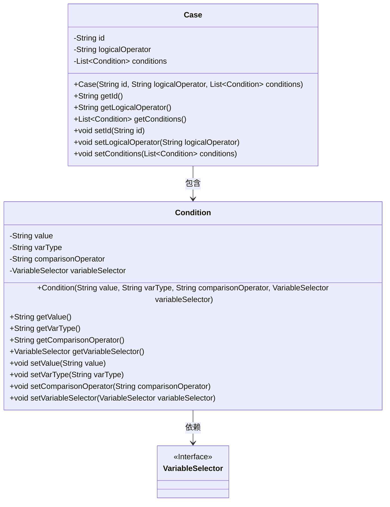
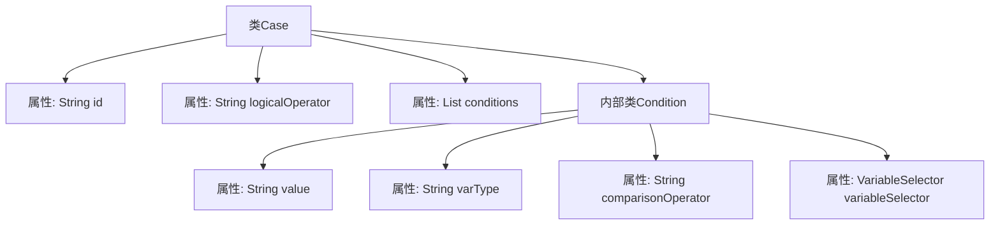

# 基础信息

|      |      |
|------|------|
| 名称 | Case |
| 编码语言 | .java |
| 代码路径 | spring-ai-alibaba/spring-ai-alibaba-graph/spring-ai-alibaba-graph-studio/src/main/java/com/alibaba/cloud/ai/model/workflow/Case.java |
| 包名 | com.alibaba.cloud.ai.model.workflow |
| 依赖项 | ['com.alibaba.cloud.ai.model.VariableSelector', 'lombok.Data', 'lombok.experimental.Accessors', 'java.util.List'] |
| 概述说明 | Case类含ID、逻辑运算符和条件列表，条件包括值、类型、比较运算符和选择器。 |

# 说明

Case类是一个数据结构，包含三个主要属性：ID、逻辑运算符和条件列表。ID用于唯一标识该Case实例。逻辑运算符用于定义多个条件之间的逻辑关系，如“与”或“或”。条件列表由多个条件组成，每个条件包含四个要素：值、变量类型、比较运算符和变量选择器。值表示条件的比较基准，变量类型指定变量的数据类型，比较运算符用于定义比较方式，变量选择器用于确定参与比较的具体变量。

# 类列表 Class Summary

| 名称   | 类型  | 说明 |
|-------|------|-------------|
| Case | class | Case类包含ID、逻辑运算符和条件列表，每个条件有值、变量类型、比较运算符和变量选择器。 |

## 类 Case

|      |      |
|------|------|
| 访问范围 | @Data;@Accessors(chain = true);public |
| 类型 | class |
| 名称 | Case |
| 说明 | Case类包含ID、逻辑运算符和条件列表，每个条件有值、变量类型、比较运算符和变量选择器。 |

### UML类图

### 描述
这段代码定义了一个`Case`类，其中包含一个内部静态类`Condition`。`Case`类有三个私有字段：`id`、`logicalOperator`和`conditions`，其中`conditions`是一个`Condition`对象的列表。`Condition`类有四个私有字段：`value`、`varType`、`comparisonOperator`和`variableSelector`，其中`variableSelector`是一个接口类型。`Case`类通过`conditions`字段与`Condition`类建立了包含关系，而`Condition`类通过`variableSelector`字段依赖于`VariableSelector`接口。

### 内部方法调用关系图

这段代码定义了一个名为 `Case` 的类，该类包含三个属性：`id`、`logicalOperator` 和 `conditions`。其中，`conditions` 是一个 `Condition` 类型的列表。`Condition` 是一个内部类，包含四个属性：`value`、`varType`、`comparisonOperator` 和 `variableSelector`。这些属性用于描述条件的详细信息。`Case` 类和 `Condition` 类都使用了 `@Data` 和 `@Accessors(chain=true)` 注解，表明它们会自动生成 getter、setter 和链式调用方法。

### 字段列表 Field List

| 名称  | 类型  | 说明 |
|-------|-------|------|
| conditions | List<Condition> | 私有条件列表变量conditions。 |
| logicalOperator | String | 定义私有字符串变量logicalOperator。 |
| id | String | 定义一个私有字符串类型的变量id。 |

### 方法列表 Method List

| 名称  | 类型  | 说明 |
|-------|-------|------|

