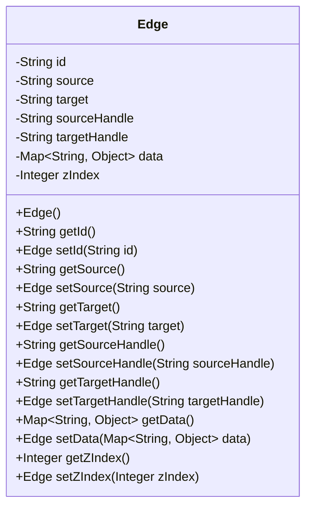
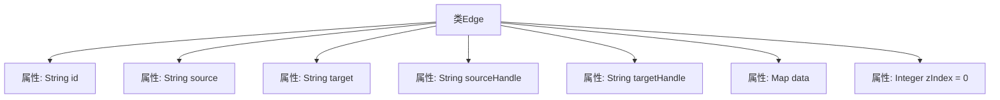

# 基础信息

|      |      |
|------|------|
| 名称 | Edge |
| 编码语言 | .java |
| 代码路径 | spring-ai-alibaba/spring-ai-alibaba-graph/spring-ai-alibaba-graph-studio/src/main/java/com/alibaba/cloud/ai/model/workflow/Edge.java |
| 包名 | com.alibaba.cloud.ai.model.workflow |
| 依赖项 | ['lombok.Data', 'lombok.experimental.Accessors', 'java.util.List', 'java.util.Map'] |
| 概述说明 | Edge类包含ID、源、目标、句柄、数据和层级属性。 |

# 说明

Edge类是一个用于表示边的数据结构，包含多个关键属性。ID属性用于唯一标识每条边。源属性和目标属性分别表示边的起始节点和终止节点。源句柄和目标句柄用于精确指定边在节点上的连接点。数据属性用于存储与边相关的附加信息。zIndex属性用于控制边的显示层级，确保在可视化时边按正确的顺序呈现。这些属性共同构成了Edge类的完整定义，使其能够灵活地表示和处理图中的边关系。

# 类列表 Class Summary

| 名称   | 类型  | 说明 |
|-------|------|-------------|
| Edge | class | Edge类包含ID、源、目标、源句柄、目标句柄、数据和zIndex属性。 |

## 类 Edge

|      |      |
|------|------|
| 访问范围 | @Data;@Accessors(chain = true);public |
| 类型 | class |
| 名称 | Edge |
| 说明 | Edge类包含ID、源、目标、源句柄、目标句柄、数据和zIndex属性。 |

### UML类图

### 描述
`Edge`类是一个用于表示边的数据结构，包含边的唯一标识符`id`、源节点`source`、目标节点`target`、源节点句柄`sourceHandle`、目标节点句柄`targetHandle`、数据`data`以及层级索引`zIndex`。该类使用了链式调用（`@Accessors(chain = true)`），使得设置属性时可以连续调用。`data`属性是一个键值对映射，用于存储边的附加信息。`zIndex`属性用于控制边的显示层级，默认值为0。

### 内部方法调用关系图

这段代码定义了一个名为 `Edge` 的类，包含了多个属性，如 `id`、`source`、`target`、`sourceHandle`、`targetHandle`、`data` 和 `zIndex`。这些属性用于描述图中的边，包括边的唯一标识、起点、终点、起点和终点的句柄、附加数据以及边的层级索引。类使用了 `@Data` 和 `@Accessors(chain = true)` 注解，自动生成 getter 和 setter 方法，并支持链式调用。

### 字段列表 Field List

| 名称  | 类型  | 说明 |
|-------|-------|------|
| source | String | 定义私有字符串变量source。 |
| targetHandle | String | 定义私有字符串变量targetHandle。 |
| data | Map<String, Object> | 定义一个私有Map变量，键为String，值为Object。 |
| zIndex = 0 | Integer | 私有整型变量zIndex初始值为0。 |
| sourceHandle | String | 定义了一个私有字符串变量sourceHandle。 |
| target | String | 定义了一个私有字符串变量target。 |
| id | String | 定义私有字符串类型变量id。 |

### 方法列表 Method List

| 名称  | 类型  | 说明 |
|-------|-------|------|

