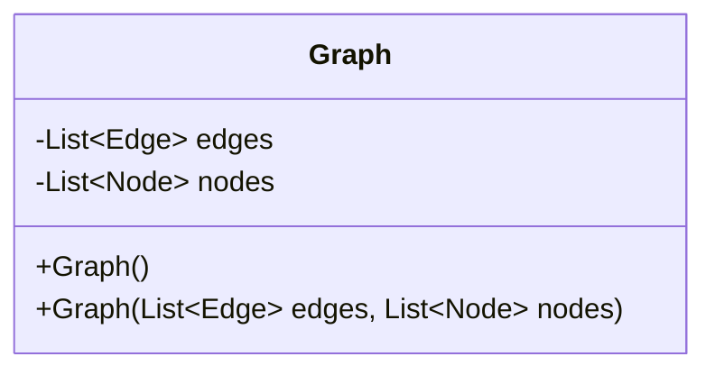
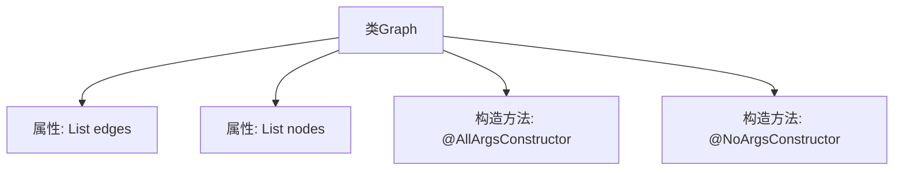

# 基础信息

|      |      |
|------|------|
| 名称 | Graph |
| 编码语言 | .java |
| 代码路径 | spring-ai-alibaba/spring-ai-alibaba-graph/spring-ai-alibaba-graph-studio/src/main/java/com/alibaba/cloud/ai/model/workflow/Graph.java |
| 包名 | com.alibaba.cloud.ai.model.workflow |
| 依赖项 | ['lombok.AllArgsConstructor', 'lombok.Data', 'lombok.NoArgsConstructor', 'java.util.List'] |
| 概述说明 | Graph类包含边和节点列表，支持全参和无参构造。 |

# 说明

Graph类是一个包含边和节点列表的数据结构，提供了两种构造方法：全参构造方法和无参构造方法。全参构造方法允许在创建Graph对象时直接传入边和节点列表，而无参构造方法则创建一个空的Graph对象，允许后续动态添加边和节点。这种设计使得Graph类既可以在初始化时完全配置，也可以在运行时逐步构建，提供了灵活性和便利性。

# 类列表 Class Summary

| 名称   | 类型  | 说明 |
|-------|------|-------------|
| Graph | class | Graph类包含边和节点列表，提供全参和无参构造方法。 |

## 类 Graph

|      |      |
|------|------|
| 访问范围 | @Data;@AllArgsConstructor;@NoArgsConstructor;public |
| 类型 | class |
| 名称 | Graph |
| 说明 | Graph类包含边和节点列表，提供全参和无参构造方法。 |

### UML类图

**描述**：  
`Graph` 类表示一个图结构，包含两个私有成员变量：`edges` 和 `nodes`，分别用于存储图的边和节点。该类提供了两个构造函数：一个无参构造函数和一个全参构造函数，用于初始化图的边和节点。通过这两个构造函数，可以灵活地创建图对象，并对其进行操作。

### 内部方法调用关系图

这段代码定义了一个名为 `Graph` 的类，该类包含两个属性：`edges` 和 `nodes`，分别表示图中的边和节点。类使用了 Lombok 注解 `@Data` 来自动生成 getter、setter、toString 等方法，`@AllArgsConstructor` 生成全参构造函数，`@NoArgsConstructor` 生成无参构造函数。流程图展示了类的基本结构及其属性和构造方法之间的关系。

### 字段列表 Field List

| 名称  | 类型  | 说明 |
|-------|-------|------|
| nodes | List<Node> | 私有节点列表声明。 |
| edges | List<Edge> | 私有边缘列表变量edges。 |

### 方法列表 Method List

| 名称  | 类型  | 说明 |
|-------|-------|------|

