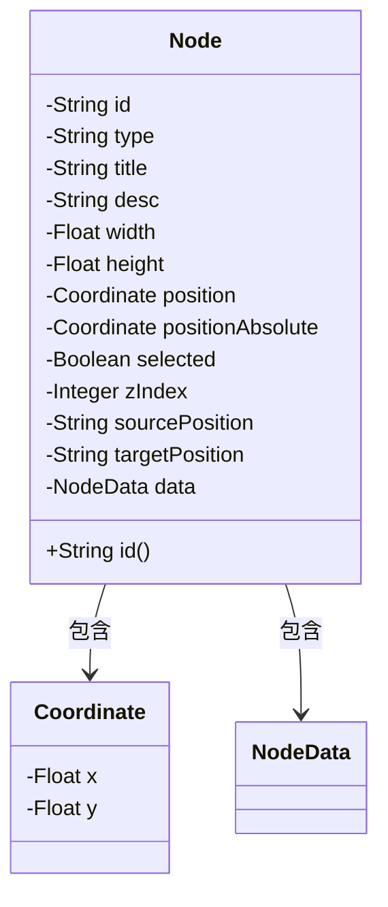
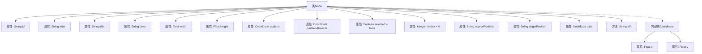

# 基础信息

|      |      |
|------|------|
| 名称 | Node |
| 编码语言 | .java |
| 代码路径 | spring-ai-alibaba/spring-ai-alibaba-graph/spring-ai-alibaba-graph-studio/src/main/java/com/alibaba/cloud/ai/model/workflow/Node.java |
| 包名 | com.alibaba.cloud.ai.model.workflow |
| 依赖项 | ['com.alibaba.cloud.ai.service.runner.RunnableModel', 'lombok.Data', 'lombok.experimental.Accessors'] |
| 概述说明 | Node类实现RunnableModel，含ID、类型、标题，支持链式访问。 |

# 说明

Node类实现了RunnableModel接口，具备ID、类型、标题等核心属性。该类支持链式访问，允许通过连续调用方法进行操作，提升了代码的可读性和编写效率。通过实现RunnableModel，Node类具备了运行模型的能力，适用于需要执行特定任务的场景。

# 类列表 Class Summary

| 名称   | 类型  | 说明 |
|-------|------|-------------|
| Node | class | Node类实现RunnableModel，包含ID、类型、标题等属性，支持链式访问。 |

## 类 Node

|      |      |
|------|------|
| 访问范围 | @Data;@Accessors(chain = true);public |
| 类型 | class |
| 名称 | Node |
| 说明 | Node类实现RunnableModel，包含ID、类型、标题等属性，支持链式访问。 |

### UML类图

类图描述：
`Node` 类实现了 `RunnableModel` 接口，包含多个属性如 `id`、`type`、`title` 等，以及一个内部类 `Coordinate` 用于表示坐标信息。`Node` 类还包含一个 `NodeData` 类型的属性 `data`，用于存储节点的数据。`Coordinate` 类包含 `x` 和 `y` 两个浮点型属性，用于表示坐标值。整体结构展示了 `Node` 类与其内部类 `Coordinate` 和 `NodeData` 之间的关系。

### 内部方法调用关系图

该流程图展示了`Node`类的结构及其内部类`Coordinate`的关系。`Node`类包含多个属性，如`id`、`type`、`title`等，以及一个用于返回`id`的方法`id()`。`Coordinate`类是`Node`的内部类，包含`x`和`y`两个属性，用于表示坐标信息。流程图清晰地展示了类与属性、方法之间的层级关系，帮助理解代码的结构和功能。

### 字段列表 Field List

| 名称  | 类型  | 说明 |
|-------|-------|------|
| id | String | 定义一个私有字符串类型的变量id。 |
| title | String | 声明一个私有的字符串类型变量title。 |
| width | Float | 声明一个私有的浮点型变量width。 |
| targetPosition | String | 定义私有字符串变量targetPosition。 |
| height | Float | 定义私有浮点型变量height。 |
| positionAbsolute | Coordinate | 私有绝对坐标变量声明。 |
| desc | String | 描述字段用于存储私有字符串信息。 |
| data | NodeData | 私有NodeData类型变量data。 |
| sourcePosition | String | 私有字符串变量sourcePosition。 |
| selected = false | Boolean | 私有布尔变量selected初始值为false。 |
| zIndex = 0 | Integer | 私有整型变量zIndex初始值为0。 |
| type | String | 定义私有字符串类型变量type。 |
| position | Coordinate | 定义了一个私有的坐标位置变量。 |

### 方法列表 Method List

| 名称  | 类型  | 说明 |
|-------|-------|------|
| id | String | 重写id方法，返回id变量值。 |

