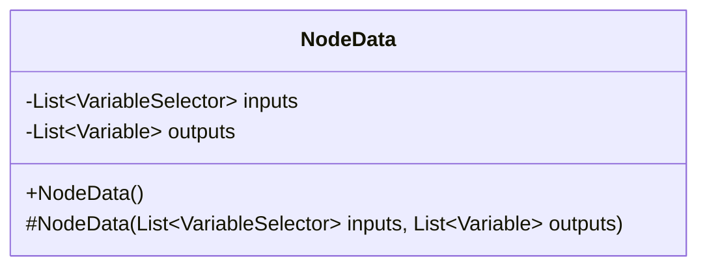
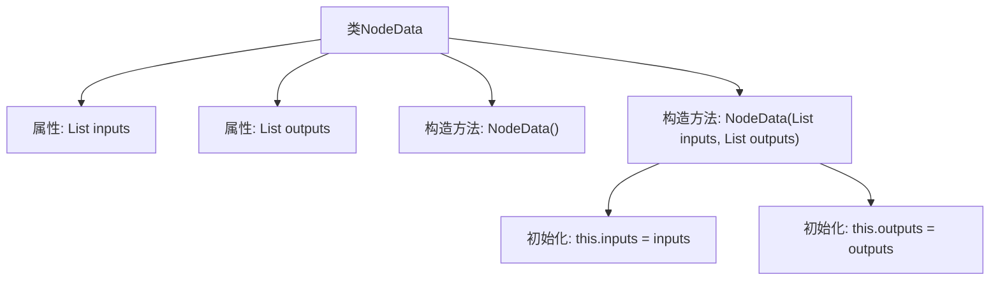

# 基础信息

|      |      |
|------|------|
| 名称 | NodeData |
| 编码语言 | .java |
| 代码路径 | spring-ai-alibaba/spring-ai-alibaba-graph/spring-ai-alibaba-graph-studio/src/main/java/com/alibaba/cloud/ai/model/workflow/NodeData.java |
| 包名 | com.alibaba.cloud.ai.model.workflow |
| 依赖项 | ['com.alibaba.cloud.ai.model.Variable', 'com.alibaba.cloud.ai.model.VariableSelector', 'lombok.AllArgsConstructor', 'lombok.Data', 'lombok.NoArgsConstructor', 'java.util.List'] |
| 概述说明 | NodeData类管理节点输入输出，输入来自前节点，输出为当前节点变量。 |

# 说明

NodeData类用于管理节点的输入输出变量。其输入变量来源于前一个节点的输出，而输出变量则是当前节点自身的变量。该类通过维护这两个变量列表，确保节点间的数据传递和当前节点的数据处理得以顺利进行。

# 类列表 Class Summary

| 名称   | 类型  | 说明 |
|-------|------|-------------|
| NodeData | class | NodeData类包含输入输出变量列表，输入为前节点输出，输出为当前节点变量。 |

## 类 NodeData

|      |      |
|------|------|
| 访问范围 | @Data;public |
| 类型 | class |
| 名称 | NodeData |
| 说明 | NodeData类包含输入输出变量列表，输入为前节点输出，输出为当前节点变量。 |

### UML类图

这段代码定义了一个名为 `NodeData` 的类，该类包含两个受保护的成员变量 `inputs` 和 `outputs`，分别表示节点的输入和输出。`inputs` 是一个 `VariableSelector` 类型的列表，而 `outputs` 是一个 `Variable` 类型的列表。类中定义了两个构造函数，一个是无参构造函数，另一个是带有 `inputs` 和 `outputs` 参数的受保护构造函数。这个类主要用于存储节点的输入和输出数据。

### 内部方法调用关系图

这段代码定义了一个名为 `NodeData` 的类，该类包含两个属性：`inputs` 和 `outputs`，分别表示节点的输入和输出。类中有两个构造方法：一个无参构造方法 `NodeData()` 和一个带参构造方法 `NodeData(List<VariableSelector> inputs, List<Variable> outputs)`，后者用于初始化 `inputs` 和 `outputs` 属性。通过流程图可以清晰地看到类的结构和构造方法的调用关系。

### 字段列表 Field List

| 名称  | 类型  | 说明 |
|-------|-------|------|
| inputs | List<VariableSelector> | 保护类型的变量输入列表。 |
| outputs | List<Variable> | 受保护的变量列表输出。 |

### 方法列表 Method List

| 名称  | 类型  | 说明 |
|-------|-------|------|

