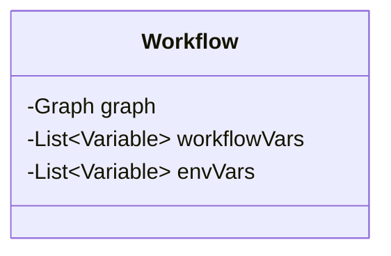
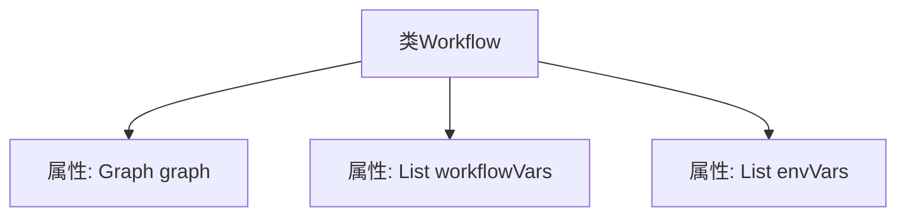

# 基础信息

|      |      |
|------|------|
| 名称 | Workflow |
| 编码语言 | .java |
| 代码路径 | spring-ai-alibaba/spring-ai-alibaba-graph/spring-ai-alibaba-graph-studio/src/main/java/com/alibaba/cloud/ai/model/workflow/Workflow.java |
| 包名 | com.alibaba.cloud.ai.model.workflow |
| 依赖项 | ['com.alibaba.cloud.ai.model.Variable', 'io.swagger.v3.oas.annotations.media.Schema', 'lombok.Data', 'java.util.List'] |
| 概述说明 | Workflow类含图结构、工作流变量及环境变量。 |

# 说明

Workflow类是一个用于管理和执行工作流的组件，其中包含图结构、工作流变量和环境变量。图结构用于定义工作流的各个节点及其相互关系，工作流变量用于存储和传递工作流执行过程中的数据，环境变量则用于配置工作流运行时的外部环境。这些元素共同协作，确保工作流能够按照预定的逻辑和条件顺利执行。

# 类列表 Class Summary

| 名称   | 类型  | 说明 |
|-------|------|-------------|
| Workflow | class | Workflow类包含图结构、工作流变量和环境变量。 |

## 类 Workflow

|      |      |
|------|------|
| 访问范围 | @Data;public |
| 类型 | class |
| 名称 | Workflow |
| 说明 | Workflow类包含图结构、工作流变量和环境变量。 |

### UML类图

这段代码定义了一个名为 `Workflow` 的类，该类包含三个私有成员变量：`graph` 类型为 `Graph`，`workflowVars` 和 `envVars` 类型均为 `List<Variable>`。`Workflow` 类可能用于表示一个工作流，其中 `graph` 表示工作流的图结构，`workflowVars` 和 `envVars` 分别表示工作流变量和环境变量。这个类没有定义任何方法，仅用于封装数据。

### 内部方法调用关系图

这段代码定义了一个名为 `Workflow` 的类，该类包含三个私有属性：`graph`、`workflowVars` 和 `envVars`。`graph` 是一个 `Graph` 类型的对象，而 `workflowVars` 和 `envVars` 都是 `List<Variable>` 类型的列表。这些属性用于存储工作流的相关数据和环境变量。类结构简单，主要用于封装工作流的基本信息。

### 字段列表 Field List

| 名称  | 类型  | 说明 |
|-------|-------|------|
| workflowVars | List<Variable> | 定义了一个私有变量列表，用于存储工作流变量。 |
| envVars | List<Variable> | 私有变量列表存储环境变量。 |
| graph | Graph | 声明了一个私有Graph类型的变量graph。 |

### 方法列表 Method List

| 名称  | 类型  | 说明 |
|-------|-------|------|

