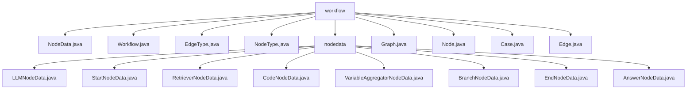

# 基础信息

|      |      |
|------|------|
| 名称 | workflow |
| 编码语言 | .java |
| 代码路径 | spring-ai-alibaba/spring-ai-alibaba-graph/spring-ai-alibaba-graph-studio/src/main/java/com/alibaba/cloud/ai/model/workflow |
| 包名 | spring-ai-alibaba.spring-ai-alibaba-graph.spring-ai-alibaba-graph-studio.src.main.java.com.alibaba.cloud.ai.model.workflow |
| 概述说明 | Spring框架的AI工作流管理系统，管理节点数据与执行流程。 |

# 说明

## 概述

该代码模块是一个基于Spring框架的AI工作流管理系统，主要用于管理和处理不同类型节点的数据。模块中的核心类包括`NodeData`、`Workflow`、`Graph`、`Node`、`Edge`和`Case`等，这些类共同协作，支持工作流的定义、执行和管理。模块通过维护节点间的数据传递、工作流变量和环境变量，确保工作流能够按照预定的逻辑和条件顺利执行。此外，模块还提供了灵活的节点设计和丰富的功能支持，能够高效地处理复杂的工作流任务，适用于多种AI应用场景。

## 主要业务场景

1. **节点数据管理**：`NodeData`类用于管理节点的输入输出变量，确保节点间的数据传递和当前节点的数据处理得以顺利进行。
2. **工作流执行**：`Workflow`类用于管理和执行工作流，包含图结构、工作流变量和环境变量，确保工作流能够按照预定的逻辑和条件顺利执行。
3. **图结构管理**：`Graph`类用于表示和管理图中的边和节点，提供了灵活的构造方法，支持在初始化时完全配置或在运行时逐步构建。
4. **节点操作**：`Node`类实现了`RunnableModel`接口，具备ID、类型、标题等核心属性，支持链式访问和运行模型的能力，适用于需要执行特定任务的场景。
5. **边关系管理**：`Edge`类用于表示图中的边关系，包含ID、源属性、目标属性、源句柄、目标句柄、数据和zIndex等关键属性，灵活地表示和处理图中的边关系。
6. **条件处理**：`Case`类用于处理条件逻辑，包含ID、逻辑运算符和条件列表，支持定义多个条件之间的逻辑关系，适用于需要根据条件执行不同路径的场景。
7. **模型配置与管理**：`LLMNodeData`类用于管理和配置模型的相关参数，包括模型配置、提示模板和内存配置等，适用于需要复杂模型处理的场景。
8. **起始节点处理**：`StartNodeData`类用于处理起始节点的数据，支持存储和管理与起始节点相关的输入信息，适用于工作流的初始化阶段。
9. **检索操作**：`RetrieverNodeData`类支持密集检索、稀疏检索和混合检索等多种检索方式，适用于需要高效检索的场景。
10. **代码执行**：`CodeNodeData`类支持代码的执行和链式调用，适用于需要嵌入代码逻辑的工作流节点。
11. **变量聚合**：`VariableAggregatorNodeData`类用于管理变量列表、输出类型和高级设置，适用于需要聚合和处理变量的场景。
12. **分支逻辑**：`BranchNodeData`类支持分支逻辑的处理，适用于需要根据条件执行不同路径的场景。
13. **结束节点处理**：`EndNodeData`类用于处理结束节点的数据，支持输入输出变量，适用于工作流的收尾阶段。
14. **答案处理**：`AnswerNodeData`类用于处理与答案相关的数据，支持模板和默认输出列表，适用于需要格式化输出的场景。

该模块通过灵活的节点设计和丰富的功能支持，能够高效地处理复杂的工作流任务，适用于多种AI应用场景。

### 包内部结构视图

该流程图展示了 `workflow` 文件夹及其子文件夹 `nodedata` 的文件结构。`workflow` 文件夹包含多个 Java 文件，如 `NodeData.java`、`Workflow.java` 等，而 `nodedata` 文件夹则包含多个与节点数据相关的 Java 文件，如 `LLMNodeData.java`、`StartNodeData.java` 等。

# 文件列表 File List

| 名称   | 类型  | 说明 |
|-------|------|-------------|
| [NodeType.java](NodeType.md) | file | 无内容提供，无法生成概要描述。 |
| [EdgeType.java](EdgeType.md) | file | 无内容可总结。 |
| [Workflow.java](Workflow.md) | file | Workflow类含图结构、工作流变量及环境变量。 |
| [Case.java](Case.md) | file | Case类含ID、逻辑运算符和条件列表，条件包括值、类型、比较运算符和选择器。 |
| [Edge.java](Edge.md) | file | Edge类包含ID、源、目标、句柄、数据和层级属性。 |
| [Node.java](Node.md) | file | Node类实现RunnableModel，含ID、类型、标题，支持链式访问。 |
| [Graph.java](Graph.md) | file | Graph类包含边和节点列表，支持全参和无参构造。 |
| [NodeData.java](NodeData.md) | file | NodeData类管理节点输入输出，输入来自前节点，输出为当前节点变量。 |
| [nodedata](nodedata/_module.md) | package | LLMNodeData管理模型参数，StartNodeData处理起始节点，RetrieverNodeData支持多种检索方式，CodeNodeData支持链式调用，VariableAggregatorNodeData定制数据处理，BranchNodeData增强代码灵活性，EndNodeData设计简洁，AnswerNodeData处理答案数据。 |

