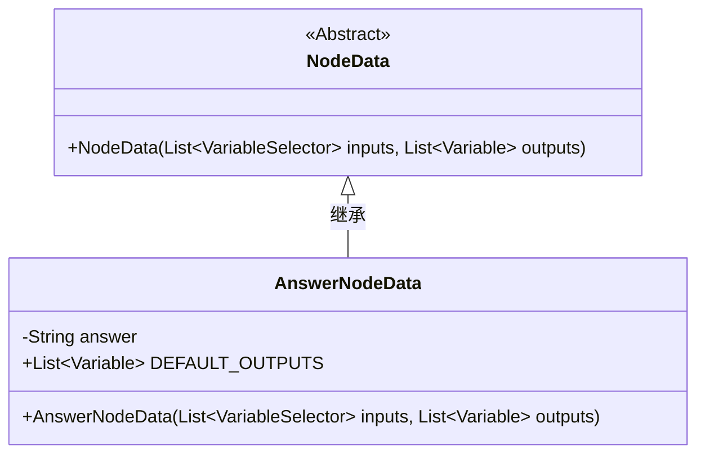
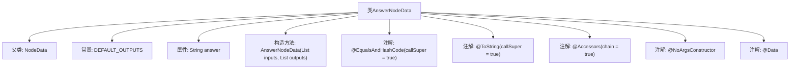

# 基础信息

|      |      |
|------|------|
| 名称 | AnswerNodeData |
| 编码语言 | .java |
| 代码路径 | spring-ai-alibaba/spring-ai-alibaba-graph/spring-ai-alibaba-graph-studio/src/main/java/com/alibaba/cloud/ai/model/workflow/nodedata/AnswerNodeData.java |
| 包名 | com.alibaba.cloud.ai.model.workflow.nodedata |
| 依赖项 | ['com.alibaba.cloud.ai.model.Variable', 'com.alibaba.cloud.ai.model.VariableSelector', 'com.alibaba.cloud.ai.model.VariableType', 'com.alibaba.cloud.ai.model.workflow.NodeData', 'lombok.Data', 'lombok.EqualsAndHashCode', 'lombok.NoArgsConstructor', 'lombok.ToString', 'lombok.experimental.Accessors', 'java.util.List'] |
| 概述说明 | AnswerNodeData继承NodeData，含字符串模板answer和默认输出列表。 |

# 说明

AnswerNodeData类继承自NodeData类，包含两个主要属性：一个字符串模板answer和一个默认输出列表。该类通过继承NodeData的功能，扩展了处理特定类型数据的能力，其中answer模板用于定义输出的格式或内容，默认输出列表则存储了预设的输出结果。这种设计使得AnswerNodeData类能够灵活地处理和管理与答案相关的数据。

# 类列表 Class Summary

| 名称   | 类型  | 说明 |
|-------|------|-------------|
| AnswerNodeData | class | AnswerNodeData类继承NodeData，包含字符串模板answer和默认输出列表。 |

## 类 AnswerNodeData

|      |      |
|------|------|
| 访问范围 | @EqualsAndHashCode(callSuper = true);@ToString(callSuper = true);@Accessors(chain = true);@NoArgsConstructor;@Data;public |
| 类型 | class |
| 名称 | AnswerNodeData |
| 说明 | AnswerNodeData类继承NodeData，包含字符串模板answer和默认输出列表。 |

### UML类图

### 描述
`AnswerNodeData` 类继承自 `NodeData` 类，表示一种特定类型的节点数据。它包含一个字符串类型的 `answer` 属性，以及一个静态的 `DEFAULT_OUTPUTS` 列表，用于存储默认的输出变量。`AnswerNodeData` 类提供了一个构造函数，用于初始化输入和输出变量列表。该类通过继承 `NodeData` 类，扩展了其功能，使其能够处理特定的节点数据。

### 内部方法调用关系图

这段代码定义了一个名为 `AnswerNodeData` 的类，该类继承自 `NodeData`。类中包含一个常量 `DEFAULT_OUTPUTS`，一个字符串属性 `answer`，以及一个构造方法。类上使用了多个注解，包括 `@EqualsAndHashCode`、`@ToString`、`@Accessors`、`@NoArgsConstructor` 和 `@Data`，这些注解分别用于生成 equals 和 hashCode 方法、toString 方法、链式访问、无参构造函数以及自动生成 getter 和 setter 方法。

### 字段列表 Field List

| 名称  | 类型  | 说明 |
|-------|-------|------|
| DEFAULT_OUTPUTS = List.of(new Variable("answer", VariableType.STRING.value())) | List<Variable> | 默认输出列表包含一个字符串类型的变量“answer”。 |
| answer | String | 定义了一个私有字符串变量answer。 |

### 方法列表 Method List

| 名称  | 类型  | 说明 |
|-------|-------|------|

