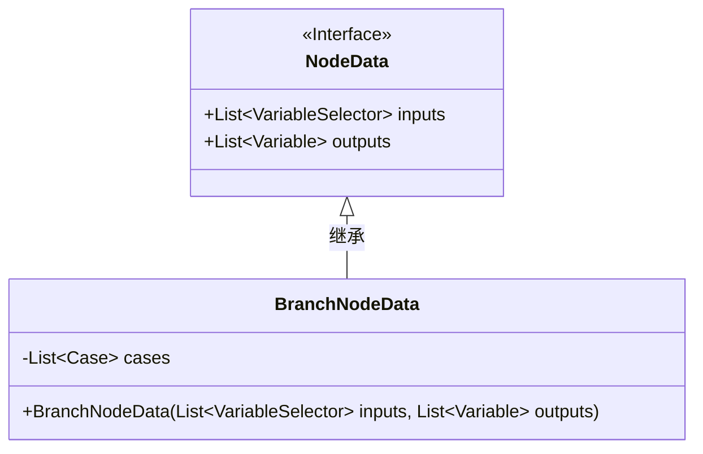
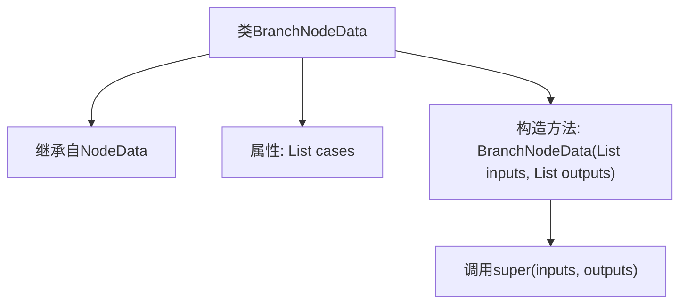

# 基础信息

|      |      |
|------|------|
| 名称 | BranchNodeData |
| 编码语言 | .java |
| 代码路径 | spring-ai-alibaba/spring-ai-alibaba-graph/spring-ai-alibaba-graph-studio/src/main/java/com/alibaba/cloud/ai/model/workflow/nodedata/BranchNodeData.java |
| 包名 | com.alibaba.cloud.ai.model.workflow.nodedata |
| 依赖项 | ['com.alibaba.cloud.ai.model.Variable', 'com.alibaba.cloud.ai.model.VariableSelector', 'com.alibaba.cloud.ai.model.workflow.Case', 'com.alibaba.cloud.ai.model.workflow.NodeData', 'lombok.Data', 'lombok.EqualsAndHashCode', 'lombok.NoArgsConstructor', 'lombok.ToString', 'lombok.experimental.Accessors', 'java.util.List'] |
| 概述说明 | BranchNodeData继承NodeData，含cases列表，支持链式调用和无参构造。 |

# 说明

BranchNodeData类继承自NodeData类，包含一个cases列表。该类支持链式调用，允许在方法调用后继续调用其他方法。此外，BranchNodeData类还提供了无参构造函数，使得实例化时无需传递任何参数。这种设计增强了代码的灵活性和可读性，便于在复杂逻辑中使用。

# 类列表 Class Summary

| 名称   | 类型  | 说明 |
|-------|------|-------------|
| BranchNodeData | class | BranchNodeData类继承NodeData，包含cases列表，支持链式调用和无参构造。 |

## 类 BranchNodeData

|      |      |
|------|------|
| 访问范围 | @EqualsAndHashCode(callSuper = true);@ToString(callSuper = true);@Accessors(chain = true);@NoArgsConstructor;@Data;public |
| 类型 | class |
| 名称 | BranchNodeData |
| 说明 | BranchNodeData类继承NodeData，包含cases列表，支持链式调用和无参构造。 |

### UML类图

**描述：**  
`BranchNodeData`类继承自`NodeData`接口，并包含一个私有成员`cases`，类型为`List<Case>`。`BranchNodeData`类提供了一个构造函数，接受`List<VariableSelector>`和`List<Variable>`类型的参数，并调用父类的构造函数进行初始化。该类通过继承`NodeData`接口，实现了对输入和输出变量的管理。

### 内部方法调用关系图

这段代码定义了一个名为`BranchNodeData`的类，该类继承自`NodeData`。`BranchNodeData`类包含一个`List<Case>`类型的属性`cases`，并提供了一个构造方法`BranchNodeData(List<VariableSelector> inputs, List<Variable> outputs)`，该构造方法在初始化时调用了父类`NodeData`的构造方法`super(inputs, outputs)`。代码使用了Lombok注解来简化代码，包括`@EqualsAndHashCode`、`@ToString`、`@Accessors`、`@NoArgsConstructor`和`@Data`，这些注解自动生成了常见的方法，如`equals`、`hashCode`、`toString`、无参构造方法和getter/setter方法。

### 字段列表 Field List

| 名称  | 类型  | 说明 |
|-------|-------|------|
| cases | List<Case> | 私有变量cases，类型为Case对象的列表。 |

### 方法列表 Method List

| 名称  | 类型  | 说明 |
|-------|-------|------|

