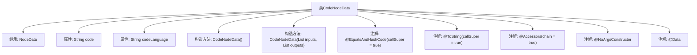

# 基础信息

|      |      |
|------|------|
| 名称 | CodeNodeData |
| 编码语言 | .java |
| 代码路径 | spring-ai-alibaba/spring-ai-alibaba-graph/spring-ai-alibaba-graph-studio/src/main/java/com/alibaba/cloud/ai/model/workflow/nodedata/CodeNodeData.java |
| 包名 | com.alibaba.cloud.ai.model.workflow.nodedata |
| 依赖项 | ['com.alibaba.cloud.ai.model.Variable', 'com.alibaba.cloud.ai.model.VariableSelector', 'com.alibaba.cloud.ai.model.workflow.NodeData', 'lombok.Data', 'lombok.EqualsAndHashCode', 'lombok.NoArgsConstructor', 'lombok.ToString', 'lombok.experimental.Accessors', 'java.util.List'] |
| 概述说明 | CodeNodeData继承NodeData，含code和codeLanguage属性，支持链式调用。 |

# 说明

CodeNodeData类继承自NodeData类，包含两个主要属性：code和codeLanguage。该类支持链式调用，允许在设置属性后继续调用其他方法或设置其他属性，从而简化代码编写和操作流程。

# 类列表 Class Summary

| 名称   | 类型  | 说明 |
|-------|------|-------------|
| CodeNodeData | class | CodeNodeData类继承NodeData，包含code和codeLanguage属性，支持链式调用。 |


## 类 CodeNodeData

|      |      |
|------|------|
| 访问范围 | @EqualsAndHashCode(callSuper = true);@ToString(callSuper = true);@Accessors(chain = true);@NoArgsConstructor;@Data;public |
| 类型 | class |
| 名称 | CodeNodeData |
| 说明 | CodeNodeData类继承NodeData，包含code和codeLanguage属性，支持链式调用。 |


### UML类图

```mermaid
classDiagram
    class NodeData {
        <<Interface>>
    }

    class CodeNodeData {
        -String code
        -String codeLanguage
        +CodeNodeData(List~VariableSelector~ inputs, List~Variable~ outputs)
    }

    NodeData <|-- CodeNodeData // CodeNodeData 继承自 NodeData
```

**描述**：`CodeNodeData` 类继承自 `NodeData` 接口，包含两个私有属性 `code` 和 `codeLanguage`，并提供了一个构造函数用于初始化输入和输出变量。该类通过继承 `NodeData` 接口来实现特定的数据结构，适用于处理代码相关的节点数据。


### 内部方法调用关系图



这段代码定义了一个名为 `CodeNodeData` 的类，它继承自 `NodeData` 类。`CodeNodeData` 类包含两个属性：`code` 和 `codeLanguage`，分别表示代码内容和代码语言。该类使用了多个 Lombok 注解，如 `@EqualsAndHashCode`、`@ToString`、`@Accessors`、`@NoArgsConstructor` 和 `@Data`，以自动生成常用的方法，如 `equals`、`hashCode`、`toString`、getter/setter 和无参构造方法。此外，该类还定义了一个带参数的构造方法，用于初始化 `inputs` 和 `outputs`。

### 字段列表 Field List

| 名称  | 类型  | 说明 |
|-------|-------|------|
| codeLanguage | String | 定义私有字符串变量codeLanguage。 |
| code | String | 定义了一个私有字符串变量code。 |

### 方法列表 Method List

| 名称  | 类型  | 说明 |
|-------|-------|------|


