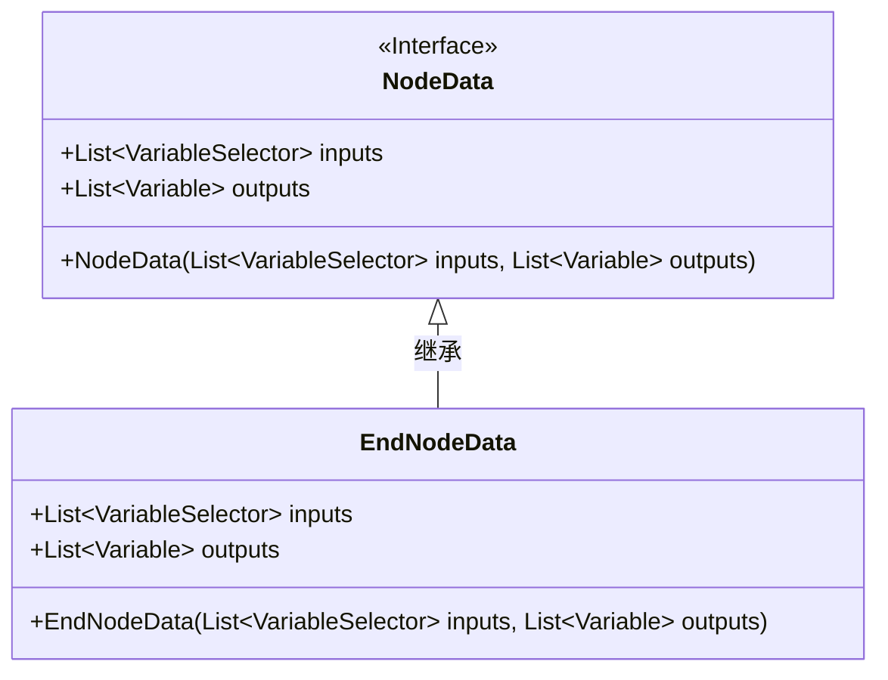
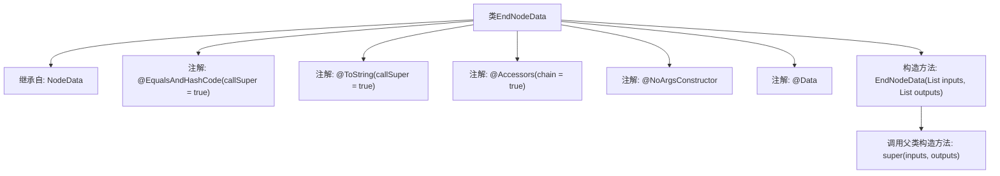

# 基础信息

|      |      |
|------|------|
| 名称 | EndNodeData |
| 编码语言 | .java |
| 代码路径 | spring-ai-alibaba/spring-ai-alibaba-graph/spring-ai-alibaba-graph-studio/src/main/java/com/alibaba/cloud/ai/model/workflow/nodedata/EndNodeData.java |
| 包名 | com.alibaba.cloud.ai.model.workflow.nodedata |
| 依赖项 | ['com.alibaba.cloud.ai.model.Variable', 'com.alibaba.cloud.ai.model.VariableSelector', 'com.alibaba.cloud.ai.model.VariableType', 'com.alibaba.cloud.ai.model.workflow.NodeData', 'lombok.Data', 'lombok.EqualsAndHashCode', 'lombok.NoArgsConstructor', 'lombok.ToString', 'lombok.experimental.Accessors', 'java.util.List'] |
| 概述说明 | EndNodeData继承NodeData，含输入输出变量，支持链式访问和无参构造。 |

# 说明

EndNodeData类继承自NodeData类，具备输入输出变量，支持链式访问和无参构造函数。该类设计简洁，便于扩展和使用。

# 类列表 Class Summary

| 名称   | 类型  | 说明 |
|-------|------|-------------|
| EndNodeData | class | EndNodeData类继承NodeData，包含输入输出变量，使用链式访问和无参构造。 |

## 类 EndNodeData

|      |      |
|------|------|
| 访问范围 | @EqualsAndHashCode(callSuper = true);@ToString(callSuper = true);@Accessors(chain = true);@NoArgsConstructor;@Data;public |
| 类型 | class |
| 名称 | EndNodeData |
| 说明 | EndNodeData类继承NodeData，包含输入输出变量，使用链式访问和无参构造。 |

### UML类图

### 描述
`EndNodeData` 类继承自 `NodeData` 接口，并包含两个构造函数。`NodeData` 接口定义了两个属性 `inputs` 和 `outputs`，分别表示输入和输出的变量列表。`EndNodeData` 类通过构造函数初始化这些属性，并且使用了 Lombok 注解来简化代码，如 `@Data` 自动生成 getter 和 setter 方法，`@NoArgsConstructor` 生成无参构造函数。

### 内部方法调用关系图

这段代码定义了一个名为 `EndNodeData` 的类，该类继承自 `NodeData`。类中使用了多个注解，包括 `@EqualsAndHashCode`、`@ToString`、`@Accessors`、`@NoArgsConstructor` 和 `@Data`，这些注解用于自动生成常见的代码片段，如 `equals`、`hashCode`、`toString` 方法等。类中还定义了一个带参数的构造方法，该方法接受两个列表作为参数，并调用父类的构造方法进行初始化。

### 字段列表 Field List

| 名称  | 类型  | 说明 |
|-------|-------|------|

### 方法列表 Method List

| 名称  | 类型  | 说明 |
|-------|-------|------|

