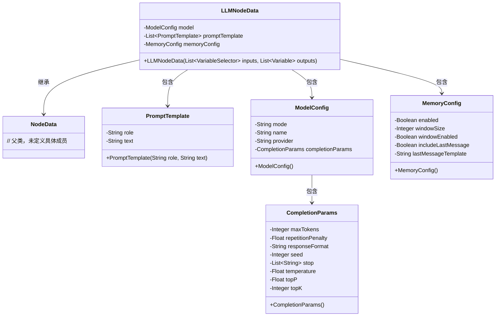

# 基础信息

|      |      |
|------|------|
| 名称 | LLMNodeData |
| 编码语言 | .java |
| 代码路径 | spring-ai-alibaba/spring-ai-alibaba-graph/spring-ai-alibaba-graph-studio/src/main/java/com/alibaba/cloud/ai/model/workflow/nodedata/LLMNodeData.java |
| 包名 | com.alibaba.cloud.ai.model.workflow.nodedata |
| 依赖项 | ['com.alibaba.cloud.ai.model.Variable', 'com.alibaba.cloud.ai.model.VariableSelector', 'com.alibaba.cloud.ai.model.VariableType', 'com.alibaba.cloud.ai.model.workflow.NodeData', None, 'lombok.experimental.Accessors', 'java.util.List'] |
| 概述说明 | LLMNodeData继承NodeData，含模型配置、提示模板、内存配置，支持多模式与参数设置。 |

# 说明

LLMNodeData类继承自NodeData类，主要用于管理和配置模型的相关参数。该类包含模型配置、提示模板和内存配置等关键组件，支持多种操作模式和灵活的参数设置，以满足不同场景下的需求。通过继承NodeData类，LLMNodeData具备了基础节点的功能，同时扩展了针对模型和提示模板的特定配置能力，使其在处理复杂任务时更加高效和便捷。

# 类列表 Class Summary

| 名称   | 类型  | 说明 |
|-------|------|-------------|
| LLMNodeData | class | LLMNodeData类继承NodeData，包含模型配置、提示模板和内存配置，支持多种模式和参数设置。 |

## 类 LLMNodeData

|      |      |
|------|------|
| 访问范围 | @EqualsAndHashCode(callSuper = true);@ToString(callSuper = true);@Accessors(chain = true);@NoArgsConstructor;@Data;public |
| 类型 | class |
| 名称 | LLMNodeData |
| 说明 | LLMNodeData类继承NodeData，包含模型配置、提示模板和内存配置，支持多种模式和参数设置。 |

### UML类图

这段代码定义了一个名为 `LLMNodeData` 的类，它继承自 `NodeData` 类，并包含多个内部类，如 `PromptTemplate`、`ModelConfig`、`CompletionParams` 和 `MemoryConfig`。`LLMNodeData` 类用于管理模型配置、提示模板和内存配置等数据。每个内部类都有其特定的属性和功能，共同构成了一个复杂的配置结构。

### 内部方法调用关系图

```mermaid
graph TD
    A["类LLMNodeData"]
    B["继承自: NodeData"]
    C["属性: ModelConfig model"]
    D["属性: List<PromptTemplate> promptTemplate"]
    E["属性: MemoryConfig memoryConfig"]
    F["构造方法: LLMNodeData(List<VariableSelector> inputs, List<Variable> outputs)"]
    G["内部类: PromptTemplate"]
    H["属性: String role"]
    I["属性: String text"]
    J["内部类: ModelConfig"]
    K["属性: String mode"]
    L["属性: String name"]
    M["属性: String provider"]
    N["属性: CompletionParams completionParams"]
    O["内部类: CompletionParams"]
    P["属性: Integer maxTokens"]
    Q["属性: Float repetitionPenalty"]
    R["属性: String responseFormat"]
    S["属性: Integer seed"]
    T["属性: List<String> stop"]
    U["属性: Float temperature"]
    V["属性: Float topP"]
    W["属性: Integer topK"]
    X["内部类: MemoryConfig"]
    Y["属性: Boolean enabled"]
    Z["属性: Integer windowSize"]
    AA["属性: Boolean windowEnabled"]
    AB["属性: Boolean includeLastMessage"]
    AC["属性: String lastMessageTemplate"]

    A --> B
    A --> C
    A --> D
    A --> E
    A --> F
    A --> G
    G --> H
    G --> I
    A --> J
    J --> K
    J --> L
    J --> M
    J --> N
    A --> O
    O --> P
    O --> Q
    O --> R
    O --> S
    O --> T
    O --> U
    O --> V
    O --> W
    A --> X
    X --> Y
    X --> Z
    X --> AA
    X --> AB
    X --> AC
```

这段代码定义了一个名为`LLMNodeData`的类，它继承自`NodeData`类，并包含多个内部类：`PromptTemplate`、`ModelConfig`、`CompletionParams`和`MemoryConfig`。`LLMNodeData`类用于管理LLM节点的数据，包括模型配置、提示模板和内存配置等。每个内部类都有各自的属性，用于描述LLM节点的不同配置项。通过这种结构化的设计，代码能够清晰地管理复杂的LLM节点数据。

### 字段列表 Field List

| 名称  | 类型  | 说明 |
|-------|-------|------|
| model | ModelConfig | 私有ModelConfig模型配置变量。 |
| promptTemplate | List<PromptTemplate> | 定义了一个私有列表，用于存储PromptTemplate对象。 |
| memoryConfig | MemoryConfig | 私有内存配置对象声明。 |
| DEFAULT_OUTPUT_SCHEMA = new Variable("text", VariableType.STRING.value()) | Variable | 定义默认输出模式为字符串类型的变量"text"。 |

### 方法列表 Method List

| 名称  | 类型  | 说明 |
|-------|-------|------|

