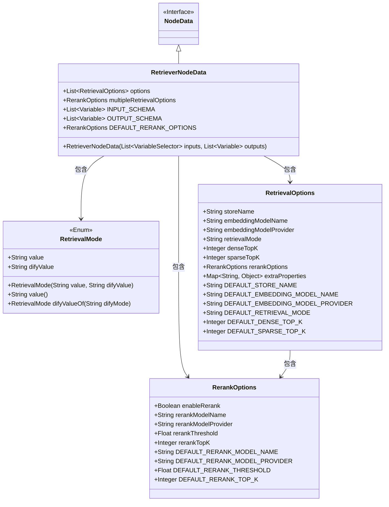

# 基础信息

|      |      |
|------|------|
| 名称 | RetrieverNodeData |
| 编码语言 | .java |
| 代码路径 | spring-ai-alibaba/spring-ai-alibaba-graph/spring-ai-alibaba-graph-studio/src/main/java/com/alibaba/cloud/ai/model/workflow/nodedata/RetrieverNodeData.java |
| 包名 | com.alibaba.cloud.ai.model.workflow.nodedata |
| 依赖项 | ['com.alibaba.cloud.ai.model.Variable', 'com.alibaba.cloud.ai.model.VariableSelector', 'com.alibaba.cloud.ai.model.VariableType', 'com.alibaba.cloud.ai.model.workflow.NodeData', 'lombok.Data', 'lombok.EqualsAndHashCode', 'lombok.NoArgsConstructor', 'lombok.ToString', 'lombok.experimental.Accessors', 'java.util.List', 'java.util.Map'] |
| 概述说明 | RetrieverNodeData类支持多种检索模式及配置。 |

# 说明

RetrieverNodeData类是一个用于处理检索操作的类，它包含了检索模式、选项和重排配置。该类支持三种不同的检索方式：密集检索、稀疏检索和混合检索。这些配置和模式使得该类能够灵活地应对各种检索需求，确保在不同场景下都能高效地执行检索任务。

# 类列表 Class Summary

| 名称   | 类型  | 说明 |
|-------|------|-------------|
| RetrieverNodeData | class | RetrieverNodeData类包含检索模式、选项和重排配置，支持密集、稀疏和混合检索。 |

## 类 RetrieverNodeData

|      |      |
|------|------|
| 访问范围 | @EqualsAndHashCode(callSuper = true);@ToString(callSuper = true);@Accessors(chain = true);@NoArgsConstructor;@Data;public |
| 类型 | class |
| 名称 | RetrieverNodeData |
| 说明 | RetrieverNodeData类包含检索模式、选项和重排配置，支持密集、稀疏和混合检索。 |

### UML类图

这段代码定义了一个名为 `RetrieverNodeData` 的类，它继承自 `NodeData` 接口。`RetrieverNodeData` 类包含了多个静态常量和方法，用于处理检索和重排选项。它还包含两个内部类 `RetrievalOptions` 和 `RerankOptions`，分别用于配置检索和重排的具体参数。`RetrievalMode` 是一个枚举类，定义了不同的检索模式。整体设计用于管理和配置检索过程中的各种选项和参数。

### 内部方法调用关系图

```mermaid
graph TD
    A["类RetrieverNodeData"]
    B["属性: List<RetrievalOptions> options"]
    C["属性: RerankOptions multipleRetrievalOptions"]
    D["构造方法: RetrieverNodeData(List<VariableSelector> inputs, List<Variable> outputs)"]
    E["枚举类: RetrievalMode"]
    F["内部类: RetrievalOptions"]
    G["内部类: RerankOptions"]
    H["常量: INPUT_SCHEMA"]
    I["常量: OUTPUT_SCHEMA"]
    J["常量: DEFAULT_RERANK_OPTIONS"]

    A --> B
    A --> C
    A --> D
    A --> E
    A --> F
    A --> G
    A --> H
    A --> I
    A --> J

    E --> K["枚举值: DENSE"]
    E --> L["枚举值: SPARSE"]
    E --> M["枚举值: HYBRID"]
    E --> N["方法: value()"]
    E --> O["方法: difyValueOf(String difyMode)"]

    F --> P["属性: String storeName"]
    F --> Q["属性: String embeddingModelName"]
    F --> R["属性: String embeddingModelProvider"]
    F --> S["属性: String retrievalMode"]
    F --> T["属性: Integer denseTopK"]
    F --> U["属性: Integer sparseTopK"]
    F --> V["属性: RerankOptions rerankOptions"]
    F --> W["属性: Map<String, Object> extraProperties"]

    G --> X["属性: Boolean enableRerank"]
    G --> Y["属性: String rerankModelName"]
    G --> Z["属性: String rerankModelProvider"]
    G --> AA["属性: Float rerankThreshold"]
    G --> AB["属性: Integer rerankTopK"]
```

这段代码定义了一个名为 `RetrieverNodeData` 的类，该类继承自 `NodeData`。`RetrieverNodeData` 类包含两个主要属性：`options` 和 `multipleRetrievalOptions`，分别表示检索选项和多重检索选项。此外，该类还定义了一个枚举类 `RetrievalMode`，用于表示不同的检索模式，以及两个内部类 `RetrievalOptions` 和 `RerankOptions`，分别用于配置检索和重排选项。代码中还定义了一些常量和构造方法，用于初始化类的实例。流程图展示了类的结构及其内部类和枚举的关系。

### 字段列表 Field List

| 名称  | 类型  | 说明 |
|-------|-------|------|
| DEFAULT_RERANK_OPTIONS = new RerankOptions() | RerankOptions | 定义了默认的RerankOptions静态常量。 |
| INPUT_SCHEMA = List.of(new Variable("query", VariableType.STRING.value())) | List<Variable> | 定义了一个静态常量INPUT_SCHEMA，包含一个字符串类型的变量"query"。 |
| multipleRetrievalOptions | RerankOptions | 私有变量multipleRetrievalOptions用于重排选项。 |
| options | List<RetrievalOptions> | 私有变量options存储RetrievalOptions类型的列表。 |
| OUTPUT_SCHEMA = List		.of(new Variable("documents", VariableType.ARRAY_OBJECT.value())) | List<Variable> | 定义了一个静态常量列表，包含名为“documents”的数组对象变量。 |

### 方法列表 Method List

| 名称  | 类型  | 说明 |
|-------|-------|------|

