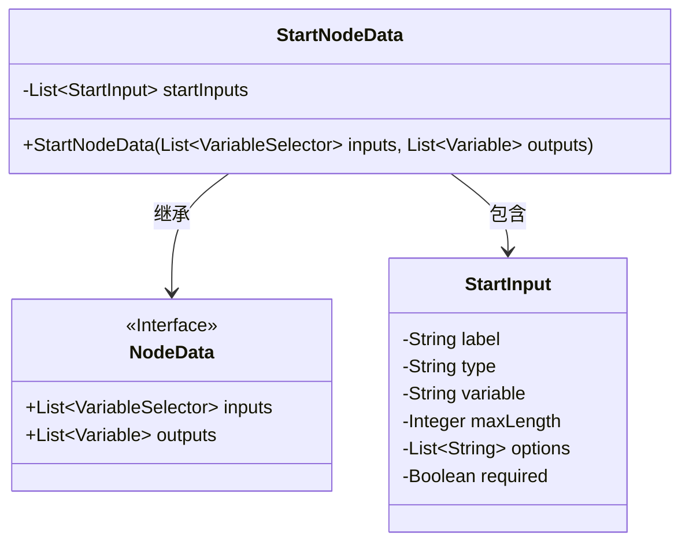
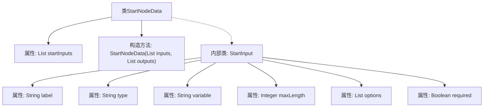

# 基础信息

|      |      |
|------|------|
| 名称 | StartNodeData |
| 编码语言 | .java |
| 代码路径 | spring-ai-alibaba/spring-ai-alibaba-graph/spring-ai-alibaba-graph-studio/src/main/java/com/alibaba/cloud/ai/model/workflow/nodedata/StartNodeData.java |
| 包名 | com.alibaba.cloud.ai.model.workflow.nodedata |
| 依赖项 | ['com.alibaba.cloud.ai.model.Variable', 'com.alibaba.cloud.ai.model.VariableSelector', 'com.alibaba.cloud.ai.model.workflow.NodeData', 'lombok.Data', 'lombok.EqualsAndHashCode', 'lombok.NoArgsConstructor', 'lombok.ToString', 'lombok.experimental.Accessors', 'java.util.List'] |
| 概述说明 | StartNodeData继承NodeData，包含StartInput列表，处理起始节点数据。 |

# 说明

StartNodeData类继承自NodeData类，主要用于处理起始节点的数据。该类包含一个名为StartInput的列表，用于存储和管理与起始节点相关的输入信息。通过继承NodeData，StartNodeData类能够利用父类的属性和方法，同时扩展特定于起始节点的功能。这种设计使得起始节点的数据处理更加模块化和可维护。

# 类列表 Class Summary

| 名称   | 类型  | 说明 |
|-------|------|-------------|
| StartNodeData | class | StartNodeData类继承NodeData，包含StartInput列表，用于处理起始节点数据。 |

## 类 StartNodeData

|      |      |
|------|------|
| 访问范围 | @EqualsAndHashCode(callSuper = true);@ToString(callSuper = true);@Accessors(chain = true);@NoArgsConstructor;@Data;public |
| 类型 | class |
| 名称 | StartNodeData |
| 说明 | StartNodeData类继承NodeData，包含StartInput列表，用于处理起始节点数据。 |

### UML类图

这段代码描述了一个继承自`NodeData`的`StartNodeData`类，其中包含一个内部类`StartInput`。`StartNodeData`类具有一个私有成员`startInputs`，它是一个`StartInput`对象的列表。`StartInput`类包含多个私有成员，如`label`、`type`、`variable`等，用于描述输入的属性。`StartNodeData`通过构造函数初始化其父类`NodeData`的`inputs`和`outputs`成员。整体结构展示了类之间的继承和包含关系。

### 内部方法调用关系图

这段代码定义了一个名为`StartNodeData`的类，该类继承自`NodeData`，并包含一个名为`startInputs`的属性，该属性是一个`StartInput`对象的列表。`StartInput`是一个内部类，包含多个属性，如`label`、`type`、`variable`、`maxLength`、`options`和`required`。代码还提供了一个构造方法，用于初始化`StartNodeData`对象。通过`@Data`、`@EqualsAndHashCode`、`@ToString`等注解，简化了代码的生成和维护。

### 字段列表 Field List

| 名称  | 类型  | 说明 |
|-------|-------|------|
| startInputs | List<StartInput> | 私有列表存储StartInput类型对象。 |

### 方法列表 Method List

| 名称  | 类型  | 说明 |
|-------|-------|------|

