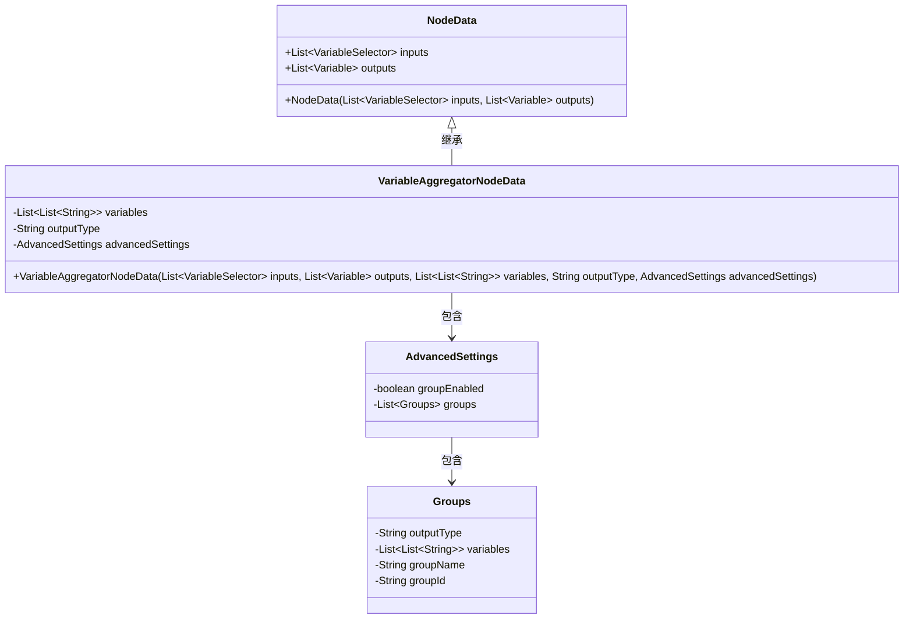
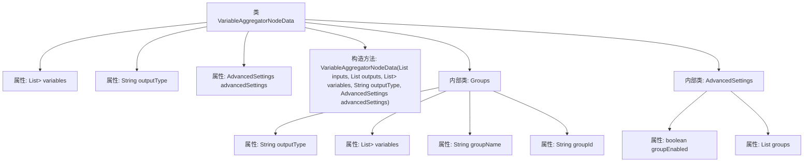

# 基础信息

|      |      |
|------|------|
| 名称 | VariableAggregatorNodeData |
| 编码语言 | .java |
| 代码路径 | spring-ai-alibaba/spring-ai-alibaba-graph/spring-ai-alibaba-graph-studio/src/main/java/com/alibaba/cloud/ai/model/workflow/nodedata/VariableAggregatorNodeData.java |
| 包名 | com.alibaba.cloud.ai.model.workflow.nodedata |
| 依赖项 | ['com.alibaba.cloud.ai.model.Variable', 'com.alibaba.cloud.ai.model.VariableSelector', 'com.alibaba.cloud.ai.model.workflow.NodeData', 'com.fasterxml.jackson.annotation.JsonIgnoreProperties', 'com.fasterxml.jackson.annotation.JsonInclude', 'com.fasterxml.jackson.annotation.JsonProperty', None, 'lombok.experimental.Accessors', 'java.util.List'] |
| 概述说明 | VariableAggregatorNodeData继承NodeData，含变量列表、输出类型及分组功能的高级设置。 |

# 说明

VariableAggregatorNodeData类继承自NodeData类，主要包含三个核心部分：变量列表、输出类型和高级设置。变量列表用于存储相关变量，输出类型定义了数据的输出格式，高级设置则提供了分组功能及其详细配置，用于进一步定制化数据处理和输出行为。

# 类列表 Class Summary

| 名称   | 类型  | 说明 |
|-------|------|-------------|
| VariableAggregatorNodeData | class | VariableAggregatorNodeData类继承NodeData，包含变量列表、输出类型和高级设置。高级设置包含分组功能及其配置。 |

## 类 VariableAggregatorNodeData

|      |      |
|------|------|
| 访问范围 | @EqualsAndHashCode(callSuper = true);@ToString(callSuper = true);@Accessors(chain = true);@NoArgsConstructor;@Data;public |
| 类型 | class |
| 名称 | VariableAggregatorNodeData |
| 说明 | VariableAggregatorNodeData类继承NodeData，包含变量列表、输出类型和高级设置。高级设置包含分组功能及其配置。 |

### UML类图

### 描述
这段代码定义了一个名为 `VariableAggregatorNodeData` 的类，该类继承自 `NodeData`。`VariableAggregatorNodeData` 类包含三个私有成员变量：`variables`（一个二维字符串列表）、`outputType`（字符串类型）和 `advancedSettings`（`AdvancedSettings` 类型）。`AdvancedSettings` 类包含一个布尔类型的 `groupEnabled` 和一个 `Groups` 类型的列表。`Groups` 类则包含 `outputType`、`variables`、`groupName` 和 `groupId` 四个私有成员变量。这些类之间的关系通过继承和包含来体现。

### 内部方法调用关系图

这段代码定义了一个名为 `VariableAggregatorNodeData` 的类，继承自 `NodeData`。该类包含三个主要属性：`variables`、`outputType` 和 `advancedSettings`，并提供了一个构造方法用于初始化这些属性。此外，类中还定义了两个内部类：`Groups` 和 `AdvancedSettings`。`Groups` 类用于存储分组相关的信息，包括 `outputType`、`variables`、`groupName` 和 `groupId`。`AdvancedSettings` 类则包含一个布尔类型的 `groupEnabled` 属性和一个 `Groups` 类型的列表 `groups`，用于管理高级设置。

### 字段列表 Field List

| 名称  | 类型  | 说明 |
|-------|-------|------|
| variables | List<List<String>> | 定义了一个私有二维字符串列表变量。 |
| outputType | String | 定义私有字符串变量outputType。 |
| advancedSettings | AdvancedSettings | 私有变量advancedSettings，类型为AdvancedSettings。 |

### 方法列表 Method List

| 名称  | 类型  | 说明 |
|-------|-------|------|

