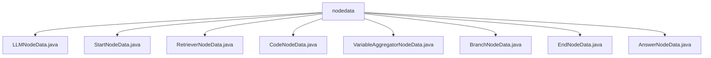

# 基础信息

|      |      |
|------|------|
| 名称 | nodedata |
| 编码语言 | .java |
| 代码路径 | spring-ai-alibaba/spring-ai-alibaba-graph/spring-ai-alibaba-graph-studio/src/main/java/com/alibaba/cloud/ai/model/workflow/nodedata |
| 包名 | spring-ai-alibaba.spring-ai-alibaba-graph.spring-ai-alibaba-graph-studio.src.main.java.com.alibaba.cloud.ai.model.workflow.nodedata |
| 概述说明 | LLMNodeData管理模型参数，StartNodeData处理起始节点，RetrieverNodeData支持多种检索方式，CodeNodeData支持链式调用，VariableAggregatorNodeData定制数据处理，BranchNodeData增强代码灵活性，EndNodeData设计简洁，AnswerNodeData处理答案数据。 |

# 说明

## 概述

该代码模块是一个基于Spring框架的AI工作流管理系统，主要用于管理和处理不同类型节点的数据。模块中的各个类均继承自`NodeData`类，扩展了特定节点的功能，支持灵活的参数配置和链式调用，以满足不同业务场景的需求。模块涵盖了从起始节点到结束节点的完整工作流，支持模型配置、检索操作、代码执行、变量聚合、分支逻辑等多种功能。

## 主要业务场景

1. **模型配置与管理**：`LLMNodeData`类用于管理和配置模型的相关参数，包括模型配置、提示模板和内存配置等，适用于需要复杂模型处理的场景。
2. **起始节点处理**：`StartNodeData`类用于处理起始节点的数据，支持存储和管理与起始节点相关的输入信息，适用于工作流的初始化阶段。
3. **检索操作**：`RetrieverNodeData`类支持密集检索、稀疏检索和混合检索等多种检索方式，适用于需要高效检索的场景。
4. **代码执行**：`CodeNodeData`类支持代码的执行和链式调用，适用于需要嵌入代码逻辑的工作流节点。
5. **变量聚合**：`VariableAggregatorNodeData`类用于管理变量列表、输出类型和高级设置，适用于需要聚合和处理变量的场景。
6. **分支逻辑**：`BranchNodeData`类支持分支逻辑的处理，适用于需要根据条件执行不同路径的场景。
7. **结束节点处理**：`EndNodeData`类用于处理结束节点的数据，支持输入输出变量，适用于工作流的收尾阶段。
8. **答案处理**：`AnswerNodeData`类用于处理与答案相关的数据，支持模板和默认输出列表，适用于需要格式化输出的场景。

该模块通过灵活的节点设计和丰富的功能支持，能够高效地处理复杂的工作流任务，适用于多种AI应用场景。

### 包内部结构视图

该流程图展示了`nodedata`文件夹下的文件层级关系。`nodedata`作为根节点，包含了多个节点数据文件，如`LLMNodeData.java`、`StartNodeData.java`、`RetrieverNodeData.java`等。这些文件均直接隶属于`nodedata`文件夹，反映了该文件夹内部的文件结构。

# 文件列表 File List

| 名称   | 类型  | 说明 |
|-------|------|-------------|
| [EndNodeData.java](EndNodeData.md) | file | EndNodeData继承NodeData，含输入输出变量，支持链式访问和无参构造。 |
| [VariableAggregatorNodeData.java](VariableAggregatorNodeData.md) | file | VariableAggregatorNodeData继承NodeData，含变量列表、输出类型及分组功能的高级设置。 |
| [RetrieverNodeData.java](RetrieverNodeData.md) | file | RetrieverNodeData类支持多种检索模式及配置。 |
| [AnswerNodeData.java](AnswerNodeData.md) | file | AnswerNodeData继承NodeData，含字符串模板answer和默认输出列表。 |
| [BranchNodeData.java](BranchNodeData.md) | file | BranchNodeData继承NodeData，含cases列表，支持链式调用和无参构造。 |
| [CodeNodeData.java](CodeNodeData.md) | file | CodeNodeData继承NodeData，含code和codeLanguage属性，支持链式调用。 |
| [StartNodeData.java](StartNodeData.md) | file | StartNodeData继承NodeData，包含StartInput列表，处理起始节点数据。 |
| [LLMNodeData.java](LLMNodeData.md) | file | LLMNodeData继承NodeData，含模型配置、提示模板、内存配置，支持多模式与参数设置。 |

