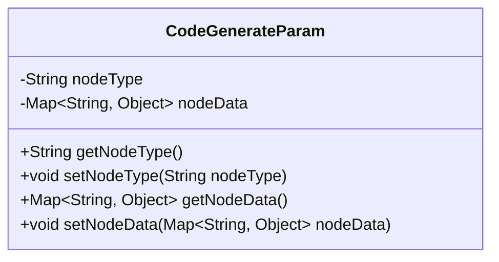
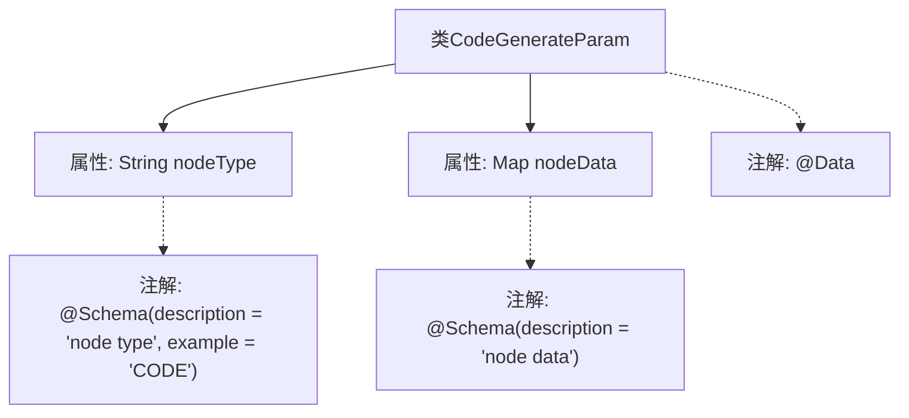

# 基础信息

|      |      |
|------|------|
| 名称 | CodeGenerateParam |
| 编码语言 | .java |
| 代码路径 | spring-ai-alibaba/spring-ai-alibaba-graph/spring-ai-alibaba-graph-studio/src/main/java/com/alibaba/cloud/ai/param/CodeGenerateParam.java |
| 包名 | com.alibaba.cloud.ai.param |
| 依赖项 | ['io.swagger.v3.oas.annotations.media.Schema', 'lombok.Data', 'java.util.Map'] |
| 概述说明 | CodeGenerateParam类包含节点类型和节点数据属性。 |

# 说明

CodeGenerateParam类是一个包含两个主要属性的类，分别是节点类型和节点数据。节点类型用于标识生成代码的节点种类，而节点数据则存储与该节点相关的具体信息。这两个属性共同构成了生成代码所需的关键参数，确保了代码生成的准确性和完整性。

# 类列表 Class Summary

| 名称   | 类型  | 说明 |
|-------|------|-------------|
| CodeGenerateParam | class | CodeGenerateParam类包含节点类型和节点数据两个属性。 |

## 类 CodeGenerateParam

|      |      |
|------|------|
| 访问范围 | @Data;public |
| 类型 | class |
| 名称 | CodeGenerateParam |
| 说明 | CodeGenerateParam类包含节点类型和节点数据两个属性。 |

### UML类图

这段代码定义了一个名为 `CodeGenerateParam` 的类，该类包含两个私有属性：`nodeType` 和 `nodeData`。`nodeType` 是一个字符串类型，用于表示节点的类型；`nodeData` 是一个泛型映射，键为字符串类型，值为任意对象类型。类中还提供了这些属性的 getter 和 setter 方法，用于访问和修改这些属性的值。这个类可能用于在代码生成过程中传递节点类型和节点数据。

### 内部方法调用关系图

这段代码定义了一个名为`CodeGenerateParam`的类，包含两个属性：`nodeType`和`nodeData`。`nodeType`属性使用`@Schema`注解来描述其类型和示例值，`nodeData`属性同样使用`@Schema`注解来描述其内容。类本身使用了`@Data`注解，通常用于自动生成getter、setter、toString等方法。该类的结构简单，主要用于存储和传递代码生成所需的参数。

### 字段列表 Field List

| 名称  | 类型  | 说明 |
|-------|-------|------|
| nodeType | String | 节点类型字段，示例为CODE。 |
| nodeData | Map<String, Object> | 节点数据存储为键值对映射。 |

### 方法列表 Method List

| 名称  | 类型  | 说明 |
|-------|-------|------|

