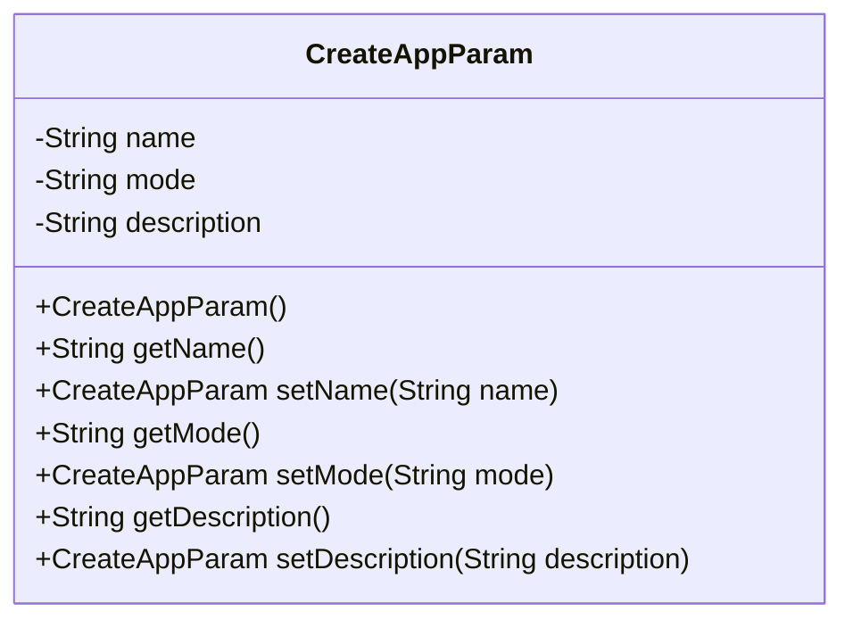
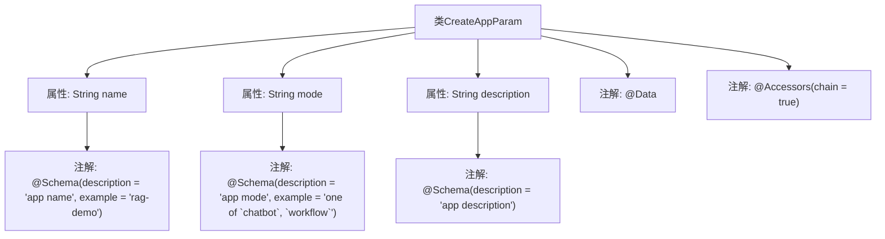

# 基础信息

|      |      |
|------|------|
| 名称 | CreateAppParam |
| 编码语言 | .java |
| 代码路径 | spring-ai-alibaba/spring-ai-alibaba-graph/spring-ai-alibaba-graph-studio/src/main/java/com/alibaba/cloud/ai/param/CreateAppParam.java |
| 包名 | com.alibaba.cloud.ai.param |
| 依赖项 | ['io.swagger.v3.oas.annotations.media.Schema', 'lombok.Data', 'lombok.experimental.Accessors'] |
| 概述说明 | CreateAppParam类含app名称、模式和描述字段。 |

# 说明

CreateAppParam类是一个用于创建应用程序的参数类，包含三个主要字段：app名称、模式和描述。app名称字段用于指定应用程序的名称，模式字段用于定义应用程序的运行模式，描述字段则用于提供关于应用程序的详细信息或说明。这三个字段共同构成了创建应用程序所需的基本信息。

# 类列表 Class Summary

| 名称   | 类型  | 说明 |
|-------|------|-------------|
| CreateAppParam | class | CreateAppParam类包含app名称、模式和描述三个字段。 |

## 类 CreateAppParam

|      |      |
|------|------|
| 访问范围 | @Data;@Accessors(chain = true);public |
| 类型 | class |
| 名称 | CreateAppParam |
| 说明 | CreateAppParam类包含app名称、模式和描述三个字段。 |

### UML类图

### 描述
`CreateAppParam` 类是一个用于创建应用程序的参数类，包含三个私有属性：`name`、`mode` 和 `description`。类提供了这些属性的 getter 和 setter 方法，并且 setter 方法支持链式调用。该类通常用于接收和处理应用程序创建时的输入参数。

### 内部方法调用关系图

这段代码定义了一个名为 `CreateAppParam` 的类，使用了 `@Data` 和 `@Accessors(chain = true)` 注解。类中包含三个私有属性：`name`、`mode` 和 `description`，每个属性都使用了 `@Schema` 注解来描述其用途和示例。`@Data` 注解自动生成 getter、setter、toString 等方法，`@Accessors(chain = true)` 允许方法链式调用。

### 字段列表 Field List

| 名称  | 类型  | 说明 |
|-------|-------|------|
| description | String | 应用描述字段定义。 |
| name | String | 应用名称为"rag-demo"。 |
| mode | String | app模式，可选chatbot或workflow。 |

### 方法列表 Method List

| 名称  | 类型  | 说明 |
|-------|-------|------|

