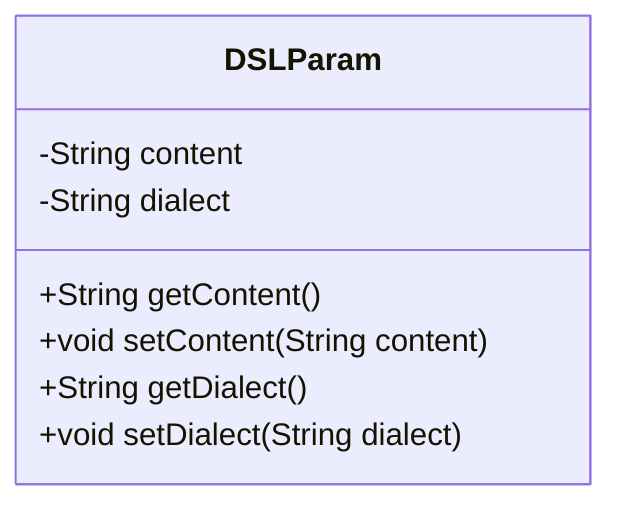
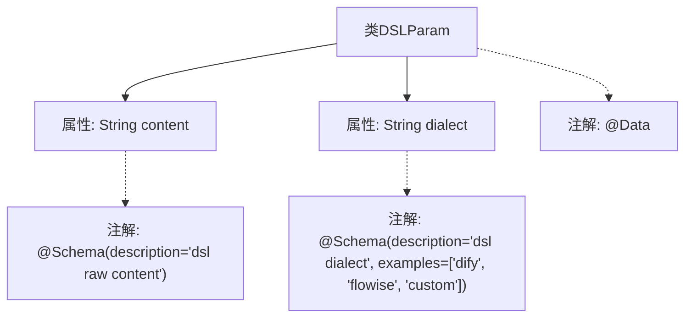

# 基础信息

|      |      |
|------|------|
| 名称 | DSLParam |
| 编码语言 | .java |
| 代码路径 | spring-ai-alibaba/spring-ai-alibaba-graph/spring-ai-alibaba-graph-studio/src/main/java/com/alibaba/cloud/ai/param/DSLParam.java |
| 包名 | com.alibaba.cloud.ai.param |
| 依赖项 | ['io.swagger.v3.oas.annotations.media.Schema', 'lombok.Data'] |
| 概述说明 | DSLParam类含两个字段：content存储dsl原始内容，dialect表示dsl方言类型。 |

# 说明

DSLParam类是一个用于存储DSL相关数据的类，包含两个主要字段。第一个字段是content，用于存储DSL的原始内容。第二个字段是dialect，用于表示DSL的方言类型。这两个字段共同作用，帮助管理和区分不同类型的DSL内容，确保在处理和解析DSL时能够准确识别其方言类型。

# 类列表 Class Summary

| 名称   | 类型  | 说明 |
|-------|------|-------------|
| DSLParam | class | DSLParam类包含两个字段：content用于存储dsl原始内容，dialect表示dsl方言类型。 |

## 类 DSLParam

|      |      |
|------|------|
| 访问范围 | @Data;public |
| 类型 | class |
| 名称 | DSLParam |
| 说明 | DSLParam类包含两个字段：content用于存储dsl原始内容，dialect表示dsl方言类型。 |

### UML类图

这段代码定义了一个名为 `DSLParam` 的类，该类包含两个私有属性：`content` 和 `dialect`，分别表示 DSL 的原始内容和方言类型。类中提供了这些属性的 getter 和 setter 方法，用于访问和修改这些属性的值。`@Data` 注解通常用于自动生成这些方法，简化代码。该类可能用于处理与 DSL（领域特定语言）相关的参数，支持多种方言类型，如 "dify"、"flowise" 和 "custom"。

### 内部方法调用关系图

这段代码定义了一个名为`DSLParam`的类，包含两个属性：`content`和`dialect`。`content`属性使用`@Schema`注解描述为"dsl raw content"，而`dialect`属性使用`@Schema`注解描述为"dsl dialect"，并提供了三个示例值："dify"、"flowise"和"custom"。整个类使用了`@Data`注解，可能用于自动生成getter、setter等方法。流程图展示了类与属性、注解之间的层级关系。

### 字段列表 Field List

| 名称  | 类型  | 说明 |
|-------|-------|------|
| content | String | DSL原始内容存储字段。 |
| dialect | String | DSL方言，示例包括dify、flowise、custom。 |

### 方法列表 Method List

| 名称  | 类型  | 说明 |
|-------|-------|------|

