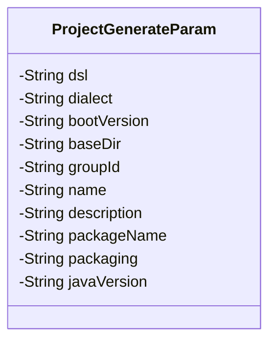
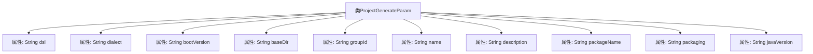

# 基础信息

|      |      |
|------|------|
| 名称 | ProjectGenerateParam |
| 编码语言 | .java |
| 代码路径 | spring-ai-alibaba/spring-ai-alibaba-graph/spring-ai-alibaba-graph-studio/src/main/java/com/alibaba/cloud/ai/param/ProjectGenerateParam.java |
| 包名 | com.alibaba.cloud.ai.param |
| 依赖项 | ['io.swagger.v3.oas.annotations.media.Schema', 'lombok.Data'] |
| 概述说明 | 项目生成参数类包含DSL、方言、Spring Boot版本、目录、组ID、项目名、描述、包名、打包方式和Java版本。 |

# 说明

项目生成参数类用于定义生成项目所需的关键配置信息，包括DSL内容、方言、Spring Boot版本、基础目录、组ID、项目名、描述、包名、打包方式和Java版本。这些参数共同决定了项目的结构、依赖关系和运行环境，确保项目能够按照预期生成并运行。

# 类列表 Class Summary

| 名称   | 类型  | 说明 |
|-------|------|-------------|
| ProjectGenerateParam | class | 项目生成参数类，包含DSL内容、方言、Spring Boot版本、基础目录、组ID、项目名、描述、包名、打包方式和Java版本。 |

## 类 ProjectGenerateParam

|      |      |
|------|------|
| 访问范围 | @Data;public |
| 类型 | class |
| 名称 | ProjectGenerateParam |
| 说明 | 项目生成参数类，包含DSL内容、方言、Spring Boot版本、基础目录、组ID、项目名、描述、包名、打包方式和Java版本。 |

### UML类图

**描述：**  
`ProjectGenerateParam` 类是一个用于生成项目参数的数据模型类，包含了多个私有字段，如 `dsl`、`dialect`、`bootVersion`、`baseDir`、`groupId`、`name`、`description`、`packageName`、`packaging` 和 `javaVersion`。这些字段用于描述项目的各种配置信息，如 DSL 内容、Spring Boot 版本、基础目录、组 ID、项目名称、描述、包名、打包方式和 Java 版本等。该类通过 `@Data` 注解自动生成 getter、setter、toString 等方法，简化了代码的编写。

### 内部方法调用关系图

这段代码定义了一个名为`ProjectGenerateParam`的类，该类包含多个属性，用于存储项目生成所需的各种参数。每个属性都使用了`@Schema`注解来描述其用途和示例值。这些属性包括`dsl`、`dialect`、`bootVersion`、`baseDir`、`groupId`、`name`、`description`、`packageName`、`packaging`和`javaVersion`。流程图展示了类与其属性之间的关系，每个属性都直接关联到`ProjectGenerateParam`类。

### 字段列表 Field List

| 名称  | 类型  | 说明 |
|-------|-------|------|
| dsl | String | dsl原始内容存储字段。 |
| bootVersion | String | Spring Boot版本字段定义。 |
| packageName | String | 包名字段，示例为com.example.demo。 |
| description | String | Schema描述字段为字符串类型。 |
| packaging | String | 定义了一个表示打包类型的字符串变量。 |
| groupId | String | group id字段，示例值为com.example。 |
| javaVersion | String | Java版本字段，示例值为21。 |
| name | String | 描述：定义名为name的私有字符串变量，示例值为demo。 |
| dialect | String | DSL方言定义为字符串类型，示例为"dify"。 |
| baseDir | String | 基础目录字段，示例值为“demo”。 |

### 方法列表 Method List

| 名称  | 类型  | 说明 |
|-------|-------|------|

