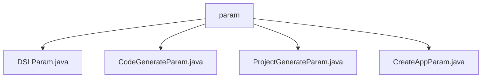

# 基础信息

|      |      |
|------|------|
| 名称 | param |
| 编码语言 | .java |
| 代码路径 | spring-ai-alibaba/spring-ai-alibaba-graph/spring-ai-alibaba-graph-studio/src/main/java/com/alibaba/cloud/ai/param |
| 包名 | spring-ai-alibaba.spring-ai-alibaba-graph.spring-ai-alibaba-graph-studio.src.main.java.com.alibaba.cloud.ai.param |
| 概述说明 | DSLParam存储DSL内容及方言，CodeGenerateParam定义节点类型及数据，ProjectGenerateParam配置项目生成参数，CreateAppParam包含应用名称、模式及描述。 |

# 说明

## 概述
该代码模块主要涉及参数类的定义，这些类用于存储和管理不同业务场景下的关键配置信息。模块中的类包括 `DSLParam`、`CodeGenerateParam`、`ProjectGenerateParam` 和 `CreateAppParam`，它们分别用于处理DSL相关数据、代码生成参数、项目生成参数以及应用程序创建参数。这些类通过定义和封装必要的字段，确保了在不同业务场景下数据的准确传递和处理。

## 主要业务场景
1. **DSL管理**：`DSLParam` 类用于存储和区分不同类型的DSL内容，确保在处理和解析DSL时能够准确识别其方言类型。
2. **代码生成**：`CodeGenerateParam` 类用于定义生成代码所需的节点类型和节点数据，确保代码生成的准确性和完整性。
3. **项目生成**：`ProjectGenerateParam` 类用于定义生成项目所需的关键配置信息，包括DSL内容、方言、Spring Boot版本等，确保项目能够按照预期生成并运行。
4. **应用程序创建**：`CreateAppParam` 类用于定义创建应用程序所需的基本信息，包括应用程序名称、运行模式和描述，确保应用程序能够正确创建和配置。

### 包内部结构视图

该流程图展示了`param`目录下的四个Java文件：`DSLParam.java`、`CodeGenerateParam.java`、`ProjectGenerateParam.java`和`CreateAppParam.java`。这些文件都位于同一层级，直接归属于`param`目录，没有进一步的子目录结构。

# 文件列表 File List

| 名称   | 类型  | 说明 |
|-------|------|-------------|
| [ProjectGenerateParam.java](ProjectGenerateParam.md) | file | 项目生成参数类包含DSL、方言、Spring Boot版本、目录、组ID、项目名、描述、包名、打包方式和Java版本。 |
| [CreateAppParam.java](CreateAppParam.md) | file | CreateAppParam类含app名称、模式和描述字段。 |
| [CodeGenerateParam.java](CodeGenerateParam.md) | file | CodeGenerateParam类包含节点类型和节点数据属性。 |
| [DSLParam.java](DSLParam.md) | file | DSLParam类含两个字段：content存储dsl原始内容，dialect表示dsl方言类型。 |

