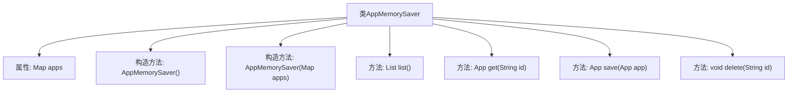

# 基础信息

|      |      |
|------|------|
| 名称 | AppMemorySaver |
| 编码语言 | .java |
| 代码路径 | spring-ai-alibaba/spring-ai-alibaba-graph/spring-ai-alibaba-graph-studio/src/main/java/com/alibaba/cloud/ai/saver/AppMemorySaver.java |
| 包名 | com.alibaba.cloud.ai.saver |
| 依赖项 | ['com.alibaba.cloud.ai.model.App', 'java.util.List', 'java.util.Map', 'java.util.concurrent.ConcurrentHashMap'] |
| 概述说明 | AppMemorySaver类实现AppSaver接口，负责管理内存中的应用列表。 |

# 说明

AppMemorySaver类实现了AppSaver接口，主要负责管理内存中的应用列表。该类通过实现接口定义的方法，确保应用数据在内存中的有效存储和访问，从而支持应用状态的保存和恢复功能。

# 类列表 Class Summary

| 名称   | 类型  | 说明 |
|-------|------|-------------|
| AppMemorySaver | class | AppMemorySaver类实现AppSaver接口，管理内存中的应用列表。 |


## 类 AppMemorySaver

|      |      |
|------|------|
| 访问范围 | public |
| 类型 | class |
| 名称 | AppMemorySaver |
| 说明 | AppMemorySaver类实现AppSaver接口，管理内存中的应用列表。 |


### UML类图

```mermaid
classDiagram
    class AppMemorySaver {
        -Map~String, App~ apps
        +AppMemorySaver()
        +AppMemorySaver(Map~String, App~ apps)
        +List~App~ list()
        +App get(String id)
        +App save(App app)
        +void delete(String id)
    }
    class App {
        // App类定义
    }
    class Map~K, V~ {
        // Map接口定义
    }
    class ConcurrentHashMap~K, V~ {
        // ConcurrentHashMap类定义
    }
    class List~T~ {
        // List接口定义
    }
    AppMemorySaver --> Map~String, App~ : 依赖
    AppMemorySaver --> ConcurrentHashMap~String, App~ : 依赖
    AppMemorySaver --> List~App~ : 依赖
    AppMemorySaver --> App : 依赖
    ConcurrentHashMap~K, V~ ..|> Map~K, V~ : 实现
    List~T~ <<Interface>>
    Map~K, V~ <<Interface>>
```

这段代码定义了一个 `AppMemorySaver` 类，该类实现了 `AppSaver` 接口，用于管理应用程序的内存存储。`AppMemorySaver` 使用 `ConcurrentHashMap` 来存储应用程序对象，并提供了列出、获取、保存和删除应用程序的方法。类图中展示了 `AppMemorySaver` 与其他类（如 `App`、`Map`、`ConcurrentHashMap` 和 `List`）之间的依赖关系，以及 `ConcurrentHashMap` 对 `Map` 接口的实现。


### 内部方法调用关系图



**描述：**  
`AppMemorySaver`类实现了`AppSaver`接口，用于管理`App`对象的存储和操作。它包含一个`ConcurrentHashMap`类型的`apps`属性，用于存储`App`对象。类提供了两个构造方法，分别用于初始化空的`apps`或从现有映射中初始化。`list()`方法返回所有`App`对象的列表，`get(String id)`方法根据ID获取特定`App`对象，`save(App app)`方法保存或更新`App`对象，`delete(String id)`方法根据ID删除`App`对象。

### 字段列表 Field List

| 名称  | 类型  | 说明 |
|-------|-------|------|
| apps | Map<String, App> | 私有变量apps存储字符串到App对象的映射。 |

### 方法列表 Method List

| 名称  | 类型  | 说明 |
|-------|-------|------|
| delete | void | 删除指定ID的应用。 |
| save | App | 重写save方法，将应用存入映射并返回。 |
| get | App | 重写get方法，通过id获取App对象。 |
| list | List<App> | 重写list方法，返回应用列表。 |


