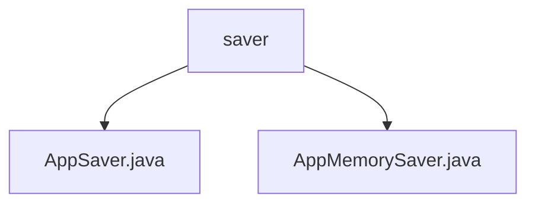

# 基础信息

|      |      |
|------|------|
| 名称 | saver |
| 编码语言 | .java |
| 代码路径 | spring-ai-alibaba/spring-ai-alibaba-graph/spring-ai-alibaba-graph-studio/src/main/java/com/alibaba/cloud/ai/saver |
| 包名 | spring-ai-alibaba.spring-ai-alibaba-graph.spring-ai-alibaba-graph-studio.src.main.java.com.alibaba.cloud.ai.saver |
| 概述说明 | AppMemorySaver类实现AppSaver接口，管理内存应用列表，支持数据存储与访问。 |

# 说明

## 概述

该代码模块主要涉及应用数据的内存管理功能，核心类为 `AppMemorySaver`，它实现了 `AppSaver` 接口。该模块的主要职责是确保应用数据在内存中的有效存储和访问，从而支持应用状态的保存和恢复功能。

## 主要业务场景

1. **应用数据的内存存储**：`AppMemorySaver` 类负责将应用数据存储在内存中，确保数据的高效访问和操作。
2. **应用状态的保存与恢复**：通过实现 `AppSaver` 接口，`AppMemorySaver` 支持应用状态的保存和恢复功能，确保应用在运行过程中能够保持其状态并在需要时进行恢复。
3. **内存管理**：该模块通过内存管理机制，确保应用数据的有效存储和释放，避免内存泄漏或资源浪费。

该模块在需要频繁保存和恢复应用状态的场景中尤为重要，例如在应用调试、状态监控或数据持久化等场景中发挥关键作用。

### 包内部结构视图

该流程图展示了`saver`文件夹下的文件层级关系，包含两个文件：`AppSaver.java`和`AppMemorySaver.java`。`saver`作为根节点，直接关联到这两个文件，清晰地反映了它们之间的从属关系。

# 文件列表 File List

| 名称   | 类型  | 说明 |
|-------|------|-------------|
| [AppMemorySaver.java](AppMemorySaver.md) | file | AppMemorySaver类实现AppSaver接口，负责管理内存中的应用列表。 |
| [AppSaver.java](AppSaver.md) | file | 信息为空，无法生成概要描述。 |

