# 基础信息

|      |      |
|------|------|
| 名称 | service |
| 编码语言 | .java |
| 代码路径 | spring-ai-alibaba/spring-ai-alibaba-graph/spring-ai-alibaba-graph-studio/src/main/java/com/alibaba/cloud/ai/service |
| 包名 | spring-ai-alibaba.spring-ai-alibaba-graph.spring-ai-alibaba-graph-studio.src.main.java.com.alibaba.cloud.ai.service |
| 概述说明 | 模块支持DSL数据处理、节点转换、序列化及元数据映射，适用于复杂业务场景。 |

# 说明

## 概述

该代码模块主要分为两个核心功能领域：领域特定语言（DSL）的数据处理与转换，以及应用程序生命周期的管理。

1. **DSL数据处理与转换**：该部分代码模块围绕DSL的数据处理、转换和序列化展开，涵盖了从数据导入导出到节点数据转换的多个功能。模块的核心设计基于抽象类和接口，提供了高度灵活性和扩展性，能够支持多种DSL方言和数据处理场景。主要功能包括DSL数据转换、元数据映射、节点数据转换以及YAML和JSON格式的序列化与反序列化。

2. **应用程序生命周期管理**：该部分代码模块的核心功能是管理应用程序的生命周期，包括创建、获取、列出、同步和删除应用程序。通过`AppDelegate`接口和`AppDelegateImpl`类的实现，模块为应用程序的管理提供了全面的支持，并依赖`AppSaver`进行数据的持久化操作，确保应用程序状态和数据的存储与恢复。

## 主要业务场景

### DSL数据处理与转换

1. **DSL数据转换**：模块中的`DifyDSLAdapter`和`CustomDSLAdapter`类专门用于处理Dify DSL和自定义DSL的数据转换，支持多种模式和应用元数据的映射，确保数据在转换过程中保持其原始结构和含义。适用于需要处理复杂数据结构且对数据准确性要求较高的场景。
2. **节点数据转换**：模块中的多个转换器类（如`EndNodeDataConverter`、`StartNodeDataConverter`等）用于处理不同类型节点数据的转换，支持多种DSL方言，确保数据在不同系统或平台间的兼容性和一致性。适用于需要处理多种DSL方言的场景。
3. **序列化与反序列化**：`YamlSerializer`和`JsonSerializer`类分别负责处理YAML和JSON格式的数据序列化与反序列化，支持跨平台数据交换和灵活的数据处理，适用于数据存储和传输场景。
4. **元数据映射与转换**：模块中的多个类支持元数据的映射与转换，确保在数据处理过程中能够保持数据的完整性和一致性，适用于需要处理元数据的复杂业务场景。
5. **多方言支持与系统集成**：模块支持多种DSL方言，能够灵活处理不同领域的特定需求，并通过抽象类和接口的设计，提升了系统的兼容性和扩展性，便于与其他系统或平台进行集成。

### 应用程序生命周期管理

1. **应用程序创建**：通过`AppDelegateImpl`类实现应用程序的创建，并将相关数据持久化存储。
2. **应用程序获取**：提供获取特定应用程序的功能，以便查询或操作其状态。
3. **应用程序列表**：支持列出所有应用程序，便于用户查看和管理。
4. **应用程序同步**：实现应用程序状态的同步，确保数据一致性。
5. **应用程序删除**：提供删除应用程序的功能，并清理相关数据。

这些业务场景共同构成了应用程序生命周期的完整管理流程，确保了应用程序在系统中的高效运行和数据的可靠性。

### 包内部结构视图

```mermaid
graph TD
    service --> dsl
    service --> runner
    service --> app
    service --> generator
    dsl --> DSLAdapter.java
    dsl --> adapters
    dsl --> serialize
    dsl --> nodes
    dsl --> AbstractDSLAdapter.java
    dsl --> DSLDialectType.java
    dsl --> Serializer.java
    dsl --> NodeDataConverter.java
    adapters --> DifyDSLAdapter.java
    adapters --> CustomDSLAdapter.java
    serialize --> YamlSerializer.java
    serialize --> JsonSerializer.java
    nodes --> EndNodeDataConverter.java
    nodes --> StartNodeDataConverter.java
    nodes --> VariableAggregatorNodeDataConverter.java
    nodes --> CodeNodeDataConverter.java
    nodes --> LLMNodeDataConverter.java
    nodes --> RetrieverNodeDataConverter.java
    nodes --> BranchNodeDataConverter.java
    nodes --> AnswerNodeDataConverter.java
    nodes --> AbstractNodeDataConverter.java
    runner --> RunnableModel.java
    runner --> Runner.java
    app --> AppDelegate.java
    app --> AppDelegateImpl.java
    generator --> CodeGenerator.java
    generator --> ProjectGenerator.java
```

该流程图展示了 `service` 目录下的层级结构，包括 `dsl`、`runner`、`app` 和 `generator` 四个主要子目录。`dsl` 目录下进一步细分为 `adapters`、`serialize` 和 `nodes` 等子目录，并包含多个具体文件。`runner`、`app` 和 `generator` 目录下也分别包含各自的实现文件。整体结构清晰，层级关系明确。

# 文件列表 File List

| 名称   | 类型  | 说明 |
|-------|------|-------------|
| [generator](generator/_module.md) | package | 内容为空，无法总结。请提供具体信息。 |
| [app](app/_module.md) | package | AppDelegateImpl类管理应用核心功能，依赖AppSaver持久化数据。 |
| [runner](runner/_module.md) | package | 输入内容为空，无法生成总结描述。 |
| [dsl](dsl/_module.md) | package | 该代码模块包含多个类，用于处理DSL数据转换、序列化和节点数据映射，支持多种方言和格式，提升系统灵活性和扩展性。 |

