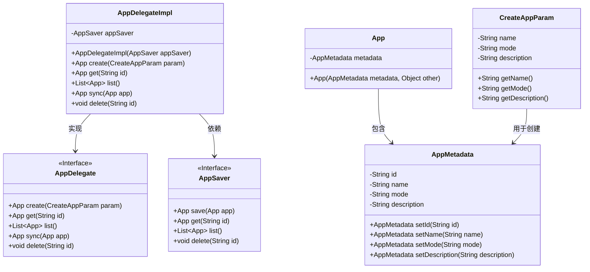
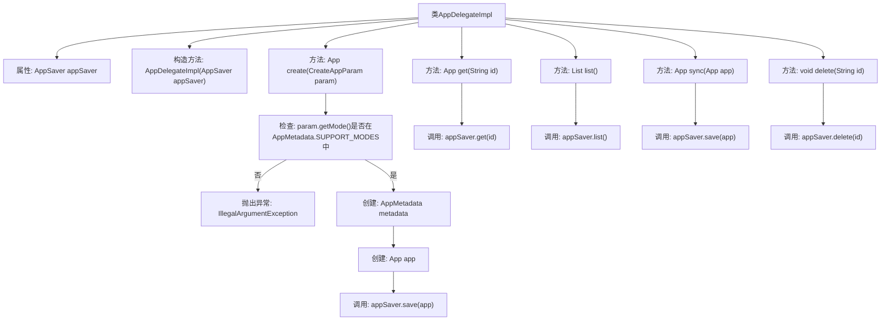

# 基础信息

|      |      |
|------|------|
| 名称 | AppDelegateImpl |
| 编码语言 | .java |
| 代码路径 | spring-ai-alibaba/spring-ai-alibaba-graph/spring-ai-alibaba-graph-studio/src/main/java/com/alibaba/cloud/ai/service/app/AppDelegateImpl.java |
| 包名 | com.alibaba.cloud.ai.service.app |
| 依赖项 | ['com.alibaba.cloud.ai.model.App', 'com.alibaba.cloud.ai.model.AppMetadata', 'com.alibaba.cloud.ai.param.CreateAppParam', 'com.alibaba.cloud.ai.saver.AppSaver', 'org.springframework.stereotype.Service', 'java.util.Arrays', 'java.util.List', 'java.util.UUID'] |
| 概述说明 | AppDelegateImpl实现接口，提供App增删查改及同步功能，依赖AppSaver持久化。 |

# 说明

AppDelegateImpl类实现了AppDelegate接口，主要负责管理应用程序的核心功能，包括创建、获取、列出、同步和删除应用程序。该类依赖AppSaver进行数据的持久化操作，确保应用程序状态和数据的存储与恢复。通过实现这些功能，AppDelegateImpl类为应用程序的生命周期管理提供了全面的支持。

# 类列表 Class Summary

| 名称   | 类型  | 说明 |
|-------|------|-------------|
| AppDelegateImpl | class | AppDelegateImpl类实现AppDelegate接口，提供创建、获取、列出、同步和删除App功能，依赖AppSaver进行持久化操作。 |

## 类 AppDelegateImpl

|      |      |
|------|------|
| 访问范围 | @Service;public |
| 类型 | class |
| 名称 | AppDelegateImpl |
| 说明 | AppDelegateImpl类实现AppDelegate接口，提供创建、获取、列出、同步和删除App功能，依赖AppSaver进行持久化操作。 |

### UML类图

**描述**：该代码展示了一个应用程序委托类 `AppDelegateImpl`，它实现了 `AppDelegate` 接口，并依赖于 `AppSaver` 接口来保存和获取应用程序数据。`AppDelegateImpl` 提供了创建、获取、列出、同步和删除应用程序的功能。`App` 类包含 `AppMetadata` 类，用于存储应用程序的元数据。`CreateAppParam` 类用于传递创建应用程序所需的参数。整个设计遵循了依赖注入和接口分离的原则，确保了代码的可扩展性和可维护性。

### 内部方法调用关系图

这段代码实现了一个`AppDelegateImpl`类，该类负责应用程序的创建、获取、列表、同步和删除操作。代码首先检查传入的`param.getMode()`是否在支持的`AppMetadata.SUPPORT_MODES`列表中，如果不在则抛出异常。如果检查通过，则创建`AppMetadata`和`App`对象，并调用`appSaver.save(app)`方法保存应用程序。其他方法分别调用`appSaver`的`get`、`list`、`save`和`delete`方法来完成相应的操作。

### 字段列表 Field List

| 名称  | 类型  | 说明 |
|-------|-------|------|
| appSaver | AppSaver | 定义私有变量appSaver，类型为AppSaver。 |

### 方法列表 Method List

| 名称  | 类型  | 说明 |
|-------|-------|------|
| delete | void | 重写delete方法，调用appSaver删除指定id。 |
| create | App | 检查应用模式合法性，生成唯一ID，创建并保存应用实例。 |
| list | List<App> | 重写list方法，返回appSaver的列表。 |
| get | App | 重写get方法，通过appSaver获取指定id的应用。 |
| sync | App | 重写sync方法，调用appSaver保存app实例。 |

