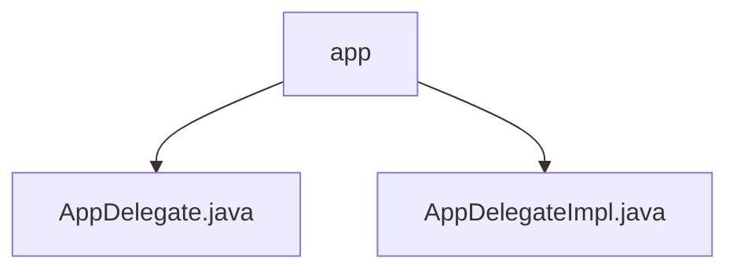

# 基础信息

|      |      |
|------|------|
| 名称 | app |
| 编码语言 | .java |
| 代码路径 | spring-ai-alibaba/spring-ai-alibaba-graph/spring-ai-alibaba-graph-studio/src/main/java/com/alibaba/cloud/ai/service/app |
| 包名 | spring-ai-alibaba.spring-ai-alibaba-graph.spring-ai-alibaba-graph-studio.src.main.java.com.alibaba.cloud.ai.service.app |
| 概述说明 | AppDelegateImpl类管理应用核心功能，依赖AppSaver持久化数据。 |

# 说明

## 概述
该代码模块的核心功能是管理应用程序的生命周期，包括创建、获取、列出、同步和删除应用程序。`AppDelegate`接口定义了这些功能，而`AppDelegateImpl`类则实现了该接口，负责具体的业务逻辑。`AppDelegateImpl`类依赖`AppSaver`进行数据的持久化操作，确保应用程序状态和数据的存储与恢复。通过这一设计，模块为应用程序的管理提供了全面的支持。

## 主要业务场景
1. **应用程序创建**：通过`AppDelegateImpl`类实现应用程序的创建，并将相关数据持久化存储。
2. **应用程序获取**：提供获取特定应用程序的功能，以便查询或操作其状态。
3. **应用程序列表**：支持列出所有应用程序，便于用户查看和管理。
4. **应用程序同步**：实现应用程序状态的同步，确保数据一致性。
5. **应用程序删除**：提供删除应用程序的功能，并清理相关数据。

这些业务场景共同构成了应用程序生命周期的完整管理流程，确保了应用程序在系统中的高效运行和数据的可靠性。

### 包内部结构视图

该流程图展示了`spring-ai-alibaba-graph-studio`项目中`app`目录下的文件结构。`app`作为根节点，包含两个子节点：`AppDelegate.java`和`AppDelegateImpl.java`。这两个文件分别代表了应用程序的委托接口及其实现类，体现了项目中的分层设计思想。

# 文件列表 File List

| 名称   | 类型  | 说明 |
|-------|------|-------------|
| [AppDelegateImpl.java](AppDelegateImpl.md) | file | AppDelegateImpl实现接口，提供App增删查改及同步功能，依赖AppSaver持久化。 |
| [AppDelegate.java](AppDelegate.md) | file | 信息为空，无法生成概要描述。 |

