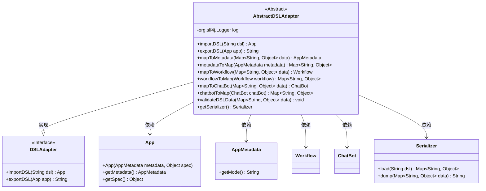

# 基础信息

|      |      |
|------|------|
| 名称 | AbstractDSLAdapter |
| 编码语言 | .java |
| 代码路径 | spring-ai-alibaba/spring-ai-alibaba-graph/spring-ai-alibaba-graph-studio/src/main/java/com/alibaba/cloud/ai/service/dsl/AbstractDSLAdapter.java |
| 包名 | com.alibaba.cloud.ai.service.dsl |
| 依赖项 | ['com.alibaba.cloud.ai.model.App', 'com.alibaba.cloud.ai.model.AppMetadata', 'com.alibaba.cloud.ai.model.chatbot.ChatBot', 'com.alibaba.cloud.ai.model.workflow.Workflow', 'org.yaml.snakeyaml.DumperOptions', 'org.yaml.snakeyaml.Yaml', 'java.util.HashMap', 'java.util.Map', 'java.util.stream.Collectors', 'java.util.stream.Stream'] |
| 概述说明 | 抽象类实现DSL导入导出，支持工作流和聊天机器人模式。 |

# 说明

抽象类实现了DSL（领域特定语言）的导入和导出功能，适用于工作流和聊天机器人两种模式。该设计提供了灵活性和扩展性，能够满足不同场景下的需求。通过抽象类的实现，用户可以轻松地导入和导出DSL，从而在不同模式之间进行切换和集成。这种设计不仅简化了开发流程，还增强了系统的可维护性和可重用性。

# 类列表 Class Summary

| 名称   | 类型  | 说明 |
|-------|------|-------------|
| AbstractDSLAdapter | class | 抽象类实现DSL导入导出功能，支持工作流和聊天机器人模式。 |

## 类 AbstractDSLAdapter

|      |      |
|------|------|
| 访问范围 | public abstract |
| 类型 | class |
| 名称 | AbstractDSLAdapter |
| 说明 | 抽象类实现DSL导入导出功能，支持工作流和聊天机器人模式。 |

### UML类图

### 描述：
`AbstractDSLAdapter` 是一个抽象类，实现了 `DSLAdapter` 接口，负责导入和导出 DSL（Domain Specific Language）数据。它包含多个抽象方法，用于将数据映射到不同的对象（如 `AppMetadata`、`Workflow`、`ChatBot`）以及验证 DSL 数据。`Serializer` 类用于数据的序列化和反序列化。`App` 类包含应用程序的元数据和规范，`AppMetadata` 用于描述应用程序的模式。

### 内部方法调用关系图

```mermaid
graph TD
    A["类AbstractDSLAdapter"]
    B["属性: Logger log"]
    C["方法: importDSL(String dsl)"]
    D["方法: exportDSL(App app)"]
    E["抽象方法: mapToMetadata(Map<String, Object> data)"]
    F["抽象方法: metadataToMap(AppMetadata metadata)"]
    G["抽象方法: mapToWorkflow(Map<String, Object> data)"]
    H["抽象方法: workflowToMap(Workflow workflow)"]
    I["抽象方法: mapToChatBot(Map<String, Object> data)"]
    J["抽象方法: chatbotToMap(ChatBot chatBot)"]
    K["抽象方法: validateDSLData(Map<String, Object> data)"]
    L["抽象方法: getSerializer()"]

    A --> B
    A --> C
    A --> D
    A --> E
    A --> F
    A --> G
    A --> H
    A --> I
    A --> J
    A --> K
    A --> L

    C --> C1["log.info('dsl importing: {}', dsl)"]
    C --> C2["Map<String, Object> data = getSerializer().load(dsl)"]
    C --> C3["validateDSLData(data)"]
    C --> C4["Map<String, Object> immutableData = Map.copyOf(data)"]
    C --> C5["AppMetadata metadata = mapToMetadata(immutableData)"]
    C --> C6["Object spec = switch (metadata.getMode())"]
    C6 --> C6a["case WORKFLOW_MODE -> mapToWorkflow(immutableData)"]
    C6 --> C6b["case CHATBOT_MODE -> mapToChatBot(immutableData)"]
    C6 --> C6c["default -> throw new IllegalArgumentException('unsupported mode: ' + metadata.getMode())"]
    C --> C7["App app = new App(metadata, spec)"]
    C --> C8["log.info('App imported:' + app)"]
    C --> C9["return app"]

    D --> D1["log.info('App exporting: \\n' + app)"]
    D --> D2["AppMetadata metadata = app.getMetadata()"]
    D --> D3["Map<String, Object> metaMap = metadataToMap(metadata)"]
    D --> D4["Map<String, Object> specMap = switch (metadata.getMode())"]
    D4 --> D4a["case WORKFLOW_MODE -> workflowToMap((Workflow) app.getSpec())"]
    D4 --> D4b["case CHATBOT_MODE -> chatbotToMap((ChatBot) app.getSpec())"]
    D4 --> D4c["default -> throw new IllegalArgumentException('unsupported mode: ' + metadata.getMode())"]
    D --> D5["Map<String, Object> data = Stream.concat(metaMap.entrySet().stream(), specMap.entrySet().stream()).collect(Collectors.toMap(Map.Entry::getKey, Map.Entry::getValue, (v1, v2) -> v1))"]
    D --> D6["String dsl = getSerializer().dump(data)"]
    D --> D7["log.info('App exported: \\n' + dsl)"]
    D --> D8["return dsl"]
```

**描述：**
`AbstractDSLAdapter` 是一个抽象类，实现了 `DSLAdapter` 接口，主要用于导入和导出 DSL（领域特定语言）数据。类中包含两个主要方法：`importDSL` 和 `exportDSL`，分别用于将 DSL 数据转换为应用对象以及将应用对象序列化为 DSL 数据。类中还定义了一系列抽象方法，用于处理元数据、工作流、聊天机器人等的映射和验证。通过这些方法，类能够根据不同的模式（如工作流模式或聊天机器人模式）来处理数据，并最终生成或解析 DSL。

### 字段列表 Field List

| 名称  | 类型  | 说明 |
|-------|-------|------|
| log = org.slf4j.LoggerFactory.getLogger(AbstractDSLAdapter.class) | org.slf4j.Logger | AbstractDSLAdapter类使用SLF4J记录日志。 |

### 方法列表 Method List

| 名称  | 类型  | 说明 |
|-------|-------|------|
| getSerializer | Serializer | 获取序列化器的抽象方法。 |
| workflowToMap | Map<String, Object> | 将工作流对象转换为键值对映射。 |
| validateDSLData | void | 抽象方法用于验证DSL数据，参数为字符串到对象的映射。 |
| mapToChatBot | ChatBot | 将Map数据映射为ChatBot对象的抽象方法。 |
| mapToMetadata | AppMetadata | 将Map数据映射为AppMetadata对象。 |
| metadataToMap | Map<String, Object> | 将AppMetadata对象转换为Map<String, Object>的抽象方法。 |
| exportDSL | String | 导出应用DSL，处理元数据和模式，生成最终DSL字符串。 |
| chatbotToMap | Map<String, Object> | 将ChatBot对象转换为Map<String, Object>的抽象方法。 |
| mapToWorkflow | Workflow | 抽象方法`mapToWorkflow`将`Map`数据转换为`Workflow`对象。 |
| importDSL | App | 方法导入DSL，验证数据，映射元数据，生成应用并返回。 |

