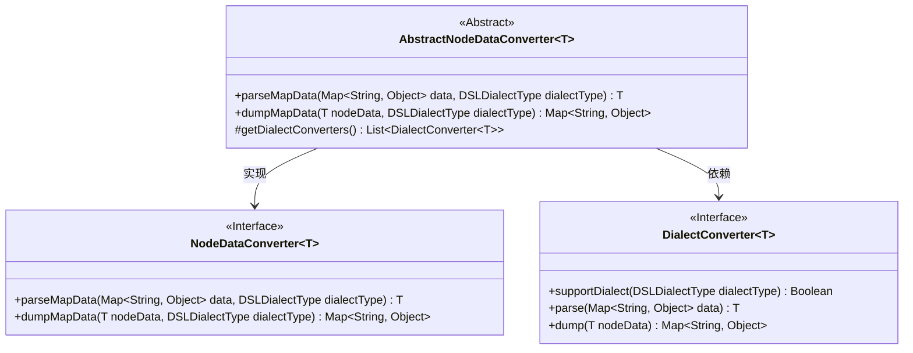
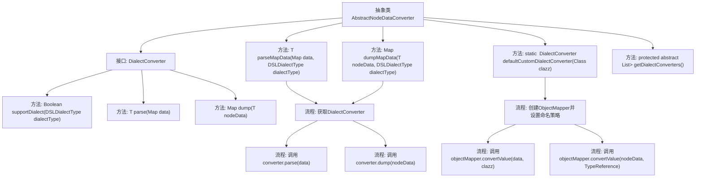

# 基础信息

|      |      |
|------|------|
| 名称 | AbstractNodeDataConverter |
| 编码语言 | .java |
| 代码路径 | spring-ai-alibaba/spring-ai-alibaba-graph/spring-ai-alibaba-graph-studio/src/main/java/com/alibaba/cloud/ai/service/dsl/AbstractNodeDataConverter.java |
| 包名 | com.alibaba.cloud.ai.service.dsl |
| 依赖项 | ['com.alibaba.cloud.ai.model.workflow.NodeData', 'com.fasterxml.jackson.core.type.TypeReference', 'com.fasterxml.jackson.databind.ObjectMapper', 'com.fasterxml.jackson.databind.PropertyNamingStrategies', 'org.apache.commons.lang3.NotImplementedException', 'java.util.List', 'java.util.Map'] |
| 概述说明 | 抽象类实现节点数据转换，支持多DSL方言解析与导出。 |

# 说明

抽象类实现了节点数据的转换功能，能够支持多种DSL（领域特定语言）方言的解析与导出。通过抽象类的设计，用户可以灵活处理不同DSL方言的数据节点，确保数据的准确解析和高效导出。该功能适用于需要处理多种DSL方言的场景，提升了系统的兼容性和扩展性。

# 类列表 Class Summary

| 名称   | 类型  | 说明 |
|-------|------|-------------|
| AbstractNodeDataConverter | class | 抽象类实现节点数据转换，支持不同DSL方言的解析与导出。 |

## 类 AbstractNodeDataConverter

|      |      |
|------|------|
| 访问范围 | public abstract |
| 类型 | class |
| 名称 | AbstractNodeDataConverter |
| 说明 | 抽象类实现节点数据转换，支持不同DSL方言的解析与导出。 |

### UML类图

这段代码定义了一个抽象类 `AbstractNodeDataConverter`，它实现了 `NodeDataConverter` 接口，并依赖于 `DialectConverter` 接口。`AbstractNodeDataConverter` 提供了 `parseMapData` 和 `dumpMapData` 方法，用于将 `Map` 数据转换为特定类型的节点数据，反之亦然。`DialectConverter` 接口定义了不同 DSL 方言的转换方法。`AbstractNodeDataConverter` 通过 `getDialectConverters` 方法获取具体的转换器列表，并根据传入的方言类型选择合适的转换器进行操作。

### 内部方法调用关系图

这段代码定义了一个抽象类 `AbstractNodeDataConverter`，它实现了 `NodeDataConverter` 接口，并包含两个主要方法 `parseMapData` 和 `dumpMapData`，用于解析和转换节点数据。代码中还定义了一个内部接口 `DialectConverter`，用于处理不同 DSL 方言的转换逻辑。`defaultCustomDialectConverter` 方法提供了一个默认的转换器实现，使用 `ObjectMapper` 进行数据转换。流程图展示了类的方法调用关系和数据处理流程，确保代码逻辑清晰且易于理解。

### 字段列表 Field List

| 名称  | 类型  | 说明 |
|-------|-------|------|

### 方法列表 Method List

| 名称  | 类型  | 说明 |
|-------|-------|------|
| getDialectConverters | List<DialectConverter<T>> | 获取方言转换器的抽象方法，返回类型为列表。 |
| parseMapData | T | 方法解析Map数据，根据方言类型选择转换器并返回解析结果。 |
| dumpMapData | Map<String, Object> | 重写方法，根据方言类型转换节点数据并返回映射结果。 |
| defaultCustomDialectConverter | DialectConverter<R> | 定义默认自定义方言转换器，支持CUSTOM类型，实现解析和转储功能。 |

