# 基础信息

|      |      |
|------|------|
| 名称 | dsl |
| 编码语言 | .java |
| 代码路径 | spring-ai-alibaba/spring-ai-alibaba-graph/spring-ai-alibaba-graph-studio/src/main/java/com/alibaba/cloud/ai/service/dsl |
| 包名 | spring-ai-alibaba.spring-ai-alibaba-graph.spring-ai-alibaba-graph-studio.src.main.java.com.alibaba.cloud.ai.service.dsl |
| 概述说明 | 该代码模块包含多个类，用于处理DSL数据转换、序列化和节点数据映射，支持多种方言和格式，提升系统灵活性和扩展性。 |

# 说明

## 概述
该代码模块主要围绕领域特定语言（DSL）的数据处理、转换和序列化展开，涵盖了从数据导入导出到节点数据转换的多个功能。模块的核心设计基于抽象类和接口，提供了高度灵活性和扩展性，能够支持多种DSL方言和数据处理场景。主要功能包括DSL数据转换、元数据映射、节点数据转换以及YAML和JSON格式的序列化与反序列化。

## 主要业务场景
1. **DSL数据转换**：模块中的`DifyDSLAdapter`和`CustomDSLAdapter`类专门用于处理Dify DSL和自定义DSL的数据转换，支持多种模式和应用元数据的映射，确保数据在转换过程中保持其原始结构和含义。适用于需要处理复杂数据结构且对数据准确性要求较高的场景。
2. **节点数据转换**：模块中的多个转换器类（如`EndNodeDataConverter`、`StartNodeDataConverter`等）用于处理不同类型节点数据的转换，支持多种DSL方言，确保数据在不同系统或平台间的兼容性和一致性。适用于需要处理多种DSL方言的场景。
3. **序列化与反序列化**：`YamlSerializer`和`JsonSerializer`类分别负责处理YAML和JSON格式的数据序列化与反序列化，支持跨平台数据交换和灵活的数据处理，适用于数据存储和传输场景。
4. **元数据映射与转换**：模块中的多个类支持元数据的映射与转换，确保在数据处理过程中能够保持数据的完整性和一致性，适用于需要处理元数据的复杂业务场景。
5. **多方言支持与系统集成**：模块支持多种DSL方言，能够灵活处理不同领域的特定需求，并通过抽象类和接口的设计，提升了系统的兼容性和扩展性，便于与其他系统或平台进行集成。

### 包内部结构视图

```mermaid
graph TD
    dsl --> DSLAdapter.java
    dsl --> adapters
    dsl --> serialize
    dsl --> nodes
    dsl --> AbstractDSLAdapter.java
    dsl --> DSLDialectType.java
    dsl --> Serializer.java
    dsl --> NodeDataConverter.java
    adapters --> DifyDSLAdapter.java
    adapters --> CustomDSLAdapter.java
    serialize --> YamlSerializer.java
    serialize --> JsonSerializer.java
    nodes --> EndNodeDataConverter.java
    nodes --> StartNodeDataConverter.java
    nodes --> VariableAggregatorNodeDataConverter.java
    nodes --> CodeNodeDataConverter.java
    nodes --> LLMNodeDataConverter.java
    nodes --> RetrieverNodeDataConverter.java
    nodes --> BranchNodeDataConverter.java
    nodes --> AnswerNodeDataConverter.java
    nodes --> AbstractNodeDataConverter.java
```

该流程图展示了`dsl`目录下的文件与子目录的层级关系。`dsl`目录包含多个文件和子目录，如`adapters`、`serialize`和`nodes`。每个子目录下又有多个文件，分别处理不同的功能模块。整个结构清晰地反映了项目的组织方式，便于理解和管理。

# 文件列表 File List

| 名称   | 类型  | 说明 |
|-------|------|-------------|
| [Serializer.java](Serializer.md) | file | 输入内容为空，无法生成概要描述。 |
| [AbstractDSLAdapter.java](AbstractDSLAdapter.md) | file | 抽象类实现DSL导入导出，支持工作流和聊天机器人模式。 |
| [DSLAdapter.java](DSLAdapter.md) | file | 无内容可总结。 |
| [NodeDataConverter.java](NodeDataConverter.md) | file | 输入内容为空，无法生成概要描述。 |
| [DSLDialectType.java](DSLDialectType.md) | file | 信息为空，无法生成概要描述。 |
| [AbstractNodeDataConverter.java](AbstractNodeDataConverter.md) | file | 抽象类实现节点数据转换，支持多DSL方言解析与导出。 |
| [adapters](adapters/_module.md) | package | DifyDSLAdapter处理DSL数据转换，支持多模式与元数据映射。CustomDSLAdapter继承AbstractDSLAdapter，提供自定义DSL方言与高度可定制解决方案。 |
| [nodes](nodes/_module.md) | package | 多个数据转换类支持DIFY和CUSTOM方言，确保数据兼容性和一致性。 |
| [serialize](serialize/_module.md) | package | YamlSerializer和JsonSerializer类分别实现Serializer接口，支持YAML和JSON数据的序列化与反序列化。 |

