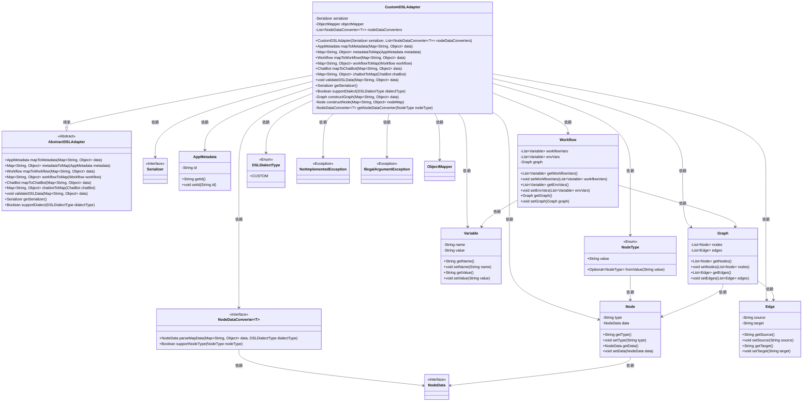
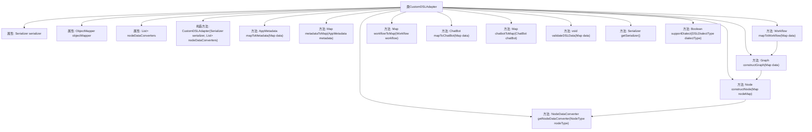

# 基础信息

|      |      |
|------|------|
| 名称 | CustomDSLAdapter |
| 编码语言 | .java |
| 代码路径 | spring-ai-alibaba/spring-ai-alibaba-graph/spring-ai-alibaba-graph-studio/src/main/java/com/alibaba/cloud/ai/service/dsl/adapters/CustomDSLAdapter.java |
| 包名 | com.alibaba.cloud.ai.service.dsl.adapters |
| 依赖项 | ['com.alibaba.cloud.ai.model.AppMetadata', 'com.alibaba.cloud.ai.model.Variable', 'com.alibaba.cloud.ai.model.chatbot.ChatBot', 'com.alibaba.cloud.ai.model.workflow', 'com.alibaba.cloud.ai.service.dsl.AbstractDSLAdapter', 'com.alibaba.cloud.ai.service.dsl.DSLDialectType', 'com.alibaba.cloud.ai.service.dsl.NodeDataConverter', 'com.alibaba.cloud.ai.service.dsl.Serializer', 'com.fasterxml.jackson.core.type.TypeReference', 'com.fasterxml.jackson.databind.DeserializationFeature', 'com.fasterxml.jackson.databind.ObjectMapper', 'org.apache.commons.lang3.NotImplementedException', 'org.springframework.beans.factory.annotation.Qualifier', 'org.springframework.stereotype.Component', 'com.alibaba.cloud.ai.model.App', 'java.util'] |
| 概述说明 | CustomDSLAdapter继承AbstractDSLAdapter，实现元数据、工作流和图的映射转换，支持自定义DSL方言。 |

# 说明

CustomDSLAdapter类继承自AbstractDSLAdapter，主要负责元数据、工作流和图的映射与转换功能。该类支持自定义DSL方言，能够灵活处理不同领域的特定需求，提供高度可定制的解决方案。通过继承和实现，CustomDSLAdapter增强了系统的扩展性和适应性，满足复杂场景下的数据处理要求。

# 类列表 Class Summary

| 名称   | 类型  | 说明 |
|-------|------|-------------|
| CustomDSLAdapter | class | CustomDSLAdapter类继承AbstractDSLAdapter，实现元数据、工作流和图的映射与转换，支持自定义DSL方言。 |

## 类 CustomDSLAdapter

|      |      |
|------|------|
| 访问范围 | @Component;public |
| 类型 | class |
| 名称 | CustomDSLAdapter |
| 说明 | CustomDSLAdapter类继承AbstractDSLAdapter，实现元数据、工作流和图的映射与转换，支持自定义DSL方言。 |

### UML类图

**描述：**

`CustomDSLAdapter` 类继承自 `AbstractDSLAdapter`，并实现了多种数据转换方法，如 `mapToMetadata`、`metadataToMap`、`mapToWorkflow` 等。它依赖于 `Serializer`、`ObjectMapper` 和 `NodeDataConverter` 等组件来处理数据的序列化和反序列化。`CustomDSLAdapter` 还负责构建 `Graph`、`Node` 和 `Edge` 等复杂数据结构，并处理 `Workflow` 中的变量和图形数据。整个类图展示了 `CustomDSLAdapter` 如何通过依赖多个组件来实现 DSL（领域特定语言）数据的转换和验证。

### 内部方法调用关系图

**描述：**
该流程图展示了`CustomDSLAdapter`类的结构及其内部方法之间的调用关系。`CustomDSLAdapter`类继承自`AbstractDSLAdapter`，并包含多个属性和方法，用于处理元数据、工作流、节点数据转换等操作。流程图清晰地展示了各个方法的调用顺序和依赖关系，特别是`mapToWorkflow`方法如何调用`constructGraph`和`constructNode`方法，以及`constructNode`方法如何依赖`getNodeDataConverter`方法。

### 字段列表 Field List

| 名称  | 类型  | 说明 |
|-------|-------|------|
| serializer | Serializer | 私有且不可变的序列化器实例。 |
| nodeDataConverters | List<NodeDataConverter<?>> | 私有节点数据转换器列表。 |
| objectMapper | ObjectMapper | 私有且不可变的对象映射器实例。 |

### 方法列表 Method List

| 名称  | 类型  | 说明 |
|-------|-------|------|
| constructNode | Node | 方法从Map构建Node对象，转换数据并设置类型。 |
| constructGraph | Graph | 根据数据构建图，包含节点和边的转换与设置。 |
| supportDialect | Boolean | 该方法检查是否支持指定方言类型，仅支持自定义方言。 |
| workflowToMap | Map<String, Object> | 将工作流对象转换为包含其规范的映射。 |
| mapToMetadata | AppMetadata | 将数据映射为应用元数据，生成唯一ID并返回。 |
| metadataToMap | Map<String, Object> | 将AppMetadata转换为Map，存储并返回。 |
| getSerializer | Serializer | 重写getSerializer方法，返回serializer实例。 |
| mapToWorkflow | Workflow | 将数据映射为工作流，包含变量和图的设置。 |
| getNodeDataConverter | NodeDataConverter<?> | 获取支持指定节点类型的数据转换器，若未找到则抛出异常。 |
| chatbotToMap | Map<String, Object> | 重写chatbotToMap方法，将ChatBot对象转换为Map，返回null。 |
| validateDSLData | void | 验证DSL数据，检查metadata中是否包含mode字段，否则抛出异常。 |
| mapToChatBot | ChatBot | 重写mapToChatBot方法，将Map数据映射为ChatBot对象。 |

