# 基础信息

|      |      |
|------|------|
| 名称 | DifyDSLAdapter |
| 编码语言 | .java |
| 代码路径 | spring-ai-alibaba/spring-ai-alibaba-graph/spring-ai-alibaba-graph-studio/src/main/java/com/alibaba/cloud/ai/service/dsl/adapters/DifyDSLAdapter.java |
| 包名 | com.alibaba.cloud.ai.service.dsl.adapters |
| 依赖项 | ['com.alibaba.cloud.ai.model.App', 'com.alibaba.cloud.ai.model.AppMetadata', 'com.alibaba.cloud.ai.model.Variable', 'com.alibaba.cloud.ai.model.chatbot.ChatBot', 'com.alibaba.cloud.ai.model.workflow', 'com.alibaba.cloud.ai.service.dsl.DSLDialectType', 'com.alibaba.cloud.ai.service.dsl.Serializer', 'com.alibaba.cloud.ai.service.dsl.NodeDataConverter', 'com.alibaba.cloud.ai.service.dsl.AbstractDSLAdapter', 'com.fasterxml.jackson.core.type.TypeReference', 'com.fasterxml.jackson.databind.DeserializationFeature', 'com.fasterxml.jackson.databind.ObjectMapper', 'com.fasterxml.jackson.databind.PropertyNamingStrategies', 'org.apache.commons.lang3.NotImplementedException', 'org.springframework.beans.factory.annotation.Qualifier', 'org.springframework.stereotype.Component', 'java.util', 'java.util.stream.Collectors'] |
| 概述说明 | DifyDSLAdapter类处理Dify DSL数据转换，支持多模式及元数据映射。 |

# 说明

DifyDSLAdapter类是一个专门用于处理Dify DSL数据转换的工具，它具备多种模式的支持，能够灵活应对不同的数据处理需求。此外，该类还支持应用元数据的映射，确保数据在转换过程中能够准确无误地反映其原始结构和含义。通过这一适配器，用户可以高效地实现复杂数据的转换和映射操作。

# 类列表 Class Summary

| 名称   | 类型  | 说明 |
|-------|------|-------------|
| DifyDSLAdapter | class | DifyDSLAdapter类用于处理Dify DSL数据转换，支持多种模式和应用元数据映射。 |

## 类 DifyDSLAdapter

|      |      |
|------|------|
| 访问范围 | @Component;public |
| 类型 | class |
| 名称 | DifyDSLAdapter |
| 说明 | DifyDSLAdapter类用于处理Dify DSL数据转换，支持多种模式和应用元数据映射。 |

### UML类图

```mermaid
classDiagram
    class AbstractDSLAdapter {
        <<Abstract>>
        +validateDSLData(Map~String, Object~ dslData)
        +getSerializer() Serializer
        +mapToMetadata(Map~String, Object~ data) AppMetadata
        +metadataToMap(AppMetadata metadata) Map~String, Object~
        +mapToWorkflow(Map~String, Object~ data) Workflow
        +workflowToMap(Workflow workflow) Map~String, Object~
        +mapToChatBot(Map~String, Object~ data) ChatBot
        +chatbotToMap(ChatBot chatBot) Map~String, Object~
        +supportDialect(DSLDialectType dialectType) Boolean
    }

    class DifyDSLAdapter {
        -String[] DIFY_CHATBOT_MODES
        -String[] DIFY_WORKFLOW_MODES
        -List~NodeDataConverter~<? extends NodeData~> nodeDataConverters
        -Serializer serializer
        +DifyDSLAdapter(List~NodeDataConverter~<? extends NodeData~> nodeDataConverters, Serializer serializer)
        -getNodeDataConverter(NodeType nodeType) NodeDataConverter~? extends NodeData~
        +validateDSLData(Map~String, Object~ dslData)
        +getSerializer() Serializer
        +mapToMetadata(Map~String, Object~ data) AppMetadata
        +metadataToMap(AppMetadata metadata) Map~String, Object~
        +mapToWorkflow(Map~String, Object~ data) Workflow
        +workflowToMap(Workflow workflow) Map~String, Object~
        +mapToChatBot(Map~String, Object~ data) ChatBot
        +chatbotToMap(ChatBot chatBot) Map~String, Object~
        +supportDialect(DSLDialectType dialectType) Boolean
        -constructGraph(Map~String, Object~ data) Graph
        -constructNodes(List~Map~String, Object~~ nodeMaps) List~Node~
        -constructEdges(List~Map~String, Object~~ edgeMaps) List~Edge~
        -deconstructGraph(Graph graph) Map~String, Object~
        -deconstructEdge(List~Edge~ edges) List~Map~String, Object~~
        -deconstructNode(List~Node~ nodes) List~Map~String, Object~~
        -dumpMapData(NodeDataConverter~T~ converter, NodeData data) Map~String, Object~
    }

    class NodeDataConverter~T~ {
        <<Interface>>
        +supportNodeType(NodeType nodeType) Boolean
        +parseMapData(Map~String, Object~ data, DSLDialectType dialectType) T
        +dumpMapData(T data, DSLDialectType dialectType) Map~String, Object~
    }

    class Serializer {
        <<Interface>>
        +serialize(Object obj) String
        +deserialize(String str, Class~T~ clazz) T
    }

    class AppMetadata {
        -String id
        -String name
        -String description
        -String mode
        +setId(String id)
        +setName(String name)
        +setDescription(String description)
        +setMode(String mode)
        +getId() String
        +getName() String
        +getDescription() String
        +getMode() String
    }

    class Workflow {
        -List~Variable~ workflowVars
        -List~Variable~ envVars
        -Graph graph
        +setWorkflowVars(List~Variable~ workflowVars)
        +setEnvVars(List~Variable~ envVars)
        +setGraph(Graph graph)
        +getWorkflowVars() List~Variable~
        +getEnvVars() List~Variable~
        +getGraph() Graph
    }

    class Graph {
        -List~Node~ nodes
        -List~Edge~ edges
        +setNodes(List~Node~ nodes)
        +setEdges(List~Edge~ edges)
        +getNodes() List~Node~
        +getEdges() List~Edge~
    }

    class Node {
        -String type
        -String title
        -String desc
        -NodeData data
        +setType(String type)
        +setTitle(String title)
        +setDesc(String desc)
        +setData(NodeData data)
        +getType() String
        +getTitle() String
        +getDesc() String
        +getData() NodeData
    }

    class Edge {
        -String source
        -String target
        +setSource(String source)
        +setTarget(String target)
        +getSource() String
        +getTarget() String
    }

    class Variable {
        -String name
        -String value
        +setName(String name)
        +setValue(String value)
        +getName() String
        +getValue() String
    }

    class ChatBot {
        // TODO
    }

    class DSLDialectType {
        <<Enumeration>>
        +DIFY
        +OTHER
    }

    class NodeType {
        <<Enumeration>>
        +fromDifyValue(String difyValue) Optional~NodeType~
        +fromValue(String value) Optional~NodeType~
        +difyValue() String
        +value() String
    }

    class NodeData {
        <<Abstract>>
    }

    DifyDSLAdapter --|> AbstractDSLAdapter : 继承
    DifyDSLAdapter --> NodeDataConverter~T~ : 依赖
    DifyDSLAdapter --> Serializer : 依赖
    DifyDSLAdapter --> AppMetadata : 依赖
    DifyDSLAdapter --> Workflow : 依赖
    DifyDSLAdapter --> Graph : 依赖
    DifyDSLAdapter --> Node : 依赖
    DifyDSLAdapter --> Edge : 依赖
    DifyDSLAdapter --> Variable : 依赖
    DifyDSLAdapter --> ChatBot : 依赖
    DifyDSLAdapter --> DSLDialectType : 依赖
    DifyDSLAdapter --> NodeType : 依赖
    DifyDSLAdapter --> NodeData : 依赖
```

### 描述
`DifyDSLAdapter` 是一个继承自 `AbstractDSLAdapter` 的类，用于处理与 Dify DSL 相关的数据转换和验证。它依赖于多个类，如 `NodeDataConverter`、`Serializer`、`AppMetadata`、`Workflow`、`Graph`、`Node`、`Edge`、`Variable`、`ChatBot`、`DSLDialectType`、`NodeType` 和 `NodeData`。该类主要负责将 DSL 数据转换为元数据、工作流等对象，并支持特定 DSL 方言的验证和转换。

### 内部方法调用关系图

```mermaid
graph TD
    A["类DifyDSLAdapter"]
    B["属性: String[] DIFY_CHATBOT_MODES"]
    C["属性: String[] DIFY_WORKFLOW_MODES"]
    D["属性: List<NodeDataConverter<? extends NodeData>> nodeDataConverters"]
    E["属性: Serializer serializer"]
    F["构造方法: DifyDSLAdapter(List<NodeDataConverter<? extends NodeData>> nodeDataConverters, Serializer serializer)"]
    G["方法: NodeDataConverter<? extends NodeData> getNodeDataConverter(NodeType nodeType)"]
    H["方法: void validateDSLData(Map<String, Object> dslData)"]
    I["方法: Serializer getSerializer()"]
    J["方法: AppMetadata mapToMetadata(Map<String, Object> data)"]
    K["方法: Map<String, Object> metadataToMap(AppMetadata metadata)"]
    L["方法: Workflow mapToWorkflow(Map<String, Object> data)"]
    M["方法: Graph constructGraph(Map<String, Object> data)"]
    N["方法: List<Node> constructNodes(List<Map<String, Object>> nodeMaps)"]
    O["方法: List<Edge> constructEdges(List<Map<String, Object>> edgeMaps)"]
    P["方法: Map<String, Object> workflowToMap(Workflow workflow)"]
    Q["方法: Map<String, Object> deconstructGraph(Graph graph)"]
    R["方法: List<Map<String, Object>> deconstructEdge(List<Edge> edges)"]
    S["方法: List<Map<String, Object>> deconstructNode(List<Node> nodes)"]
    T["方法: <T extends NodeData> Map<String, Object> dumpMapData(NodeDataConverter<T> converter, NodeData data)"]
    U["方法: ChatBot mapToChatBot(Map<String, Object> data)"]
    V["方法: Map<String, Object> chatbotToMap(ChatBot chatBot)"]
    W["方法: Boolean supportDialect(DSLDialectType dialectType)"]

    A --> B
    A --> C
    A --> D
    A --> E
    A --> F
    A --> G
    A --> H
    A --> I
    A --> J
    A --> K
    A --> L
    L --> M
    M --> N
    M --> O
    A --> P
    P --> Q
    Q --> R
    Q --> S
    A --> T
    A --> U
    A --> V
    A --> W
```

这段代码定义了一个名为 `DifyDSLAdapter` 的类，它继承自 `AbstractDSLAdapter`。该类主要负责处理与 Dify DSL 相关的数据转换和验证。它包含多个方法，用于将不同类型的 DSL 数据转换为对象，以及将对象转换回 DSL 数据。代码中使用了多个辅助方法来完成节点、边、图的构建与解构，并且通过 `NodeDataConverter` 来处理特定类型的节点数据。整个类的设计旨在支持 Dify DSL 的解析和生成，确保数据的正确性和一致性。

### 字段列表 Field List

| 名称  | 类型  | 说明 |
|-------|-------|------|
| DIFY_CHATBOT_MODES = { "chat", "completion", "agent-chat" } | String[] | DIFY聊天机器人支持三种模式：聊天、完成和代理聊天。 |
| DIFY_WORKFLOW_MODES = { "workflow", "advanced-chat" } | String[] | 定义包含两种工作流模式的字符串数组。 |
| serializer | Serializer | 私有且不可变的序列化器实例。 |
| nodeDataConverters | List<NodeDataConverter<? extends NodeData>> | 私有节点数据转换器列表。 |

### 方法列表 Method List

| 名称  | 类型  | 说明 |
|-------|-------|------|
| workflowToMap | Map<String, Object> | 将工作流对象转换为包含变量和图的映射。 |
| metadataToMap | Map<String, Object> | 将AppMetadata转换为Map，包含应用名称、描述和模式信息。 |
| constructGraph | Graph | 根据数据构建图结构，包含节点和边。 |
| getSerializer | Serializer | 重写getSerializer方法，返回serializer实例。 |
| constructEdges | List<Edge> | 方法将Map列表转换为Edge对象列表，忽略未知属性。 |
| dumpMapData | Map<String, Object> | 私有方法将节点数据转换为Map，使用指定转换器和DSL方言类型。 |
| getNodeDataConverter | NodeDataConverter<? extends NodeData> | 获取支持指定节点类型的NodeDataConverter，若无则抛出异常。 |
| deconstructEdge | List<Map<String, Object>> | 将Edge对象列表转换为包含自定义类型的Map列表。 |
| deconstructGraph | Map<String, Object> | 将图结构解构为边和节点的映射集合。 |
| supportDialect | Boolean | 该方法检查DSLDialectType是否为DIFY。 |
| validateDSLData | void | 验证DSL数据，检查非空且包含"app"键。 |
| deconstructNode | List<Map<String, Object>> | 将节点列表转换为包含类型和数据的映射列表。 |
| mapToChatBot | ChatBot | 重写ChatBot类方法，将Map数据映射为ChatBot对象。 |
| mapToMetadata | AppMetadata | 将数据映射为AppMetadata，根据模式设置类型，生成唯一ID并填充名称和描述。 |
| mapToWorkflow | Workflow | 将Map数据转换为Workflow对象，处理对话和环境变量，构建图形结构。 |
| constructNodes | List<Node> | 将节点映射列表转换为节点对象列表，处理未知属性，设置标题和描述，并转换节点数据。 |
| chatbotToMap | Map<String, Object> | 将ChatBot对象转换为Map的方法，未实现。 |

